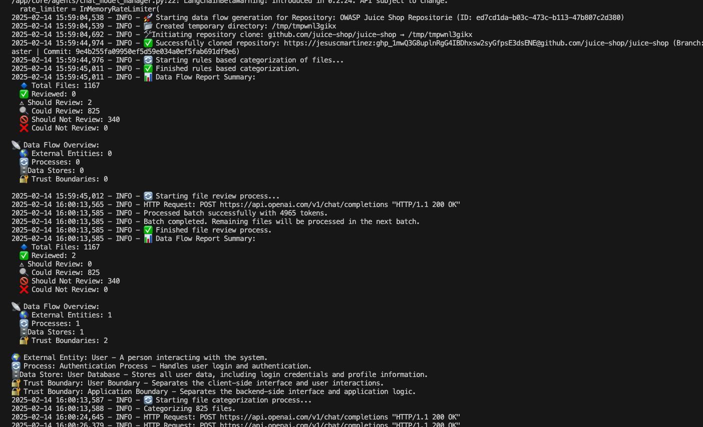
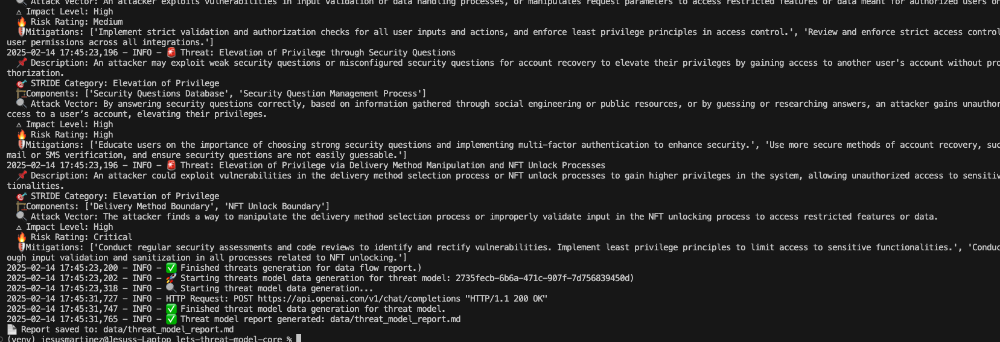
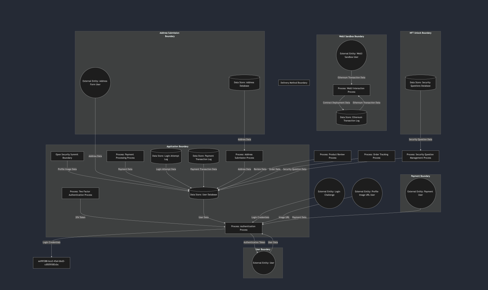
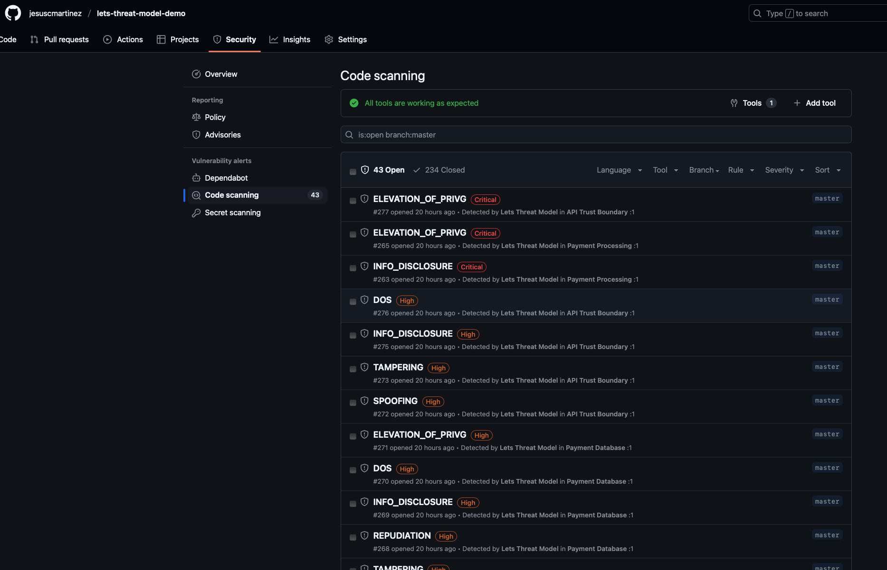
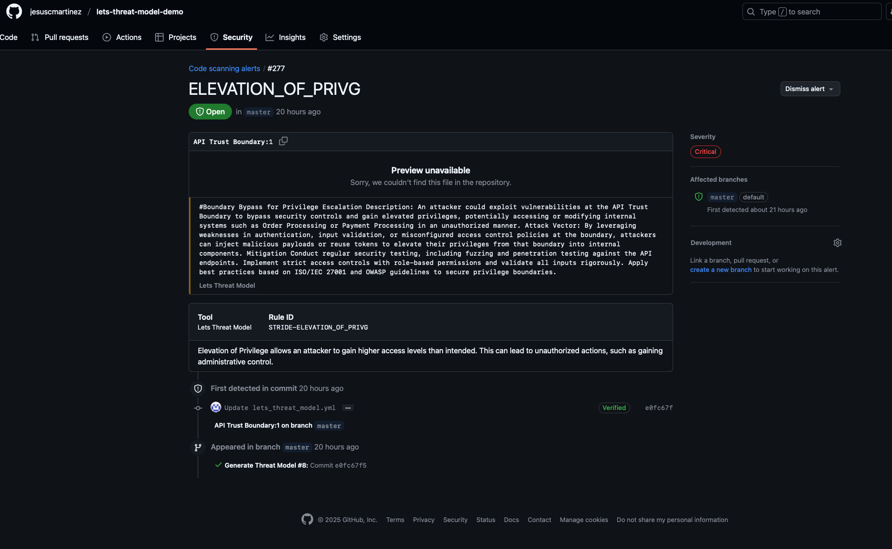

# Let's Threat Model

---

Let's Threat Model is an Agentic AI tool that helps teams identify and manage threats early in the development lifecycle. Built with extensibility and automation in mind, it brings threat modeling into agile workflows by generating actionable threat models.

## 📌 Features
- Parses a **YAML configuration file** containing asset and repository details.
- Uses the configuration to **analyze the specified repository** for potential threats.
- Generates an **Agentic AI-driven threat model report** based on repository structure and metadata.
- Supports output in **Markdown, JSON, and SARIF formats** via command-line flags.
- SARIF output is **compatible with GitHub Code Scanning** and can also be viewed in **IDEs that support SARIF**, such as Visual Studio Code.
- Provides **detailed logging and error handling** for smooth and transparent execution.


---

## ⚡ Quick Start

If you're eager to get up and running with **Lets Threat Model**, follow these steps to generate your first threat model report in minutes!

### 1️⃣ Run with Docker (Recommended)

The easiest way to start is by using the pre-built Docker image.

#### Run with a Remote Repository
```sh
docker run --rm -it \
  -v "$(pwd)":/data \
  --env-file .env \
  ghcr.io/jesuscmartinez/lets-threat-model-core:latest \
  --config-file /data/config.yaml
```

#### Run with a Local Repository
```sh
docker run --rm -it \
  -v "$(pwd)":/data \
  -v /path/to/your/local/repo:/repos/my-local-repo \
  --env-file .env \
  ghcr.io/jesuscmartinez/lets-threat-model-core:latest \
  --config-file /data/config.yaml
```

⮕ Replace /path/to/your/local/repo with the path to your local repo.

### 2️⃣ Prepare a YAML Configuration File

Here’s a minimal example config.yaml you can use:
```yaml
asset:
  name: "Sample Asset"
  description: "A quick-start example asset."
  internet_facing: False
  authn_type: "None"
  data_classification: "CONFIDENTIAL"

repositories:
  - name: "Sample Repo"
    url: "github.com/jesuscmartinez/lets-threat-model-core"

config:
  llm_provider: "openai"
  context_window: 128000
  max_output_tokens: 16384
  categorization_agent_llm: "gpt-4o-mini"
  review_agent_llm: "o3-mini"
  threat_model_agent_llm: "o3-mini"
  report_agent_llm: "gpt-4o-mini"
```

### 3️⃣ Set Up Environment Variables

Create a .env file in your project root:
```ini
PROVIDER_API_KEY=your_llm_provider_key
GITHUB_USERNAME=your_github_username
GITHUB_PAT=your_github_token
LOG_LEVEL=INFO
```

### 4️⃣ View Your Threat Model Report!

After running the container, reports will be generated only if you specify the corresponding output flags:

- `--markdown-output` → Markdown format
- `--json-output` → Structured JSON
- `--sarif-output` → SARIF format for integration with code scanning tools

🔧 Optional: If you’d rather run locally without Docker, see the Installation and Usage sections below.


## 🚀 Installation
### **1. Clone the Repository**
```sh
 git clone https://github.com/jesuscmartinez/lets-threat-model-core
 cd lets-threat-model-core
```

### **2. Install Dependencies**
Ensure you have Python **3.8+** installed, then install dependencies:
```sh
pip install -r requirements.txt
```

---

## 📄 Usage
### **1. Prepare a YAML File**
Create a YAML file with the asset, repositories and config settings. Example:
```yaml
asset:
  name: "Lets Threat Model"
  description: "An agentic based threat modeling tool."
  internet_facing: False
  authn_type: "None"
  data_classification: "CONFIDENTIAL"

repositories:
  # Example 1: Remote repository (use 'url' only)
  - name: "Lets Threat Model Core"
    url: "github.com/jesuscmartinez/lets-threat-model-core"
    # Do NOT specify local_path when using a remote URL

  # # Example 2: Local repository (use 'local_path' only)
  # - name: "Lets Threat Model Core"
  #   local_path: "/repos/my-local-repo"  # This should match the mount point in Docker or the local file system
  #   # Do NOT specify url when using a local path

# ----------------------------
# Configuration
# ----------------------------
config:
  llm_provider: "openai"
  context_window: 128000
  max_output_tokens: 16384
  categorization_agent_llm: "gpt-4o3-mini"
  review_agent_llm: "o3-mini"
  threat_model_agent_llm: "o3-mini"
  report_agent_llm: "gpt-4o-mini"

# Categorize_only is useful when initially running the tool on a new repository.
# It focuses solely on categorizing files to determine which ones should be reviewed
# for threat modeling. After reviewing the file categorization results, you can add
# patterns to the exclude_patterns list to mark files that should be excluded from review.
# This helps refine and streamline future analysis by excluding unnecessary files.
  categorize_only: True

  exclude_patterns:
    - demo/*
```

### **3. Set Up Environment Variables**
Create a `.env` file and define necessary environment variables:
```ini
# ----------------------
# GLOBAL Configuration
# ----------------------
LOG_LEVEL=INFO

# ----------------------------
# GITHUB Configuration
# ----------------------------
GITHUB_USERNAME=username
GITHUB_PAT=personal_access_token

# ----------------------------
# LLM Configuration
# ----------------------------
PROVIDER_API_KEY=api_key
```
## Field Descriptions

### Asset
- **asset**: Details of the asset to be analyzed.
  - **name**: Name of the asset.
  - **description**: Brief description of the asset.
  - **internet_facing**: Indicates if the asset is exposed to the internet (`True` or `False`).
  - **authn_type**: Authentication type used by the asset (e.g., `NONE`, `BASIC`, `OAUTH`).
  - **data_classification**: Classification of data handled by the asset (e.g., `PUBLIC`, `INTERNAL`, `CONFIDENTIAL`).

### Repositories
- **repositories**: List of repositories associated with the asset.
  - **name**: Name of the repository.
  - **url**: URL of the repository.
  - **local_path**: Local repository path.

  > **Note:**  
  > You must specify **either** `url` **or** `local_path` for each repository.  
  > If both are provided, or neither is provided, the system will raise a validation error.


### Configuration
- **config**: Configuration settings for the threat modeling process.
  - **llm_provider**: Provider of the language model (e.g., `openai`).
  - **categorization_agent_llm**: Language model used for categorization.
  - **review_agent_llm**: Language model used for review.
  - **threat_model_agent_llm**: Language model used for threat modeling.
  - **report_agent_llm**: Language model used for report generation.
  - **context_window**: Context window size for the language model.
  - **max_output_tokens**: Maximum number of tokens for the output.
  - **review_max_file_in_batch**: Maximum number of files to review in a batch.
  - **review_token_buffer**: Token buffer ratio for review.
  - **categorize_max_file_in_batch**: Maximum number of files to categorize in a batch.
  - **categorize_token_buffer**: Token buffer ratio for categorization.
  - **categorize_only**: Flag to indicate if only categorization should be performed (`True` or `False`).
  - **completion_threshold**: Threshold for completion.

### Patterns
- **exclude_patterns**: List of file patterns to exclude from analysis.
- **include_patterns**: List of file patterns to include in the analysis.


### **2. Run the Script**
You can specify the output format paths using optional flags:
```sh
python -m main \
  --config-file config.yaml \
  --markdown-output reports/threat_model_report.md \
  --json-output reports/threat_model_report.json \
  --sarif-output reports/threat_model_report.sarif
```

### **3. Run the Script via Docker**
#### **Run the Container**
With remote repository:
```sh
docker run --rm -it --env-file .env -v "$(pwd)":/app lets_threat_model \
  --config-file config.yaml \
  --markdown-output /app/reports/threat_model_report.md \
  --json-output /app/reports/threat_model_report.json \
  --sarif-output /app/reports/threat_model_report.sarif
```

With local repository:
```sh
docker run --rm -it --env-file .env \
  -v "$(pwd)":/app \
  -v "$(pwd)":/repos/my-local-repo \
  lets_threat_model \
  --config-file config.yaml \
  --markdown-output /app/reports/threat_model_report.md \
  --json-output /app/reports/threat_model_report.json \
  --sarif-output /app/reports/threat_model_report.sarif
```

#### **Access the Generated Report**
The Markdown report will be available on your host machine:
```sh
cat reports/threat_model_report.md
```

---
## Example Output:
### JuiceShop
Here is an example output when using GPT 4o-mini on OWASP Juiceshop

Initial data flow report...


Threats...


Data Flow Diagram


Github Code Scanning Integration




Threat Model Report
[Threat Model Report w/ gpt-4o-mini](demo/juiceshop_report_gpt4omini.md)

---

## 🛠 Development & Debugging
### **Run with Debug Logging**
To enable detailed logging, set `LOG_LEVEL` to `DEBUG`:
```sh
export LOG_LEVEL=DEBUG
python main.py --config-file config.yaml
```

### **Run with a Virtual Environment**
```sh
python -m venv venv
source venv/bin/activate  # On macOS/Linux
venv\Scripts\activate  # On Windows
pip install -r requirements.txt
```

---

## 🏗 Contributing
Feel free to submit **issues** or **pull requests** to improve the the project.

---
