# Threat Model Report: OWASP Juice Shop: Data Flow and Threat Analysis
**Generated on:** 2025-02-14 17:45:31 UTC

## Summary
The OWASP Juice Shop is a deliberately insecure web application developed for security training and testing. It serves as a practical tool for learning about web application security vulnerabilities, making it significant in the ethical hacking community. The associated repository on GitHub contains the codebase, which allows users to explore and practice exploiting its vulnerabilities. Data Flow Reports provide crucial insights into the application's data handling, outlining potential security risks like improper input handling and exposure of sensitive data. Identified threats include spoofing, tampering, and information disclosure, all of which could significantly impact the integrity and confidentiality of the asset and its associated repositories.

## Asset Information
- **Name:** OWASP Juice Shop
- **Description:** OWASP Juice Shop is a deliberately insecure web application developed for security training, awareness, and testing. It is maintained by the Open Web Application Security Project (OWASP) and is widely used for ethical hacking practice, penetration testing, and learning web security vulnerabilities.
- **Internet Facing:** Yes
- **Authentication Type:** PASSWORD
- **Data Classification:** CONFIDENTIAL

## Repository Information
- **Name:** OWASP Juice Shop Repositorie
- **Description:** None
- **URL:** github.com/juice-shop/juice-shop
## Data Flow Diagrams
### Diagram 1

```mermaid
graph TD;
    bcf107db-e48e-437f-ab16-431581133e3d(("External Entity: User"))
    ff229938-aff0-4e52-843e-cdc75fcdfb8a(("External Entity: Login Challenge"))
    8e024391-a672-4a69-823d-f0207e59209e(("External Entity: Web3 Sandbox User"))
    c77eeaef-f37a-4a1c-b086-79efb479209e(("External Entity: Address Form User"))
    269ef469-2732-47b4-8f82-9dc31dc53ea7(("External Entity: Payment User"))
    ff573590-d9f8-4ec2-b33b-9bbdcdc3c7cd(("External Entity: Profile Image URL User"))
    3ffe2f73-d7ab-4376-b317-325b6b288ca5["Process: Authentication Process"]
    fbae60c5-ad1f-43fc-a079-be546b395038["Process: Two Factor Authentication Process"]
    00d527ba-c769-41ab-a6bc-38ca7b6c1ddb["Process: Web3 Interaction Process"]
    7c8beceb-ca4f-4050-a752-738da728921f["Process: Address Submission Process"]
    3500d928-d128-4cd7-94c7-2f6ac5e0803a["Process: Payment Processing Process"]
    e4bb8c49-67e5-4f20-a19b-8b03c494fecf["Process: Profile Image Upload Process"]
    41ea5a9a-f040-403f-bcec-e2a9d968b0ff["Process: Security Question Management Process"]
    1aefdeb1-83f1-4361-8c8c-f18a1ac1249b["Process: Product Review Process"]
    e4bd1cfd-457a-4821-b2f6-a377ed49d22f["Process: Order Tracking Process"]
    39a38741-e506-4394-bd47-5e11f703f205[("Data Store: User Database")]
    81489d43-410f-455e-b1ea-ff0e034e269d[("Data Store: Login Attempt Log")]
    0eb72889-4fe8-498d-9f94-0b07bc164f5a[("Data Store: Ethereum Transaction Log")]
    38debe2c-e2be-43eb-82be-d3e32de2ea92[("Data Store: Address Database")]
    44b78a72-6af8-4f21-a0ac-489cb162918e[("Data Store: Payment Transaction Log")]
    168cb356-6b8d-45ef-b98f-920e90f8b236[("Data Store: Security Questions Database")]
    subgraph 58d708f5-4bef-4e41-b768-4e0ba5c3162f["User Boundary"]
        bcf107db-e48e-437f-ab16-431581133e3d
    end
    subgraph 4078516c-742d-4445-9017-685c6b9ed5a3["Application Boundary"]
        3ffe2f73-d7ab-4376-b317-325b6b288ca5
        39a38741-e506-4394-bd47-5e11f703f205
        fbae60c5-ad1f-43fc-a079-be546b395038
        81489d43-410f-455e-b1ea-ff0e034e269d
        7c8beceb-ca4f-4050-a752-738da728921f
        3500d928-d128-4cd7-94c7-2f6ac5e0803a
        44b78a72-6af8-4f21-a0ac-489cb162918e
        e4bb8c49-67e5-4f20-a19b-8b03c494fecf
    end
    subgraph de9f0e1b-15e7-4a98-8efc-93d5b77946bf["Web3 Sandbox Boundary"]
        8e024391-a672-4a69-823d-f0207e59209e
        00d527ba-c769-41ab-a6bc-38ca7b6c1ddb
        0eb72889-4fe8-498d-9f94-0b07bc164f5a
    end
    subgraph eb117af7-a90c-4429-9b7f-70a9b6c63549["Address Submission Boundary"]
        c77eeaef-f37a-4a1c-b086-79efb479209e
        7c8beceb-ca4f-4050-a752-738da728921f
        38debe2c-e2be-43eb-82be-d3e32de2ea92
    end
    subgraph caa388e0-358f-46d8-8ce9-1d6f160fbe85["Payment Boundary"]
        269ef469-2732-47b4-8f82-9dc31dc53ea7
        3500d928-d128-4cd7-94c7-2f6ac5e0803a
        44b78a72-6af8-4f21-a0ac-489cb162918e
    end
    subgraph e4bb8c49-67e5-4f20-a19b-8b03c494fecf["Open Security Summit Boundary"]
        39a38741-e506-4394-bd47-5e11f703f205
    end
    subgraph bcd75e2c-49d2-4869-b48a-fa9ce1af5953["Delivery Method Boundary"]
        c77eeaef-f37a-4a1c-b086-79efb479209e
    end
    subgraph 38fbe9e1-e8cc-4316-998e-d0eb7b26d03d["NFT Unlock Boundary"]
        168cb356-6b8d-45ef-b98f-920e90f8b236
    end
    bcf107db-e48e-437f-ab16-431581133e3d -->|User Data| 3ffe2f73-d7ab-4376-b317-325b6b288ca5
    ff229938-aff0-4e52-843e-cdc75fcdfb8a -->|Login Credentials| 3ffe2f73-d7ab-4376-b317-325b6b288ca5
    8e024391-a672-4a69-823d-f0207e59209e -->|Ethereum Transaction Data| 00d527ba-c769-41ab-a6bc-38ca7b6c1ddb
    c77eeaef-f37a-4a1c-b086-79efb479209e -->|Address Data| 39a38741-e506-4394-bd47-5e11f703f205
    269ef469-2732-47b4-8f82-9dc31dc53ea7 -->|Payment Data| 3ffe2f73-d7ab-4376-b317-325b6b288ca5
    ff573590-d9f8-4ec2-b33b-9bbdcdc3c7cd -->|Image URL| 3ffe2f73-d7ab-4376-b317-325b6b288ca5
    3ffe2f73-d7ab-4376-b317-325b6b288ca5 -->|Login Credentials| ee99f388-6ce3-4fa4-bbd3-cd5059383cbc
    3ffe2f73-d7ab-4376-b317-325b6b288ca5 -->|Authentication Token| bcf107db-e48e-437f-ab16-431581133e3d
    fbae60c5-ad1f-43fc-a079-be546b395038 -->|2FA Token| 3ffe2f73-d7ab-4376-b317-325b6b288ca5
    00d527ba-c769-41ab-a6bc-38ca7b6c1ddb -->|Contract Deployment Data| 0eb72889-4fe8-498d-9f94-0b07bc164f5a
    7c8beceb-ca4f-4050-a752-738da728921f -->|Address Data| 39a38741-e506-4394-bd47-5e11f703f205
    3500d928-d128-4cd7-94c7-2f6ac5e0803a -->|Payment Data| 39a38741-e506-4394-bd47-5e11f703f205
    e4bb8c49-67e5-4f20-a19b-8b03c494fecf -->|Profile Image Data| 39a38741-e506-4394-bd47-5e11f703f205
    41ea5a9a-f040-403f-bcec-e2a9d968b0ff -->|Security Question Data| 39a38741-e506-4394-bd47-5e11f703f205
    1aefdeb1-83f1-4361-8c8c-f18a1ac1249b -->|Review Data| 39a38741-e506-4394-bd47-5e11f703f205
    e4bd1cfd-457a-4821-b2f6-a377ed49d22f -->|Order Data| 39a38741-e506-4394-bd47-5e11f703f205
    39a38741-e506-4394-bd47-5e11f703f205 -->|User Data| 3ffe2f73-d7ab-4376-b317-325b6b288ca5
    81489d43-410f-455e-b1ea-ff0e034e269d -->|Login Attempt Data| 39a38741-e506-4394-bd47-5e11f703f205
    0eb72889-4fe8-498d-9f94-0b07bc164f5a -->|Ethereum Transaction Data| 00d527ba-c769-41ab-a6bc-38ca7b6c1ddb
    38debe2c-e2be-43eb-82be-d3e32de2ea92 -->|Address Data| 7c8beceb-ca4f-4050-a752-738da728921f
    44b78a72-6af8-4f21-a0ac-489cb162918e -->|Payment Transaction Data| 39a38741-e506-4394-bd47-5e11f703f205
    168cb356-6b8d-45ef-b98f-920e90f8b236 -->|Security Question Data| 41ea5a9a-f040-403f-bcec-e2a9d968b0ff
```

## Data Flow Reports
### Report 1
**Overview:** Data Flow Report for OWASP Juice Shop, an insecure web application used for security training and demonstration. This report has been enhanced to include additional details from the context provided in the file data. It now includes potential vulnerabilities related to user input handling, access log exposure, and other related security risks. Additionally, it highlights the security vulnerabilities associated with using security questions for account recovery, as well as potential redirect flaws. The application is also vulnerable to JWT null algorithm attacks, which could lead to critical security issues. The integration of the OpenSecuritySummit Store with the Juice Shop may expose additional data handling risks, particularly around product data and user interactions. Furthermore, the addition of new routes and components for address management and payment processing indicates an expansion in user interactions and data flows within the application. The report now also includes the interaction with the bot training data, which may influence user engagement and response patterns.

#### External Entities
- **User**: A person interacting with the system.
- **Login Challenge**: Represents the specific login challenge for the application, where a user submits credentials and may require two-factor authentication (2FA).
- **Web3 Sandbox User**: User interacting with the Web3 sandbox for contract deployment and management.
- **Address Form User**: User filling out the address creation form in the application.
- **Payment User**: User interacting with the payment interface for transactions.
- **Profile Image URL User**: User uploading a profile image through the application.

#### Processes
- **Authentication Process**: Handles user login and authentication, including two-factor authentication if required. Vulnerable to XSS and access log exposure due to improper input handling. Potential vulnerability with using security questions as a recovery option.
- **Two Factor Authentication Process**: Handles the verification of two-factor authentication tokens for enhanced security. Potential vulnerabilities related to token storage.
- **Web3 Interaction Process**: Handles user interactions with the Ethereum blockchain for deploying and managing smart contracts. Security considerations include interaction with external networks.
- **Address Submission Process**: Handles the submission of new address data from the user to the application. Vulnerable to improper validation.
- **Payment Processing Process**: Handles the payment processing including wallet transactions and payment method selections. Vulnerable to improper API handling.
- **Profile Image Upload Process**: Handles the upload of user profile images including security checks against SSRF vulnerabilities.
- **Security Question Management Process**: Handles the management of security questions used for user account recovery. Vulnerable to security lapses if not properly configured.
- **Product Review Process**: Handles product reviews submitted by users, incorporating security vulnerabilities related to NoSQL injection and timing attacks.
- **Order Tracking Process**: Handles the retrieval of order tracking information for users, including potential XSS vulnerabilities in input handling.

#### Data Stores
- **User Database**: Stores all user data, including login credentials and profile information. Security considerations include potential exposure of sensitive data.
- **Login Attempt Log**: Records all login attempts, including successful and failed attempts for security monitoring. May be exposed due to improper access controls.
- **Ethereum Transaction Log**: Stores data related to transactions made on the Ethereum blockchain, including contract interactions. Security aspects involve proper logging and monitoring.
- **Address Database**: Stores user addresses submitted through the application. Security considerations include potential data exposure.
- **Payment Transaction Log**: Stores records of payment transactions processed through the application. Security aspects involve compliance with payment processing regulations.
- **Security Questions Database**: Stores security questions used for user account recovery. Vulnerabilities may arise if questions are predictable or easily guessable.

#### Trust Boundaries
- **User Boundary**: Separates the client-side interface and user interactions.
- **Application Boundary**: Separates the backend-side interface and application logic, including authentication processes. This boundary is critical to enforce security checks on internal processes.
- **Web3 Sandbox Boundary**: Separates interactions with the Ethereum blockchain from the main application logic. External entities communicating with the Ethereum network are closely monitored for security risks.
- **Address Submission Boundary**: Separates address submission interactions from other application processes. Ensures that address data is validated and securely stored.
- **Payment Boundary**: Separates payment processing interactions from other application processes, ensuring secure transaction handling and compliance with payment regulations.
- **Open Security Summit Boundary**: Separates interactions with the OpenSecuritySummit Store from the Juice Shop application. Ensures that interactions and data handling are subject to appropriate security measures to protect user data and application integrity.
- **Delivery Method Boundary**: Separates interactions related to delivery method selection from other application processes. Ensures that delivery method data is securely handled and validated.
- **NFT Unlock Boundary**: Separates interactions related to NFT unlocking processes from other application components, ensuring proper handling of private keys and associated data.

## Threat Table
| Threat | STRIDE Category | Attack Vector | Impact Level | Risk Rating | Affected Components |
|---|---|---|---|---|---|
| Spoofing User Identity and Credential Theft | SPOOFING | An attacker leverages phishing techniques to trick users into providing their credentials, uses brute-force attacks to guess passwords, or exploits session hijacking to gain access. Additionally, attackers may use leaked credentials from other services to access user accounts or impersonate legitimate users through various means including credential stuffing and security question exploitation. | HIGH | CRITICAL | User, Authentication Process, Login Challenge, Web3 Sandbox User, Payment Processing Process, User Database, Two Factor Authentication Process, Profile Image Upload Process, Security Question Management Process, User Boundary, Application Boundary, Security Questions Database, Payment Boundary, Web3 Interaction Process, Product Review Process |
| Tampering with User and Transaction Data | TAMPERING | The attacker intercepts the data flow from the user to the application (e.g., via a man-in-the-middle attack) and alters the data before it reaches the server. This includes modifying transaction data sent to the Ethereum blockchain or altering the outgoing data flow from the Web3 Sandbox User to the Ethereum network. | CRITICAL | CRITICAL | User, User Database, Authentication Process, Web3 Interaction Process, Ethereum Transaction Log |
| Tampering with Address Submission and Payment Data | TAMPERING | User fills out the address or payment forms with malicious SQL code instead of normal details, which is then processed without proper validation. This can lead to data manipulation or unauthorized access to sensitive data. | HIGH | CRITICAL | Address Submission Process, Payment Processing Process, Address Database, Payment Transaction Log |
| Cross-Site Scripting (XSS) Vulnerabilities | TAMPERING | Attacker submits crafted input containing JavaScript code through the address form or order tracking input. If the application reflects this input without sanitization, it can be executed in the context of other users' sessions. | HIGH | CRITICAL | Address Submission Process, Order Tracking Process |
| Tampering with Security Questions and Login Attempts | TAMPERING | Exploiting vulnerabilities in the Security Question Management Process or logging mechanism, an attacker could submit altered security questions or forged log entries to the database, bypassing validation checks. | HIGH | CRITICAL | Security Questions Database, Login Attempt Log |
| Manipulation of JWT Tokens and API Handling | TAMPERING | The attacker modifies the payload of a JWT token or crafts a request with altered payment data and sends it to the application, bypassing validation checks due to improper handling. | CRITICAL | HIGH | Authentication Process, Open Security Summit Boundary |
| Repudiation of User Actions and Submissions | REPUDIATION | Without sufficient logging mechanisms, users can claim they did not perform actions like making payments, submitting addresses, or deploying contracts, leading to accountability issues and disputes. | MEDIUM | HIGH | User, Authentication Process, Login Attempt Log, Web3 Interaction Process, Ethereum Transaction Log, Payment Processing Process, Address Submission Process, Profile Image Upload Process, Security Question Management Process, User Database, Order Tracking Process, Delivery Method Boundary, NFT Unlock Boundary |
| Information Disclosure via Improper Log Exposure | INFO_DISCLOSURE | An attacker gains access to logs that contain sensitive information about user credentials and activities, possibly through an insecure API or direct database access. An attacker gains unauthorized access to the logs and retrieves sensitive information about user login activities. An attacker gains access to the log storage system through misconfigured permissions, allowing them to read the logs and extract sensitive information. | HIGH | CRITICAL | Login Attempt Log, User Database |
| Information Disclosure of Sensitive Data | INFO_DISCLOSURE | An unauthorized user gains access to the Ethereum Transaction Log, revealing sensitive details about past transactions and contract interactions. An attacker exploits a vulnerability to access the User Database directly or through an insecure API call, retrieving address data without proper authentication. An attacker intercepts unencrypted payment data during transmission using a man-in-the-middle (MitM) attack, allowing them to view sensitive information such as payment methods and amounts. | HIGH | CRITICAL | Web3 Interaction Process, User Database, Address Database, Payment Transaction Log |
| Information Disclosure via Insecure Data Flows | INFO_DISCLOSURE | An attacker eavesdrops on the data flow between the Web3 Interaction Process and the Ethereum network, capturing sensitive information through unencrypted communication. Data sent over the network without encryption can be intercepted by attackers, revealing sensitive information such as user data and payment details. | HIGH | HIGH | Web3 Interaction Process, Open Security Summit Boundary, Ethereum Transaction Log, Address Database |
| Exposure of Security Questions Data | INFO_DISCLOSURE | An attacker researches public information about a user to guess the answers to security questions, successfully bypassing authentication mechanisms. An attacker exploits vulnerabilities in the Security Question Management Process, accessing the database directly or through poorly configured APIs, leaking security questions and answers. | MEDIUM | HIGH | Security Question Management Process, Security Questions Database |
| Profile Image Information Disclosure | INFO_DISCLOSURE | Exploiting a flaw in the image upload process may allow the attacker to view or download images belonging to other users. An attacker exploits misconfigured access controls to retrieve or view profile images stored in the database, gaining unauthorized access to sensitive user data. | HIGH | HIGH | Profile Image Upload Process, User Database |
| Data Exposure through Improper Access Control | INFO_DISCLOSURE | An attacker gains access to the User Database without proper authorization, either through exploitation of vulnerabilities in the application or through compromised credentials. An attacker exploits vulnerabilities to access sensitive user data stored in the User Database. | CRITICAL | HIGH | User Database |
| Data Exposure in Payment Transaction Log | INFO_DISCLOSURE | An attacker exploits vulnerabilities in data storage or transmission, intercepting sensitive payment transaction data that is not encrypted. Malicious users exploit weaknesses in access controls to gain unauthorized access to the Payment Transaction Log, either through brute force or exploiting vulnerabilities in the authentication process. | CRITICAL | CRITICAL | Payment Transaction Log |
| Denial of Service via Authentication Flooding | DOS | An attacker scripts a bot to send a large volume of login requests to the authentication endpoint, overwhelming the server and preventing legitimate access. This attack could also involve overwhelming the login attempt logging mechanism, leading to resource exhaustion. | HIGH | HIGH | Authentication Process, Login Attempt Log |
| Denial of Service via Address Submission Flooding | DOS | By using automated tools, an attacker repeatedly submits address forms, consuming system resources and potentially leading to service outages. This can also include excessive submissions to the Address Submission Process. | HIGH | MEDIUM | Address Submission Process |
| Denial of Service on Web3 Interaction Process | DOS | An attacker sends a high volume of requests to the Web3 Interaction Process, overwhelming its resources and causing legitimate requests to fail, including contract deployment requests. | HIGH | MEDIUM | Web3 Interaction Process |
| Denial of Service on Payment Processing | DOS | The attacker sends a large volume of payment requests to the payment processing service in a short period, exhausting system resources and rendering the service unavailable for legitimate users, also affecting the logging of transactions. | HIGH | CRITICAL | Payment Processing Process, Payment Transaction Log |
| Denial of Service via User Interaction Flooding | DOS | The attacker uses automated scripts or bots to simulate a large volume of user interactions, leading to resource exhaustion, potentially affecting multiple application processes. | HIGH | HIGH | User Boundary |
| Denial of Service via Security Question Management | DOS | An attacker sends a high volume of requests to the Security Question Submission Flow, exhausting server resources and causing legitimate requests to fail. | HIGH | MEDIUM | Security Question Management Process |
| Denial of Service via Review Submissions | DOS | Automated scripts send a high volume of submissions to the review process, consuming resources and leading to service unavailability. | HIGH | HIGH | Product Review Process |
| Denial of Service through Delivery Method Submissions | DOS | The attacker sends a large volume of delivery method requests, overwhelming the system and causing delays or outages for legitimate users. | HIGH | HIGH | Delivery Method Boundary |
| Denial of Service on NFT Unlock Services | DOS | Using a botnet, an attacker targets the NFT Unlock Boundary with a high volume of requests, leading to service degradation or complete outage. | HIGH | HIGH | NFT Unlock Boundary |
| Elevation of Privilege through Insecure Token Handling and Insecure Login Logic | ELEVATION_OF_PRIVG | The attacker manipulates authentication tokens (for example, through JWT null algorithm attacks) or the login request to bypass privilege checks, gaining access to administrative functions without proper authentication. | CRITICAL | CRITICAL | User, Authentication Process |
| Elevation of Privilege through Web3 Interaction Process | ELEVATION_OF_PRIVG | The attacker discovers a flaw in the process or identifies and exploits a known vulnerability in a deployed smart contract to gain unauthorized access or perform actions not intended for them. | CRITICAL | HIGH | Web3 Interaction Process |
| Elevation of Privilege through Address Submission Process | ELEVATION_OF_PRIVG | By exploiting weaknesses in validation or authorization checks, an attacker submits address data under a different user's context or injects admin-level commands through the address submission process, potentially allowing them to escalate their privileges. | HIGH | HIGH | Address Submission Process |
| Elevation of Privilege via Payment Processing Process | ELEVATION_OF_PRIVG | The attacker identifies weaknesses in the API or manipulates the payment submission process to bypass security measures, gaining higher access levels than authorized. | CRITICAL | HIGH | Payment Processing Process |
| Elevation of Privilege via Insecure Data Handling and Improper Access Control | ELEVATION_OF_PRIVG | An attacker exploits vulnerabilities in input validation or data handling processes, or manipulates request parameters to access restricted features or data meant for authorized users only. | HIGH | MEDIUM | User Database, Open Security Summit Boundary |
| Elevation of Privilege through Security Questions | ELEVATION_OF_PRIVG | By answering security questions correctly, based on information gathered through social engineering or public resources, or by guessing or researching answers, an attacker gains unauthorized access to a user’s account, elevating their privileges. | HIGH | HIGH | Security Questions Database, Security Question Management Process |
| Elevation of Privilege via Delivery Method Manipulation and NFT Unlock Processes | ELEVATION_OF_PRIVG | The attacker finds a way to manipulate the delivery method selection process or improperly validate input in the NFT unlocking process to access restricted features or data. | HIGH | CRITICAL | Delivery Method Boundary, NFT Unlock Boundary |

## Threats Identified
### Spoofing User Identity and Credential Theft
**Description:** An attacker could impersonate a legitimate user by stealing or guessing login credentials, allowing unauthorized access to user accounts. This includes methods such as phishing, credential stuffing, and session hijacking, which all enable attackers to gain access to user accounts or perform unauthorized transactions.
**STRIDE Category:** SPOOFING
**Affected Components:** User, Authentication Process, Login Challenge, Web3 Sandbox User, Payment Processing Process, User Database, Two Factor Authentication Process, Profile Image Upload Process, Security Question Management Process, User Boundary, Application Boundary, Security Questions Database, Payment Boundary, Web3 Interaction Process, Product Review Process
**Attack Vector:** An attacker leverages phishing techniques to trick users into providing their credentials, uses brute-force attacks to guess passwords, or exploits session hijacking to gain access. Additionally, attackers may use leaked credentials from other services to access user accounts or impersonate legitimate users through various means including credential stuffing and security question exploitation.
**Impact Level:** HIGH
**Risk Rating:** CRITICAL
**Mitigations:**
- Implement multi-factor authentication (MFA), enforce strong password policies, and educate users about phishing attacks. Use account lockout mechanisms, rate limiting, and enhance authentication methods. Ensure robust logging and monitoring for unusual activities, especially during authentication processes.

### Tampering with User and Transaction Data
**Description:** An attacker could manipulate user data being sent to the application, changing critical information such as payment amounts or user profile details. Additionally, an attacker may modify transaction data sent to the Ethereum blockchain, potentially altering the outcome of a smart contract execution or transaction status, including the Ethereum transaction data and contract deployment data.
**STRIDE Category:** TAMPERING
**Affected Components:** User, User Database, Authentication Process, Web3 Interaction Process, Ethereum Transaction Log
**Attack Vector:** The attacker intercepts the data flow from the user to the application (e.g., via a man-in-the-middle attack) and alters the data before it reaches the server. This includes modifying transaction data sent to the Ethereum blockchain or altering the outgoing data flow from the Web3 Sandbox User to the Ethereum network.
**Impact Level:** CRITICAL
**Risk Rating:** CRITICAL
**Mitigations:**
- Use HTTPS to encrypt data in transit, validate and sanitize all user inputs, implement digital signatures for data integrity, and use secure communication channels for all data exchanges.

### Tampering with Address Submission and Payment Data
**Description:** An attacker can inject malicious SQL queries through the address form fields and payment data fields during submission, potentially allowing unauthorized access to the database or modification of records. Additionally, an attacker may exploit input validation weaknesses in the address submission form to inject malicious data.
**STRIDE Category:** TAMPERING
**Affected Components:** Address Submission Process, Payment Processing Process, Address Database, Payment Transaction Log
**Attack Vector:** User fills out the address or payment forms with malicious SQL code instead of normal details, which is then processed without proper validation. This can lead to data manipulation or unauthorized access to sensitive data.
**Impact Level:** HIGH
**Risk Rating:** CRITICAL
**Mitigations:**
- Implement input validation and parameterized queries to prevent SQL injection attacks. Utilize web application firewalls (WAF) to filter out malicious input and perform strict input validation on all user inputs.

### Cross-Site Scripting (XSS) Vulnerabilities
**Description:** If input fields (such as the address form or order tracking input) do not properly validate and sanitize user input, an attacker could inject malicious scripts that would execute in the browser of users, leading to session hijacking or data theft.
**STRIDE Category:** TAMPERING
**Affected Components:** Address Submission Process, Order Tracking Process
**Attack Vector:** Attacker submits crafted input containing JavaScript code through the address form or order tracking input. If the application reflects this input without sanitization, it can be executed in the context of other users' sessions.
**Impact Level:** HIGH
**Risk Rating:** CRITICAL
**Mitigations:**
- Sanitize all user inputs, use output encoding, and implement Content Security Policy (CSP) to mitigate XSS risks.

### Tampering with Security Questions and Login Attempts
**Description:** An attacker may manipulate the security questions or login attempt logs stored in the Security Questions Database or Login Attempt Log, potentially leading to unauthorized access or misleading security monitoring.
**STRIDE Category:** TAMPERING
**Affected Components:** Security Questions Database, Login Attempt Log
**Attack Vector:** Exploiting vulnerabilities in the Security Question Management Process or logging mechanism, an attacker could submit altered security questions or forged log entries to the database, bypassing validation checks.
**Impact Level:** HIGH
**Risk Rating:** CRITICAL
**Mitigations:**
- Ensure strict validation of security questions, implement input sanitization, and use logging frameworks that support integrity checks.

### Manipulation of JWT Tokens and API Handling
**Description:** An attacker could tamper with JWT tokens to impersonate users or exploit vulnerabilities related to improper API handling, allowing for unauthorized access or manipulation of data.
**STRIDE Category:** TAMPERING
**Affected Components:** Authentication Process, Open Security Summit Boundary
**Attack Vector:** The attacker modifies the payload of a JWT token or crafts a request with altered payment data and sends it to the application, bypassing validation checks due to improper handling.
**Impact Level:** CRITICAL
**Risk Rating:** HIGH
**Mitigations:**
- Use strong signing algorithms for JWTs, validate tokens properly, and implement strict input validation and sanitization on API endpoints.

### Repudiation of User Actions and Submissions
**Description:** Users may deny having performed actions or submitted data, such as payments, addresses, or contracts, due to inadequate logging and auditing mechanisms. This lack of accountability can lead to disputes and potential financial loss.
**STRIDE Category:** REPUDIATION
**Affected Components:** User, Authentication Process, Login Attempt Log, Web3 Interaction Process, Ethereum Transaction Log, Payment Processing Process, Address Submission Process, Profile Image Upload Process, Security Question Management Process, User Database, Order Tracking Process, Delivery Method Boundary, NFT Unlock Boundary
**Attack Vector:** Without sufficient logging mechanisms, users can claim they did not perform actions like making payments, submitting addresses, or deploying contracts, leading to accountability issues and disputes.
**Impact Level:** MEDIUM
**Risk Rating:** HIGH
**Mitigations:**
- Implement comprehensive logging of all user actions with timestamps and user identifiers. Ensure that logs are tamper-proof and regularly monitored to provide an audit trail for accountability.

### Information Disclosure via Improper Log Exposure
**Description:** Sensitive user information may be exposed through logs which are not adequately protected, leading to potential data breaches. Improper access controls on the login attempt logs could expose sensitive information, including usernames and timestamps of login attempts. Access log exposure may allow unauthorized users to view sensitive login attempt logs, which may contain usernames and IP addresses of users attempting to access the application. An attacker could exploit improper access controls to gain unauthorized access to the Login Attempt Log, allowing them to view sensitive information about user login attempts, including timestamps and success/failure statuses.
**STRIDE Category:** INFO_DISCLOSURE
**Affected Components:** Login Attempt Log, User Database
**Attack Vector:** An attacker gains access to logs that contain sensitive information about user credentials and activities, possibly through an insecure API or direct database access. An attacker gains unauthorized access to the logs and retrieves sensitive information about user login activities. An attacker gains access to the log storage system through misconfigured permissions, allowing them to read the logs and extract sensitive information.
**Impact Level:** HIGH
**Risk Rating:** CRITICAL
**Mitigations:**
- Secure logs with appropriate access controls, encrypt sensitive information in logs, and regularly review logging practices. Restrict access to logs based on role-based access controls and ensure logs are encrypted. Apply strict access controls to log storage. Regularly review and audit access logs to ensure proper security measures are in place.

### Information Disclosure of Sensitive Data
**Description:** Sensitive data such as Ethereum transaction details, user addresses, and payment information could be exposed due to insufficient access controls in various components. Sensitive Ethereum transaction data is leaked due to insufficient access controls in the Web3 Interaction Process. Due to improper access controls, sensitive address data submitted by users can be exposed, allowing unauthorized users to view confidential user information. Improper access controls may allow unauthorized users to access sensitive payment information stored in the User Database.
**STRIDE Category:** INFO_DISCLOSURE
**Affected Components:** Web3 Interaction Process, User Database, Address Database, Payment Transaction Log
**Attack Vector:** An unauthorized user gains access to the Ethereum Transaction Log, revealing sensitive details about past transactions and contract interactions. An attacker exploits a vulnerability to access the User Database directly or through an insecure API call, retrieving address data without proper authentication. An attacker intercepts unencrypted payment data during transmission using a man-in-the-middle (MitM) attack, allowing them to view sensitive information such as payment methods and amounts.
**Impact Level:** HIGH
**Risk Rating:** CRITICAL
**Mitigations:**
- Ensure strict access controls are in place to restrict access to sensitive data. Implement strong access controls and authentication checks for data retrieval processes. Use HTTPS for all data transmissions to encrypt sensitive information. Employ TLS for secure channel establishment.

### Information Disclosure via Insecure Data Flows
**Description:** Sensitive data may be exposed through unsecured data flows between various components, including Ethereum transaction logs and address data retrieval flows. Sensitive information regarding transactions could be exposed if the Ethereum transaction logs are not properly protected, allowing unauthorized parties to view transaction details. Data flowing between the Juice Shop and the OpenSecuritySummit Store may expose sensitive user information if not encrypted or properly secured.
**STRIDE Category:** INFO_DISCLOSURE
**Affected Components:** Web3 Interaction Process, Open Security Summit Boundary, Ethereum Transaction Log, Address Database
**Attack Vector:** An attacker eavesdrops on the data flow between the Web3 Interaction Process and the Ethereum network, capturing sensitive information through unencrypted communication. Data sent over the network without encryption can be intercepted by attackers, revealing sensitive information such as user data and payment details.
**Impact Level:** HIGH
**Risk Rating:** HIGH
**Mitigations:**
- Ensure all data flows are encrypted using strong protocols (e.g., TLS) to prevent unauthorized access to sensitive data. Implement TLS/SSL for all data transmissions and ensure proper encryption of sensitive data.

### Exposure of Security Questions Data
**Description:** If security questions are predictable or easily guessable, attackers could gain unauthorized access to user accounts by answering security questions incorrectly but successfully due to weak question design. If security questions in the Security Questions Database are insufficiently protected, attackers could gain unauthorized access to sensitive user information.
**STRIDE Category:** INFO_DISCLOSURE
**Affected Components:** Security Question Management Process, Security Questions Database
**Attack Vector:** An attacker researches public information about a user to guess the answers to security questions, successfully bypassing authentication mechanisms. An attacker exploits vulnerabilities in the Security Question Management Process, accessing the database directly or through poorly configured APIs, leaking security questions and answers.
**Impact Level:** MEDIUM
**Risk Rating:** HIGH
**Mitigations:**
- Use more complex and less predictable security questions, and consider alternative account recovery methods such as email or phone verification. Apply encryption to sensitive data in the database and enforce strict access controls to prevent unauthorized access.

### Profile Image Information Disclosure
**Description:** An attacker could exploit vulnerabilities in the profile image upload process to access sensitive user data or images from other users. Improper access controls on the profile image storage may lead to unauthorized access or disclosure of user images, violating confidentiality principles.
**STRIDE Category:** INFO_DISCLOSURE
**Affected Components:** Profile Image Upload Process, User Database
**Attack Vector:** Exploiting a flaw in the image upload process may allow the attacker to view or download images belonging to other users. An attacker exploits misconfigured access controls to retrieve or view profile images stored in the database, gaining unauthorized access to sensitive user data.
**Impact Level:** HIGH
**Risk Rating:** HIGH
**Mitigations:**
- Ensure secure access controls are in place for uploaded images, encrypt sensitive data in transit and at rest, and restrict access to image storage based on user authentication. Implement strict access controls and ensure that sensitive user data, such as profile images, are stored securely.

### Data Exposure through Improper Access Control
**Description:** Sensitive user data such as login credentials and profile information could be exposed due to inadequate access control measures in the User Database. Sensitive user data could be exposed due to inadequate access control measures in the User Database, allowing an attacker to gain access without proper authorization.
**STRIDE Category:** INFO_DISCLOSURE
**Affected Components:** User Database
**Attack Vector:** An attacker gains access to the User Database without proper authorization, either through exploitation of vulnerabilities in the application or through compromised credentials. An attacker exploits vulnerabilities to access sensitive user data stored in the User Database.
**Impact Level:** CRITICAL
**Risk Rating:** HIGH
**Mitigations:**
- Implement strict access control policies, ensure proper user role management, and conduct regular security audits to identify and rectify access vulnerabilities.

### Data Exposure in Payment Transaction Log
**Description:** Sensitive payment transaction data, if not properly encrypted, may be exposed to unauthorized parties, leading to serious privacy violations. Improper access controls on the Payment Transaction Log may allow unauthorized users to read or alter logs of sensitive payment transactions.
**STRIDE Category:** INFO_DISCLOSURE
**Affected Components:** Payment Transaction Log
**Attack Vector:** An attacker exploits vulnerabilities in data storage or transmission, intercepting sensitive payment transaction data that is not encrypted. Malicious users exploit weaknesses in access controls to gain unauthorized access to the Payment Transaction Log, either through brute force or exploiting vulnerabilities in the authentication process.
**Impact Level:** CRITICAL
**Risk Rating:** CRITICAL
**Mitigations:**
- Use strong encryption standards for both data at rest and in transit. Regularly audit data access and encryption policies. Review and strengthen access control policies for the Payment Transaction Log. Ensure that only authorized personnel can access sensitive logs.

### Denial of Service via Authentication Flooding
**Description:** An attacker could flood the authentication process with login requests, causing service degradation or denial of service for legitimate users. This includes overwhelming the authentication service, login attempts, and potentially affecting the login attempt log.
**STRIDE Category:** DOS
**Affected Components:** Authentication Process, Login Attempt Log
**Attack Vector:** An attacker scripts a bot to send a large volume of login requests to the authentication endpoint, overwhelming the server and preventing legitimate access. This attack could also involve overwhelming the login attempt logging mechanism, leading to resource exhaustion.
**Impact Level:** HIGH
**Risk Rating:** HIGH
**Mitigations:**
- Implement rate limiting and throttling on login attempts, use web application firewalls (WAFs) to detect and mitigate DoS attacks, and conduct regular stress testing.

### Denial of Service via Address Submission Flooding
**Description:** An attacker could flood the address submission process with excessive requests, overwhelming the system and preventing legitimate users from submitting their addresses. This includes multiple submissions targeting the Address Submission Process.
**STRIDE Category:** DOS
**Affected Components:** Address Submission Process
**Attack Vector:** By using automated tools, an attacker repeatedly submits address forms, consuming system resources and potentially leading to service outages. This can also include excessive submissions to the Address Submission Process.
**Impact Level:** HIGH
**Risk Rating:** MEDIUM
**Mitigations:**
- Implement rate limiting on the Address Submission Process to prevent abuse by automated scripts. Utilize CAPTCHA to validate human users.

### Denial of Service on Web3 Interaction Process
**Description:** An attacker floods the Web3 Interaction Process with excessive requests, rendering it unavailable for legitimate users. This includes flooding both the interaction and contract deployment processes.
**STRIDE Category:** DOS
**Affected Components:** Web3 Interaction Process
**Attack Vector:** An attacker sends a high volume of requests to the Web3 Interaction Process, overwhelming its resources and causing legitimate requests to fail, including contract deployment requests.
**Impact Level:** HIGH
**Risk Rating:** MEDIUM
**Mitigations:**
- Implement rate limiting and throttling on the Web3 Interaction Process to prevent abuse. Monitor traffic patterns for unusual spikes and anomalies.

### Denial of Service on Payment Processing
**Description:** An attacker could overload the payment processing service, causing service outages and preventing legitimate users from completing transactions. This includes affecting both the Payment Processing Process and the Payment Transaction Log through excessive requests.
**STRIDE Category:** DOS
**Affected Components:** Payment Processing Process, Payment Transaction Log
**Attack Vector:** The attacker sends a large volume of payment requests to the payment processing service in a short period, exhausting system resources and rendering the service unavailable for legitimate users, also affecting the logging of transactions.
**Impact Level:** HIGH
**Risk Rating:** CRITICAL
**Mitigations:**
- Implement rate limiting on the API to control the number of requests from a single user. Utilize Web Application Firewalls (WAF) to block malicious traffic.

### Denial of Service via User Interaction Flooding
**Description:** An attacker could overwhelm the application with excessive user interaction requests, leading to service outages. This includes automated scripts that simulate a large volume of user interactions on various components.
**STRIDE Category:** DOS
**Affected Components:** User Boundary
**Attack Vector:** The attacker uses automated scripts or bots to simulate a large volume of user interactions, leading to resource exhaustion, potentially affecting multiple application processes.
**Impact Level:** HIGH
**Risk Rating:** HIGH
**Mitigations:**
- Implement rate limiting and throttling on user interaction endpoints, and use Web Application Firewalls (WAF) to detect and mitigate such attacks.

### Denial of Service via Security Question Management
**Description:** An attacker could flood the security question management process with excessive requests, leading to service unavailability for legitimate users.
**STRIDE Category:** DOS
**Affected Components:** Security Question Management Process
**Attack Vector:** An attacker sends a high volume of requests to the Security Question Submission Flow, exhausting server resources and causing legitimate requests to fail.
**Impact Level:** HIGH
**Risk Rating:** MEDIUM
**Mitigations:**
- Implement rate limiting, CAPTCHA challenges, and monitor for unusual traffic patterns to prevent abuse.

### Denial of Service via Review Submissions
**Description:** An attacker could flood the 'Product Review Process' with numerous submissions, overwhelming the system and causing a denial of service for legitimate users.
**STRIDE Category:** DOS
**Affected Components:** Product Review Process
**Attack Vector:** Automated scripts send a high volume of submissions to the review process, consuming resources and leading to service unavailability.
**Impact Level:** HIGH
**Risk Rating:** HIGH
**Mitigations:**
- Implement rate limiting on review submissions and establish thresholds to detect and respond to potential DDoS attacks.

### Denial of Service through Delivery Method Submissions
**Description:** An attacker could overload the delivery method submission process, causing it to become unresponsive to legitimate users.
**STRIDE Category:** DOS
**Affected Components:** Delivery Method Boundary
**Attack Vector:** The attacker sends a large volume of delivery method requests, overwhelming the system and causing delays or outages for legitimate users.
**Impact Level:** HIGH
**Risk Rating:** HIGH
**Mitigations:**
- Implement rate limiting to control the number of requests from users and use web application firewalls to detect and block suspicious activities.

### Denial of Service on NFT Unlock Services
**Description:** An attacker could overload the NFT Unlock Boundary with requests, rendering the service unavailable to legitimate users.
**STRIDE Category:** DOS
**Affected Components:** NFT Unlock Boundary
**Attack Vector:** Using a botnet, an attacker targets the NFT Unlock Boundary with a high volume of requests, leading to service degradation or complete outage.
**Impact Level:** HIGH
**Risk Rating:** HIGH
**Mitigations:**
- Implement rate limiting to control the number of requests a user can make within a time period. Deploy web application firewalls (WAF) to detect and block anomalous traffic patterns.

### Elevation of Privilege through Insecure Token Handling and Insecure Login Logic
**Description:** An attacker could exploit vulnerabilities in token handling or insecure login logic to gain unauthorized access to elevated privileges, either by manipulating authentication tokens or bypassing privilege checks during login.
**STRIDE Category:** ELEVATION_OF_PRIVG
**Affected Components:** User, Authentication Process
**Attack Vector:** The attacker manipulates authentication tokens (for example, through JWT null algorithm attacks) or the login request to bypass privilege checks, gaining access to administrative functions without proper authentication.
**Impact Level:** CRITICAL
**Risk Rating:** CRITICAL
**Mitigations:**
- Use secure signing algorithms for tokens, validate token claims rigorously, and regularly review token handling practices.
- Ensure proper validation of user roles and privileges at every access point in the application.

### Elevation of Privilege through Web3 Interaction Process
**Description:** An attacker exploits vulnerabilities in the Web3 Interaction Process, either through privilege escalation or smart contract vulnerabilities, allowing them to execute unauthorized actions or gain elevated access permissions.
**STRIDE Category:** ELEVATION_OF_PRIVG
**Affected Components:** Web3 Interaction Process
**Attack Vector:** The attacker discovers a flaw in the process or identifies and exploits a known vulnerability in a deployed smart contract to gain unauthorized access or perform actions not intended for them.
**Impact Level:** CRITICAL
**Risk Rating:** HIGH
**Mitigations:**
- Conduct regular security audits and vulnerability assessments of the Web3 Interaction Process. Apply the principle of least privilege to all user roles and interactions.
- Conduct regular security audits of smart contracts before deployment. Utilize formal verification techniques to ensure the correctness of smart contract logic.

### Elevation of Privilege through Address Submission Process
**Description:** If the address submission process does not properly enforce user roles or validation, an attacker may manipulate the address data or submission process to gain unauthorized access to administrative functions or restricted areas of the application.
**STRIDE Category:** ELEVATION_OF_PRIVG
**Affected Components:** Address Submission Process
**Attack Vector:** By exploiting weaknesses in validation or authorization checks, an attacker submits address data under a different user's context or injects admin-level commands through the address submission process, potentially allowing them to escalate their privileges.
**Impact Level:** HIGH
**Risk Rating:** HIGH
**Mitigations:**
- Implement strict input validation rules and enforce role-based access control to ensure users cannot gain unauthorized privileges through the address form.
- Conduct regular security assessments and apply proper role-based access controls to ensure that users cannot escalate their privileges through address data manipulation.

### Elevation of Privilege via Payment Processing Process
**Description:** An attacker could exploit vulnerabilities in the payment processing APIs or interfaces to gain elevated privileges, allowing unauthorized actions within the payment system.
**STRIDE Category:** ELEVATION_OF_PRIVG
**Affected Components:** Payment Processing Process
**Attack Vector:** The attacker identifies weaknesses in the API or manipulates the payment submission process to bypass security measures, gaining higher access levels than authorized.
**Impact Level:** CRITICAL
**Risk Rating:** HIGH
**Mitigations:**
- Conduct thorough API security reviews and testing. Implement role-based access control (RBAC) to restrict access based on user roles.
- Conduct regular security assessments and penetration testing. Implement least privilege principles for user roles.

### Elevation of Privilege via Insecure Data Handling and Improper Access Control
**Description:** An attacker could manipulate input data or exploit weak access controls to gain unauthorized access rights or permissions, potentially allowing them to access restricted data in the User Database or other components.
**STRIDE Category:** ELEVATION_OF_PRIVG
**Affected Components:** User Database, Open Security Summit Boundary
**Attack Vector:** An attacker exploits vulnerabilities in input validation or data handling processes, or manipulates request parameters to access restricted features or data meant for authorized users only.
**Impact Level:** HIGH
**Risk Rating:** MEDIUM
**Mitigations:**
- Implement strict validation and authorization checks for all user inputs and actions, and enforce least privilege principles in access control.
- Review and enforce strict access controls and user permissions across all integrations.

### Elevation of Privilege through Security Questions
**Description:** An attacker may exploit weak security questions or misconfigured security questions for account recovery to elevate their privileges by gaining access to another user's account without proper authorization.
**STRIDE Category:** ELEVATION_OF_PRIVG
**Affected Components:** Security Questions Database, Security Question Management Process
**Attack Vector:** By answering security questions correctly, based on information gathered through social engineering or public resources, or by guessing or researching answers, an attacker gains unauthorized access to a user’s account, elevating their privileges.
**Impact Level:** HIGH
**Risk Rating:** HIGH
**Mitigations:**
- Educate users on the importance of choosing strong security questions and implementing multi-factor authentication to enhance security.
- Use more secure methods of account recovery, such as email or SMS verification, and ensure security questions are not easily guessable.

### Elevation of Privilege via Delivery Method Manipulation and NFT Unlock Processes
**Description:** An attacker could exploit vulnerabilities in the delivery method selection process or NFT unlock processes to gain higher privileges in the system, allowing unauthorized access to sensitive functionalities.
**STRIDE Category:** ELEVATION_OF_PRIVG
**Affected Components:** Delivery Method Boundary, NFT Unlock Boundary
**Attack Vector:** The attacker finds a way to manipulate the delivery method selection process or improperly validate input in the NFT unlocking process to access restricted features or data.
**Impact Level:** HIGH
**Risk Rating:** CRITICAL
**Mitigations:**
- Conduct regular security assessments and code reviews to identify and rectify vulnerabilities. Implement least privilege principles to limit access to sensitive functionalities.
- Conduct thorough input validation and sanitization in all processes related to NFT unlocking.

# Files:
## Reviewed
- **frontend/src/assets/i18n/he_IL.json**: Translation file that may support user interactions, although indirectly.
- **frontend/src/app/web3-sandbox/web3-sandbox.component.ts**: Source code for a web3 sandbox component, potentially relevant for user interactions.
- **data/static/codefixes/loginBenderChallenge_2_correct.ts**: Codefix that likely addresses user login functionality, relevant for understanding authentication processes.
- **frontend/src/app/administration/administration.component.ts**: Source code for an administration component, likely handling user data and interactions.
- **frontend/src/app/address-create/address-create.component.html**: HTML file for creating addresses, potentially related to user data input.
- **frontend/src/app/forgot-password/forgot-password.component.spec.ts**: Test file for forgot password component, potentially relevant for understanding user authentication flow.
- **data/static/codefixes/resetPasswordBjoernChallenge_2.yml**: Configuration file likely related to user password reset functionalities, relevant to authentication.
- **routes/order.ts**: Source file likely related to user orders and interactions, relevant for understanding data flows.
- **frontend/src/app/privacy-security/privacy-security.component.spec.ts**: Test file for privacy/security component, could provide insights into data handling.
- **frontend/src/app/wallet-web3/wallet-web3.module.ts**: Source code for a module that might be relevant for user interactions with blockchain or web3 functionality.
- **frontend/src/assets/i18n/id_ID.json**: Translation file that may support user interactions, although indirectly.
- **frontend/src/app/two-factor-auth-enter/two-factor-auth-enter.component.spec.ts**: Test file for two-factor authentication, relevant for understanding user authentication processes.
- **frontend/src/app/Services/code-snippet.service.ts**: Source code for a service that may be responsible for handling code snippets, relevant to user interactions.
- **frontend/src/app/product-review-edit/product-review-edit.component.html**: HTML file for editing product reviews, likely related to user interactions.
- **frontend/src/assets/i18n/bg_BG.json**: Translation file that may support user interactions, although indirectly.
- **frontend/src/environments/environment.ts**: Configuration file that may contain settings for the application, including API keys and endpoints.
- **frontend/src/app/payment/payment.component.html**: HTML file for payment processing, relevant for user interactions and data flows.
- **routes/updateProductReviews.ts**: Contains routing logic for updating product reviews, which may involve user interactions.
- **frontend/src/app/two-factor-auth-enter/two-factor-auth-enter.component.html**: Part of two-factor authentication process, directly linked to user authentication.
- **frontend/src/app/Services/captcha.service.ts**: Service related to captcha, which may be part of user interaction and authentication.
- **models/product.ts**: Defines product model, relevant for user interactions and data flows.
- **frontend/src/app/order-completion/order-completion.component.spec.ts**: Contains specifications related to order completion, which may involve user data.
- **frontend/src/app/Services/security-answer.service.ts**: Handles security questions, which are part of user authentication.
- **frontend/src/app/payment/payment.component.ts**: Involves payment processing, relevant for user interactions.
- **data/static/codefixes/localXssChallenge_3.ts**: Potentially addresses security vulnerabilities related to user data.
- **routes/profileImageFileUpload.ts**: Handles file upload functionality, likely related to user data.
- **routes/profileImageUrlUpload.ts**: Handles image URL uploads, related to user interactions.
- **Dockerfile**: Matched include rule.
- **frontend/src/app/score-board/components/difficulty-overview-score-card/difficulty-overview-score-card.component.ts**: This component may interact with user data, making it relevant to the user interaction flow.
- **frontend/src/app/score-board/components/filter-settings/components/category-filter/category-filter.component.ts**: This component may manage user preferences or settings, which are relevant to user interactions.
- **data/static/codefixes/web3SandboxChallenge_3.ts**: This file is associated with challenges that may involve user data flows.
- **data/static/i18n/ka_GE.json**: Localization files can indirectly support the user interface and interactions.
- **frontend/src/app/score-board/components/warning-card/warning-card.component.html**: This component may provide user-facing alerts related to authentication or data flows.
- **data/static/i18n/cs_CZ.json**: Localization files can indirectly support the user interface and interactions.
- **data/static/codefixes/xssBonusChallenge.info.yml**: This file may contain information about security challenges related to user interactions.
- **frontend/src/assets/i18n/ar_SA.json**: Localization files can indirectly support the user interface and interactions.
- **frontend/src/app/token-sale/token-sale.component.html**: This file likely contains user interaction elements and relevant data flows as it pertains to token sales.
- **frontend/.eslintrc.js**: This may contain linting configurations that impact code quality, indirectly affecting data flows.
- **data/static/challenges.yml**: Challenge configuration files may contain data relevant to user interactions.
- **data/static/i18n/fi_FI.json**: Localization files can indirectly support the user interface and interactions.
- **frontend/src/app/score-board/components/challenges-unavailable-warning/challenges-unavailable-warning.component.html**: This component may provide feedback to users about challenges, which can relate to user interaction.
- **frontend/src/app/code-fixes/code-fixes.component.html**: This component may handle user interactions related to code fixes, relevant to user data.
- **data/static/codefixes/directoryListingChallenge_4.ts**: This file is associated with challenges that may involve user data flows.
- **data/static/codefixes/resetPasswordBjoernOwaspChallenge.info.yml**: This file provides information about a challenge related to password reset, linking back to user authentication.
- **data/static/codefixes/redirectChallenge_1.ts**: This file likely contains challenge-related logic which may impact user flows.
- **.well-known/csaf/2017/juice-shop-sa-20200513-express-jwt.json**: This file may contain security and authentication-related information, relevant to user data flow.
- **routes/resetPassword.ts**: This file handles the reset password functionality, relevant to user authentication and data flow.
- **config/oss.yml**: Configuration files typically define important settings related to the system's operation, potentially including authentication settings.
- **config/unsafe.yml**: Configuration files may contain critical information about the system's security settings, relevant to data flows.
- **models/securityAnswer.ts**: May relate to security questions in authentication, relevant to user data.
- **frontend/src/app/complaint/complaint.component.spec.ts**: Testing user complaint component, relevant to user interactions.
- **frontend/src/app/order-history/order-history.component.html**: Related to user history, potentially relevant to user data outputs.
- **frontend/src/app/two-factor-auth-enter/two-factor-auth-enter.component.ts**: Involves authentication process, crucial for user login and security.
- **frontend/src/app/code-snippet/code-snippet.component.ts**: May involve user-generated content, relevant to user interactions.
- **data/static/codefixes/nftMintChallenge_1.sol**: May relate to user-generated content or transactions.
- **routes/search.ts**: May handle user search requests, directly related to user interaction data flow.
- **frontend/src/app/Services/complaint.service.ts**: Contains logic related to handling user complaints, potentially relevant to user interactions.
- **data/static/codefixes/scoreBoardChallenge_1_correct.ts**: Could relate to user data flows in challenges.
- **frontend/src/app/order-completion/order-completion.component.html**: Involves user interactions for order completion, relevant to user data flow.
- **frontend/src/assets/i18n/ca_ES.json**: Internationalization file that may impact user interactions.
- **data/static/codefixes/localXssChallenge.info.yml**: Could provide context on data handling and security measures in user data interactions.
- **data/static/botDefaultTrainingData.json**: Could provide context on user data handling.
- **frontend/src/app/payment-method/payment-method.component.spec.ts**: May include logic for handling user payment data, relevant for user interactions.
- **frontend/src/app/forgot-password/forgot-password.component.ts**: Part of the authentication process, relevant for user data flow.
- **frontend/src/app/score-board/filter-settings/query-params-converters.ts**: This file may handle query parameters related to user interactions, relevant for data flows.
- **frontend/src/app/score-board/components/filter-settings/filter-settings.component.html**: This component could be part of user interactions, potentially impacting user data.
- **frontend/src/app/purchase-basket/purchase-basket.component.ts**: This component may manage user data related to purchases, relevant to user interactions.
- **frontend/src/app/Services/socket-io.service.ts**: This file likely handles real-time communication, which could involve user interactions and data flows related to user authentication.
- **frontend/src/app/Services/country-mapping.service.ts**: This service might involve user data handling, relevant for understanding user interactions.
- **frontend/src/app/navbar/navbar.component.ts**: This component may facilitate user interactions with the application, relevant to the user data flow.
- **frontend/src/app/register/register.component.html**: This file involves user registration, directly related to the authentication process.
- **models/index.ts**: This file may define data models that could be relevant to user data and authentication.
- **frontend/src/app/two-factor-auth/two-factor-auth.component.ts**: This component is likely related to user authentication processes, which are critical to the data flow.
- **data/mongodb.ts**: This file is likely related to the database connections for user data, which is critical for the data flow involving the User Database.
- **frontend/src/app/Models/product.model.ts**: May define models that could relate to user interactions with product data.
- **lib/startup/validateChatBot.ts**: This may involve user interaction through a chatbot, relevant to understanding user data flows.
- **frontend/src/app/faucet/faucet.component.ts**: This file may contain relevant business logic for user interactions, affecting the User Interaction Flow.
- **routes/coupon.ts**: This file may define routes that interact with user data, potentially impacting the User Interaction Flow.
- **data/static/codefixes/loginBenderChallenge_1.ts**: May contain important data handling for user login challenges, relevant to the Authentication Process.
- **frontend/src/app/Services/code-snippet.service.spec.ts**: May contain relevant logic for handling user data, despite being a spec file.
- **frontend/src/hacking-instructor/challenges/adminSection.ts**: This may include administrative interactions affecting user data, relevant to the data flow.
- **data/static/codefixes/resetPasswordMortyChallenge_3.ts**: This file likely handles user authentication flows, which are critical for the Authentication Process.
- **frontend/src/app/register/register.component.spec.ts**: Even though it's a test file, it may include important structures regarding user registration which is relevant to the User Database.
- **frontend/src/app/challenge-solved-notification/challenge-solved-notification.component.ts**: This file may handle user notifications related to challenges and could contain relevant data flows.
- **data/static/codefixes/unionSqlInjectionChallenge.info.yml**: Configuration related to user data handling could provide insights into data flows.
- **frontend/src/app/last-login-ip/last-login-ip.component.ts**: This file may track user interactions and data, relevant for the User Interaction Flow.
- **data/static/deliveries.yml**: May provide additional context or configurations impacting data flows.
- **config/ctf.yml**: Configuration files can include important settings related to data flows or services.
- **data/static/codefixes/directoryListingChallenge.info.yml**: Potentially relevant to user data interactions and security.
- **frontend/src/app/photo-wall/photo-wall.component.ts**: This file may involve displaying user data, which is essential for understanding the User Interaction Flow.
- **data/types.ts**: This file likely defines data types that are crucial for understanding data structures used in the application.
- **frontend/src/app/contact/contact.component.html**: This HTML file may contain forms for user interactions, relevant to data flow.
- **routes/basket.ts**: This file handles interactions related to the user's basket, which is directly relevant to user data and interactions.
- **frontend/src/app/about/about.component.html**: This component may provide context for user interactions, relevant to data flow.
- **frontend/src/app/product-details/product-details.component.spec.ts**: This file may include tests relevant to user product interactions, which contribute to understanding data flows.
- **data/static/i18n/ja_JP.json**: This file may contain user-facing data relevant to interactions, particularly for localization.
- **frontend/src/app/score-board/components/hacking-challenge-progress-score-card/hacking-challenge-progress-score-card.component.ts**: This component may handle user-related data, relevant to user interactions and data processes.
- **data/static/i18n/az_AZ.json**: This file may contain user-facing data relevant to interactions, particularly for localization.
- **frontend/src/app/Services/request.interceptor.ts**: This file likely contains code related to handling requests, which could be relevant to user interactions and data flows.
- **frontend/src/app/score-board/score-board.component.ts**: This component may handle user-related data, relevant to user interactions and data processes.
- **data/static/i18n/es_ES.json**: This file may contain user-facing data relevant to interactions, particularly for localization.
- **frontend/src/app/privacy-policy/privacy-policy.component.ts**: This component may include user interaction elements, relevant to understanding user data flows.
- **server.ts**: The server file is likely critical for understanding the backend processes, including authentication and data handling.
- **frontend/src/app/welcome/welcome.component.ts**: This component may interact with user data during user interactions.
- **config/mozilla.yml**: Configuration files can contain critical settings for data management and authentication processes.
- **models/address.ts**: Models are typically used to define the structure of data, which is relevant for understanding data flows.
- **frontend/src/app/score-board/score-board.module.ts**: Module files often define important components and services related to data handling.
- **frontend/src/app/Services/data-subject.service.ts**: This service likely handles data interactions, which are relevant to the data flows involving user data.
- **frontend/src/app/search-result/search-result.component.ts**: This component likely interacts with user data and is relevant to user interactions.
- **frontend/src/app/two-factor-auth/two-factor-auth.component.spec.ts**: This test file could contain valuable information about the two-factor authentication flow.
- **frontend/src/app/Services/photo-wall.service.ts**: This service may handle user-related data, making it relevant for the user data flow.
- **threat-model.json**: This file may provide insights into security considerations related to data flows.
- **frontend/src/app/product-details/product-details.component.ts**: This component likely displays user-related product information, relevant for user interactions.
- **lib/startup/validateDependenciesBasic.ts**: This file may contain essential startup logic for the application, relevant to overall data flow.
- **routes/payment.ts**: This route likely handles payment processes, which are relevant to user interactions.
- **frontend/src/app/data-export/data-export.component.ts**: This component may export user-related data, which is related to user interactions.
- **frontend/src/app/payment-method/payment-method.component.ts**: This component is likely involved in handling payment information related to user interactions.
- **frontend/src/app/delivery-method/delivery-method.component.ts**: This component may handle user selections for delivery, relevant to user interactions.
- **frontend/src/app/score-board/pipes/challenge-hint.pipe.ts**: Could contain relevant logic for data transformation related to user interactions.
- **frontend/src/app/nft-unlock/nft-unlock.component.ts**: May involve user interactions relevant to the system's functionality.
- **frontend/src/app/Services/administration.service.spec.ts**: Could provide insights into the administrative functions that interact with user data.
- **frontend/src/app/login/login.component.spec.ts**: Contains the login component which is critical for the Authentication Process.
- **lib/startup/validatePreconditions.ts**: Likely contains important startup logic that may influence data flow.
- **models/complaint.ts**: Relevant for understanding data structures related to user interactions.
- **frontend/src/app/sidenav/sidenav.component.ts**: Part of the user interface which interacts with the user, thus relevant.
- **frontend/src/app/score-board/helpers/challenge-filtering.ts**: May handle user-related data flow within the score board.
- **frontend/src/app/Services/configuration.service.ts**: May include configuration related to the authentication or user services.
- **data/static/codefixes/loginJimChallenge_3.ts**: Codefix related to login challenges may provide insights into user authentication flows.
- **models/challenge.ts**: Model file could define structures related to user data or challenges, relevant to the processes.
- **frontend/src/app/wallet/wallet.component.html**: Component likely interacts with user data, relevant for user transactions.
- **frontend/src/app/saved-payment-methods/saved-payment-methods.component.html**: Component related to user payment methods, relevant to user interactions.
- **frontend/src/app/order-summary/order-summary.component.html**: Component file likely displays user-related data, relevant to user interactions.
- **frontend/src/app/Services/two-factor-auth-service.ts**: Service file likely contains logic related to user authentication and security, relevant to the Authentication Process.
- **frontend/src/hacking-instructor/challenges/scoreBoard.ts**: File may handle user scores or data, indirectly related to user interactions.
- **frontend/src/app/purchase-basket/purchase-basket.component.spec.ts**: Spec file may provide context on how user data is handled in the purchase process.
- **frontend/src/app/faucet/faucet.module.ts**: Module may include components related to user interactions, relevant to the User data flows.
- **frontend/src/app/Services/administration.service.ts**: Service file may handle user data management, relevant to the User Database.
- **frontend/src/app/Services/quantity.service.ts**: Service file may involve data handling relevant to user interactions.
- **frontend/src/app/app.guard.ts**: Guard file likely contains logic for protecting routes, directly related to user authentication.
- **data/static/i18n/he_IL.json**: Internationalization file may include user-facing messages, relevant for user interactions.
- **data/static/legal.md**: Legal documentation may provide context about user data handling and privacy.
- **frontend/src/app/Services/user.service.spec.ts**: Contains service related to user interactions, which is relevant to the User Interaction Flow.
- **routes/captcha.ts**: Contains logic related to user authentication, which is relevant to the Authentication Process.
- **frontend/src/app/Services/track-order.service.ts**: May involve user data tracking, relevant to the User entity.
- **frontend/src/app/Services/product.service.ts**: Handles product-related data, which may be relevant for user interactions.
- **frontend/src/app/oauth/oauth.component.ts**: Handles user login and authentication, directly related to the Authentication Process.
- **frontend/src/app/deluxe-user/deluxe-user.component.ts**: May involve user data, relevant to user interactions.
- **models/privacyRequests.ts**: Contains user-related data models, relevant to user interactions.
- **models/wallet.ts**: Relevant to user transactions and authentication.
- **models/memory.ts**: This file could contain logic related to user session management or data handling, which is relevant for user interactions.
- **routes/updateUserProfile.ts**: This file likely contains logic related to user profile updates, relevant to the User database and User Interaction Flow.
- **frontend/src/app/user-details/user-details.component.html**: This file is part of the user interface that interacts with user data, relevant to user interactions and authentication.
- **frontend/src/app/Models/review.model.ts**: This model might directly relate to user data, which is essential for the User Database.
- **frontend/src/app/chatbot/chatbot.component.ts**: This file may handle user interactions, contributing to understanding user data flows.
- **routes/currentUser.ts**: This file likely manages user state and authentication processes, aligning with the User Interaction Flow and Authentication Process.
- **frontend/src/app/administration/administration.component.html**: This HTML file may support administrative functions related to user management.
- **data/static/codefixes/redirectCryptoCurrencyChallenge_3_correct.ts**: This file likely contains code fixes that may influence data flows involving user interaction.
- **frontend/src/app/score-board/components/challenges-unavailable-warning/challenges-unavailable-warning.component.ts**: This component may deal with user-facing notifications related to challenges, relevant to user interaction.
- **views/userProfile.pug**: This file likely involves user profile data presentation, which is relevant to the User Database and User Interaction Flow.
- **data/static/codefixes/resetPasswordMortyChallenge_2.ts**: This file may include logic for user account management, relevant to the Authentication Process.
- **frontend/tsconfig.json**: Configuration file that may set up the project, including paths and settings related to data handling.
- **frontend/src/app/order-history/order-history.component.spec.ts**: This file may include tests related to order history, which could involve user data.
- **routes/fileServer.ts**: This file likely includes server-side logic for handling data requests, which is relevant to the User Interaction Flow and Authentication Process.
- **routes/dataErasure.ts**: This file could relate to user data management and potentially impacts data flows involving user data.
- **frontend/src/app/privacy-security/privacy-security.component.ts**: This component may handle user privacy settings, relevant to user interactions and data management.
- **models/card.ts**: This file may define models relevant to user data and interactions, aligning with the data stored in the User Database.
- **frontend/src/app/score-board/types/EnrichedChallenge.ts**: This file may define data types pertinent to user challenges, which are relevant to user interactions.
- **frontend/src/app/score-board/components/tutorial-mode-warning/tutorial-mode-warning.component.ts**: This component could provide user guidance, relevant to the User Interaction Flow.
- **frontend/src/app/welcome-banner/welcome-banner.component.html**: This file could be involved in user engagement, relevant to User Interaction Flow.
- **frontend/src/hacking-instructor/challenges/loginBender.ts**: This file likely contains challenges related to login processes, directly tied to the Authentication Process.
- **frontend/src/hacking-instructor/challenges/loginJim.ts**: This file likely contains challenges related to login processes, directly tied to the Authentication Process.
- **models/securityQuestion.ts**: This model likely defines the structure of security question data, relevant to user authentication.
- **data/datacreator.ts**: This file likely contains logic for data creation, potentially relevant to user data handling.
- **.github/workflows/zap_scan.yml**: This configuration file may relate to security practices, potentially relevant to user data protection.
- **routes/saveLoginIp.ts**: This route may be involved in logging user interactions, pertinent to the User Interaction Flow.
- **frontend/src/environments/environment.prod.ts**: Configuration file that may contain important settings related to API integrations and data flows.
- **frontend/src/app/Services/form-submit.service.ts**: This service likely handles user submissions, directly related to user interactions and authentication processes.
- **data/static/codefixes/scoreBoardChallenge_2.ts**: This file may contain logic related to user data or interactions, relevant to the application functionality.
- **data/static/i18n/da_DK.json**: Language files may contain user-facing text that interacts with the user.
- **frontend/src/app/Services/order-history.service.ts**: This service may manage user data retrieval and is relevant to the User Database and Authentication Process.
- **frontend/src/hacking-instructor/challenges/forgedFeedback.ts**: This file may relate to user interactions and data manipulation, relevant to user flows.
- **frontend/src/app/user-details/user-details.component.spec.ts**: Test file for user details component; could provide insight into user data handling.
- **lib/challengeUtils.ts**: Utility functions that may support various processes including user data handling.
- **frontend/src/hacking-instructor/challenges/passwordStrength.ts**: Contains logic related to password strength, relevant for user authentication.
- **data/static/codefixes/loginJimChallenge_1_correct.ts**: Code fix that likely relates to user authentication challenges.
- **data/static/codefixes/adminSectionChallenge_2.ts**: Potentially addresses challenges related to user authentication.
- **frontend/src/app/Services/complaint.service.spec.ts**: Test file for complaint service which may be related to user interactions.
- **frontend/src/hacking-instructor/challenges/viewBasket.ts**: Handles logic for viewing user baskets, relevant to user data flows.
- **frontend/src/app/Services/wallet.service.ts**: Contains service logic potentially related to user interactions and transactions, relevant for data flow.
- **frontend/src/app/Services/vuln-lines.service.ts**: Service that might deal with vulnerabilities, relevant for user data management.
- **frontend/src/app/Services/recycle.service.spec.ts**: Test file for recycle service, potentially relevant for user data management.
- **frontend/src/app/Services/payment.service.ts**: Manages payment processing, relevant to user interactions and may involve data flows.
- **data/static/codefixes/registerAdminChallenge_1.ts**: Code fix that may relate to administrative user registrations.
- **config.schema.yml**: Configuration file that may contain schemas related to user data inputs/outputs.
- **routes/authenticatedUsers.ts**: Handles authenticated user routes and is likely involved in the authentication process.
- **data/static/codefixes/loginJimChallenge_4.ts**: Code fix that potentially addresses aspects of user authentication.
- **frontend/src/hacking-instructor/helpers/helpers.ts**: Contains helper functions that might assist in user data processing.
- **frontend/src/app/last-login-ip/last-login-ip.component.html**: Component that may display user-related information, relevant for data flow.
- **routes/vulnCodeFixes.ts**: Handles routes potentially related to vulnerabilities, relevant for user data integrity.
- **frontend/src/app/deluxe-user/deluxe-user.component.html**: Component potentially related to user data representation.
- **data/static/codefixes/localXssChallenge_4.ts**: Potentially relevant to security challenges related to user data.
- **frontend/src/app/welcome-banner/welcome-banner.component.spec.ts**: Testing related to user interface that may involve user interactions.
- **data/static/securityQuestions.yml**: May contain configuration or data related to user authentication processes.
- **frontend/src/app/roles.ts**: Could define roles or permissions important for the authentication process.
- **frontend/src/app/error-page/error-page.component.ts**: User interface component that may handle error states during user interactions.
- **data/static/codefixes/nftMintChallenge.info.yml**: May contain information related to user interactions and data flow.
- **frontend/src/app/privacy-policy/privacy-policy.component.html**: User interface component that may involve user data interactions.
- **frontend/src/app/Services/keys.service.ts**: Contains service code likely related to user authentication and data flow.
- **frontend/src/app/nft-unlock/nft-unlock.component.html**: User interface component that likely involves user data interactions.
- **frontend/src/app/Services/challenge.service.ts**: Potentially handles user interactions or data processing relevant to the data flow.
- **data/static/codefixes/resetPasswordMortyChallenge_1.ts**: Potentially relevant to user authentication flow.
- **package.json**: Contains project dependencies which may relate to data flow processes.
- **frontend/src/app/purchase-basket/purchase-basket.component.html**: User interface component that likely involves user data interactions.
- **frontend/src/app/score-board/components/filter-settings/components/score-board-additional-settings-dialog/score-board-additional-settings-dialog.component.html**: User interface component that likely involves user data interactions.
- **data/static/i18n/bg_BG.json**: Language files may contain user-facing text that interacts with the user.
- **frontend/src/app/score-board/components/score-card/score-card.component.spec.ts**: Testing related to user interface that may involve user interactions.
- **data/static/codefixes/redirectChallenge_4_correct.ts**: Potentially relevant to user authentication flow.
- **frontend/src/app/recycle/recycle.component.html**: User interface component that likely involves user data interactions.
- **frontend/src/app/product-review-edit/product-review-edit.component.ts**: Contains code related to user interactions that may involve data flow.
- **vagrant/default.conf**: Configuration file that may pertain to the environment setup affecting data flow.
- **data/static/codefixes/resetPasswordUvoginChallenge_2.yml**: Potentially relevant to user authentication flow.
- **data/static/i18n/en.json**: Language files may contain user-facing text that interacts with the user.
- **routes/redirect.ts**: Relevant for understanding user flow and navigation within the application.
- **routes/createProductReviews.ts**: Involves user interactions that may impact data flows.
- **frontend/src/app/token-sale/token-sale.component.ts**: Contains logic related to user interactions and may involve data flows related to user authentication.
- **frontend/src/app/score-board/components/score-card/score-card.component.html**: User interface component that might relate to user-related data.
- **frontend/src/app/sidenav/sidenav.component.html**: User interface component that may relate to user interactions.
- **frontend/src/app/track-result/track-result.component.ts**: May involve tracking user data and interactions.
- **lib/startup/validateConfig.ts**: Configuration file that could be crucial for understanding data flow setup.
- **routes/videoHandler.ts**: May handle user-generated content, relevant for user interactions.
- **routes/securityQuestion.ts**: Related to user authentication processes.
- **frontend/src/app/Services/languages.service.ts**: May handle user-related data, relevant for user interactions.
- **README.md**: Matched include rule.
- **data/static/codefixes/weakPasswordChallenge_1_correct.ts**: Relevant to authentication security practices.
- **frontend/src/app/score-board/components/difficulty-stars/difficulty-stars.component.html**: Part of user interaction components.
- **data/static/contractABIs.ts**: May be relevant to data interactions within the application.
- **frontend/src/app/accounting/accounting.component.html**: May include components that interact with user data or authentication.
- **frontend/src/app/score-board/filter-settings/FilterSetting.ts**: Could be related to user settings and preferences.
- **frontend/src/app/basket/basket.component.ts**: Part of the user interaction flow, managing user basket data.
- **frontend/src/app/score-board/components/difficulty-stars/difficulty-stars.component.ts**: Potentially part of user interaction components.
- **frontend/src/app/score-board/components/filter-settings/pipes/difficulty-selection-summary.pipe.spec.ts**: May provide context around user interactions.
- **data/static/codefixes/resetPasswordBenderChallenge_1.yml**: Related to password reset functionality, critical for user authentication flow.
- **models/basketitem.ts**: Related to basket data which may involve user interactions.
- **frontend/src/app/payment-method/payment-method.component.html**: May involve user data flow related to payment processing.
- **frontend/src/app/about/about.component.ts**: May provide information related to user interactions.
- **frontend/src/app/Services/snack-bar-helper.service.ts**: Could provide user feedback in relation to authentication or data interactions.
- **frontend/src/app/Services/two-factor-auth-service.spec.ts**: Relevant to security processes which may involve user authentication.
- **routes/orderHistory.ts**: May handle user data flow and interactions, relevant to the User Database.
- **frontend/src/app/data-export/data-export.component.html**: May relate to user data exports or interactions.
- **frontend/src/app/login/login.component.ts**: Contains the login component which is directly related to the Authentication Process and User Interaction Flow.
- **frontend/src/app/Services/product-review.service.ts**: Potentially interacts with user data and authentication processes.
- **frontend/src/app/register/register.component.ts**: This component is related to user registration, relevant for the User Database and user data flows.
- **frontend/src/app/score-board/components/filter-settings/components/score-board-additional-settings-dialog/score-board-additional-settings-dialog.component.ts**: Might provide insights into user interactions and their outcomes.
- **frontend/src/app/Services/security-question.service.ts**: This service may involve user authentication processes, relevant to the Authentication Process.
- **frontend/src/app/Services/user.service.ts**: This service likely handles user data interactions which are critical for the User Interaction Flow.
- **frontend/src/app/code-area/code-area.component.ts**: This component could be involved in user interactions, potentially affecting user data.
- **frontend/src/app/Services/recycle.service.ts**: This service might be related to data management or transformations relevant to user interactions.
- **frontend/src/app/user-details/user-details.component.ts**: This component likely handles user profile information, relevant to the User Database.
- **routes/keyServer.ts**: This file likely contains logic related to user authentication and may be critical for understanding the Authentication Process.
- **routes/quarantineServer.ts**: Potentially relevant for user interactions and data flow management.
- **routes/verify.ts**: Related to user authentication and could provide insight into data flows.
- **routes/2fa.ts**: May relate to user authentication processes, which are key to the data flow.
- **frontend/src/app/Services/basket.service.ts**: Service likely handles data related to user sessions or transactions.
- **frontend/src/hacking-instructor/challenges/loginAdmin.ts**: Directly related to user authentication, which is central to the data flow.
- **frontend/src/app/Services/delivery.service.ts**: May handle data related to user interactions and data outputs.
- **app.ts**: Main application file likely containing core functionality related to user interactions and data processing.
- **frontend/src/app/app.component.ts**: Primary component file that likely handles main application logic and user interactions.
- **config/quiet.yml**: Configuration file that may contain relevant settings for application behavior.
- **lib/antiCheat.ts**: May include security features relevant to user interactions and data validation.
- **routes/countryMapping.ts**: Contains logic for country mapping, potentially relevant for user data handling.
- **routes/login.ts**: Contains route handling for user login, directly related to the Authentication Process.
- **frontend/src/app/product-review-edit/product-review-edit.component.spec.ts**: Spec file may provide context on product reviews, possibly related to user interactions.
- **routes/userProfile.ts**: Contains user-related route handling which is relevant to user interactions.
- **frontend/src/app/login/login.component.html**: Frontend component directly related to user authentication.
- **routes/changePassword.ts**: Handles password change functionality, relevant to user authentication process.
- **frontend/src/hacking-instructor/challenges/codingChallenges.ts**: May provide context on user challenges, potentially involving user data.
- **frontend/src/app/web3-sandbox/web3-sandbox.module.ts**: Module may include functionalities that handle user-related data.
- **frontend/src/app/server-started-notification/server-started-notification.component.ts**: Component may relate to notifications for users, relevant to user interactions.
- **frontend/src/hacking-instructor/challenges/domXss.ts**: Relevant for understanding security aspects related to user inputs.
- **frontend/src/app/sidenav/sidenav.component.spec.ts**: Spec file may provide context on navigation components that could relate to user interactions.
- **routes/metrics.ts**: May provide insights into application metrics and user interactions.
- **frontend/src/app/wallet-web3/wallet-web3.component.ts**: Potentially relates to user data handling in a web3 context.
- **frontend/angular.json**: Important configuration file for the Angular app related to user interface.
- **frontend/src/app/Services/code-fixes.service.ts**: Service may handle corrections related to user data input.
- **frontend/src/app/order-completion/order-completion.component.ts**: Contains core component code likely related to user interactions and data flow.
- **frontend/src/app/feedback-details/feedback-details.component.ts**: Component may handle user feedback which is relevant to user interactions.
- **routes/appConfiguration.ts**: Configuration file likely related to application routes, including authentication.
- **routes/privacyPolicyProof.ts**: May contain routing logic that is relevant to user interactions.
- **frontend/src/app/Services/feedback.service.ts**: Service likely handles data related to user feedback, relevant to data flows.
- **frontend/src/app/wallet/wallet.component.ts**: Component may handle user transactions or interactions, relevant to user data.
- **frontend/src/app/change-password/change-password.component.ts**: Handles user interactions for password changes, relevant to user data.
- **frontend/src/app/app.module.ts**: Main module configuration, likely integrates various components including user authentication.
- **config/juicebox.yml**: Configuration file likely contains settings for the application, possibly related to user authentication and data flows.
- **routes/checkKeys.ts**: Route file that may handle key checks for authentication, relevant to user authentication process.
- **frontend/src/main.ts**: Main entry file for the frontend application, likely contains core logic and setup relevant to user interactions.
- **routes/wallet.ts**: May involve user data interactions related to wallet functionality, relevant to overall data flows.
- **frontend/src/app/Services/chatbot.service.ts**: Service likely responsible for handling user interactions, which is relevant to data flows.
- **swagger.yml**: API documentation that can provide insights into data flows and interactions between components.
- **frontend/src/app/Services/address.service.ts**: Contains service logic which may interact with user data and authentication processes.
- **data/static/codefixes/tokenSaleChallenge_3_correct.ts**: Could contain interactions relevant to user data and application processes.
- **frontend/src/app/privacy-security/privacy-security.component.html**: Relevant to user interactions and privacy, indirectly related to the data flow.
- **frontend/src/app/basket/basket.component.html**: May involve user data and interactions with the application.
- **routes/chatbot.ts**: Potentially handles user interactions, related to the User entity.
- **frontend/src/app/saved-address/saved-address.component.ts**: Relevant to user data flow and interactions.
- **config/tutorial.yml**: Configuration file that may contain important setup details related to user authentication.
- **data/static/codefixes/loginJimChallenge_2.ts**: Related to user authentication flow and may contain relevant logic.
- **data/static/codefixes/dbSchemaChallenge_2_correct.ts**: Potentially relevant to user data storage and retrieval processes.
- **data/static/i18n/fr_FR.json**: Localization file that may be relevant in terms of user interaction and data presentation.
- **frontend/src/app/code-area/code-area.component.html**: Part of the frontend which interacts with user input, relevant for understanding user interaction flow.
- **routes/fileUpload.ts**: May be involved in user data handling, relevant to data flows.
- **config/7ms.yml**: Configuration file which may contain important settings related to user authentication.
- **config/fbctf.yml**: Potential configuration related to user data handling or authentication.
- **routes/nftMint.ts**: Involves NFT minting process which may interact with user data and authentication.
- **routes/imageCaptcha.ts**: Part of user interaction flows, likely involves user data for verification.
- **routes/showProductReviews.ts**: Involves displaying user-generated content, relevant to user interactions.
- **routes/trackOrder.ts**: Relevant to user interactions and could include user data.
- **models/user.ts**: Contains user model which is crucial for understanding user data flow and authentication process.

## Should Review
- **routes/basketItems.ts**: Source code for basket items management, likely relevant for user interactions and data management.
- **config/bodgeit.yml**: Configuration file that may contain details related to application setup and security.
- **data/static/codefixes/weakPasswordChallenge_3.ts**: May contain information on user input handling relevant to security vulnerabilities.
- **data/static/codefixes/nftUnlockChallenge_1.sol**: Potentially contains interactions with NFT processes, relevant for user engagement.
- **frontend/src/hacking-instructor/challenges/reflectedXss.ts**: Source code related to XSS challenges, relevant to understanding potential vulnerabilities.
- **frontend/src/app/Models/challenge.model.ts**: Source code that may define data structures relevant to the data flow.
- **data/static/codefixes/nftUnlockChallenge_3.sol**: Solidity file that may pertain to NFT interactions, relevant for user engagement.
- **data/static/codefixes/web3WalletChallenge_4.sol**: Solidity file that may relate to interactions with the Ethereum network, relevant for data flows.
- **routes/web3Wallet.ts**: Source code for managing interactions with Web3, directly related to user interactions with the Ethereum network.
- **data/static/codefixes/accessLogDisclosureChallenge_3.ts**: Relevant to security risks associated with access log exposure.
- **routes/likeProductReviews.ts**: Relevant to user interactions and product reviews, which are mentioned in the Data Flow Report.
- **data/static/codefixes/loginJimChallenge.info.yml**: May contain information related to login processes, which are critical for authentication.
- **data/static/codefixes/web3WalletChallenge_1.sol**: Contains code related to Web3 interactions, critical for understanding data flows with the Ethereum blockchain.
- **data/static/codefixes/exposedMetricsChallenge_1.ts**: Potentially relevant to security monitoring and exposure risks mentioned in the report.
- **data/static/codefixes/redirectCryptoCurrencyChallenge_4.ts**: Relevant to potential redirect flaws, which are highlighted in the data flow report.
- **config/default.yml**: Contains configuration details which may include important settings related to data flows and processes.
- **routes/angular.ts**: Contains routing logic that is likely relevant to data flows within the application.
- **data/static/codefixes/unionSqlInjectionChallenge_2_correct.ts**: Addresses security vulnerabilities related to SQL injection, relevant to the report's focus on vulnerabilities.
- **data/static/codefixes/redirectChallenge_3.ts**: Potentially contains security-related logic pertinent to redirect flaws discussed in the Data Flow Report.
- **frontend/src/app/wallet-web3/wallet-web3.component.html**: Relevant to the Web3 interaction process, likely contains user interface elements for Ethereum transactions.
- **routes/dataExport.ts**: This file likely contains code related to exporting data, which is relevant to the data flows outlined in the Data Flow Report.
- **frontend/src/polyfills.ts**: May contain essential code that supports the application's data handling and functionality.
- **frontend/src/app/Services/security-question.service.spec.ts**: This file pertains to the security question service, which is relevant to user authentication processes and security vulnerabilities.
- **data/static/codefixes/resetPasswordUvoginChallenge.info.yml**: This file relates to password reset processes, contributing to user data flow and security.
- **data/static/codefixes/changeProductChallenge_4.ts**: This file likely addresses product data handling, which is relevant to user interactions as noted in the report.
- **models/imageCaptcha.ts**: This file may relate to user data interactions and security checks during the authentication process.
- **frontend/src/app/score-board/components/challenge-card/challenge-card.component.ts**: Might provide insights into user engagement through challenges, relevant to user interaction flows.
- **frontend/src/app/score-board/components/hacking-challenge-progress-score-card/hacking-challenge-progress-score-card.component.html**: Related to user interactions and may contain relevant data flows.
- **frontend/src/app/accounting/accounting.component.ts**: Potentially related to handling user-related data or financial transactions.
- **data/static/web3-snippets/BEEToken.sol**: This file relates to Web3 interactions, which are mentioned in the Data Flow Report as part of user interactions.
- **routes/delivery.ts**: May relate to address submission or delivery method processes, which are mentioned in the Data Flow Report.
- **frontend/src/app/score-board/components/filter-settings/pipes/difficulty-selection-summary.pipe.ts**: Could provide insights into user engagement and data handling related to user input.
- **routes/appVersion.ts**: This file may provide information on the application's versioning, which can be relevant for understanding data flow and updates.
- **data/static/codefixes/resetPasswordBenderChallenge_2_correct.yml**: This file relates to password reset functionality, which is relevant to user authentication and security.
- **routes/deluxe.ts**: Could involve additional features or functionalities related to user interactions.
- **data/static/codefixes/directoryListingChallenge_2.ts**: Relevant to security vulnerabilities and potential data flow issues.
- **data/static/codefixes/xssBonusChallenge_3.ts**: Related to XSS vulnerabilities highlighted in the report, important for understanding security implications.
- **data/static/codefixes/tokenSaleChallenge_2.ts**: May involve data handling related to token sales, relevant for user interactions.
- **frontend/src/app/delivery-method/delivery-method.component.html**: Directly related to address submission, relevant for understanding user interactions and data flows.
- **frontend/src/app/Services/local-backup.service.ts**: This file may support data handling and storage, which are relevant to the data flows in the report.
- **frontend/src/app/search-result/search-result.component.html**: This file may involve user interactions and data display related to the product data mentioned in the report.
- **data/static/codefixes/accessLogDisclosureChallenge_2.ts**: Relevant to security vulnerabilities mentioned in the Data Flow Report.
- **data/static/codefixes/weakPasswordChallenge_2.ts**: This file likely addresses security concerns related to weak passwords, which is critical for user authentication.
- **frontend/src/app/product-details/product-details.component.html**: This file contains HTML for product details which may involve user data and interactions.
- **routes/b2bOrder.ts**: Source code that likely contains logic for handling order processing, relevant to user interactions and data flows.
- **frontend/src/app/qr-code/qr-code.component.ts**: This file handles QR code functionality which may be relevant to user interactions or payment processes.
- **frontend/package.json**: This is a crucial file that defines project dependencies and scripts, which are important for understanding the overall architecture.
- **data/static/codefixes/web3WalletChallenge.info.yml**: This file may contain configurations related to Web3 wallet interactions, relevant to user interactions with the Ethereum network.
- **lib/config.types.ts**: Contains type definitions that may be crucial for understanding the application's data structure and flows.
- **lib/botUtils.ts**: This file may support user engagement via bot interactions, relevant for data flow.
- **data/static/codefixes/localXssChallenge_1.ts**: This file likely addresses XSS vulnerabilities, which are crucial to the application's security.
- **data/static/codefixes/adminSectionChallenge_1_correct.ts**: This file may contain code addressing vulnerabilities in the admin section, relevant to security.
- **config/addo.yml**: Configuration file that may include important settings related to the application and data flows.
- **data/static/codefixes/resetPasswordJimChallenge_2.yml**: This file may contain configurations related to password resets, which are critical for user authentication processes.
- **data/static/codefixes/loginAdminChallenge_4_correct.ts**: This file likely contains code that addresses login challenges, which are relevant to the authentication process.
- **models/recycle.ts**: Potentially contains data models that are relevant to user data and interactions.
- **data/static/codefixes/redirectCryptoCurrencyChallenge.info.yml**: This file may contain configurations related to cryptocurrency redirects, relevant to user interactions.
- **data/static/codefixes/loginBenderChallenge_3.ts**: This file likely contains code related to login challenges, which are relevant to user authentication.
- **lib/insecurity.ts**: May contain security-related logic that is important for understanding vulnerabilities and data handling.
- **frontend/tsconfig.base.json**: This file is a configuration file that may provide insights into the project's setup and structure.
- **frontend/src/app/app.routing.ts**: This file likely contains routing information that is essential for the application's functionality and may relate to user interactions.
- **lib/utils.ts**: Utility functions that may support data processing or transformations related to user interactions.
- **frontend/src/app/qr-code/qr-code.component.html**: Component file that may be involved in user interactions and data submissions, relevant to the data flow.
- **frontend/src/assets/i18n/en.json**: Localization file that could influence user interaction flows, making it relevant to the data flow.
- **frontend/src/app/order-summary/order-summary.component.ts**: Contains logic for order summary, likely relevant to payment processing and user interactions.
- **docker-compose.test.yml**: May contain configurations related to the application's environment and services, potentially relevant for understanding data flows.
- **lib/logger.ts**: Responsible for logging which is important for monitoring user interactions and security.
- **data/static/codefixes/forgedReviewChallenge_3.ts**: Address potential security issues related to product reviews, relevant to user interactions.
- **data/static/codefixes/web3SandboxChallenge_1_correct.ts**: Contains code related to Web3 interaction, relevant to user interactions with the Ethereum network.
- **data/static/codefixes/noSqlReviewsChallenge_1.ts**: This file likely addresses NoSQL injection vulnerabilities related to product reviews, as highlighted in the Data Flow Report.
- **frontend/src/app/address-select/address-select.component.ts**: This file is likely to contain code related to user interactions for address submission, which is relevant to the Address Submission Process in the Data Flow Report.
- **frontend/src/app/code-fixes/code-fixes.component.ts**: This file may contain logic related to various code fixes, potentially including those related to vulnerabilities outlined in the Data Flow Report.
- **frontend/src/app/address/address.component.ts**: Contains logic for address submission, directly related to address management process.
- **data/static/codefixes/xssBonusChallenge_1_correct.ts**: Addresses vulnerabilities related to XSS, which is relevant to user input handling.
- **frontend/src/app/Models/securityQuestion.model.ts**: This file likely defines the data model for security questions, which is critical for the Security Question Management Process outlined in the Data Flow Report.
- **data/static/codefixes/accessLogDisclosureChallenge_4.ts**: This file likely contains code related to security issues involving access log disclosures, which is relevant to the vulnerabilities mentioned in the Data Flow Report.
- **routes/address.ts**: This file is likely to handle routes related to address submissions, directly related to the Address Submission Process.
- **lib/startup/customizeApplication.ts**: May contain essential startup configurations affecting data flow.
- **data/static/codefixes/loginBenderChallenge_4.ts**: Addresses issues related to login challenges, relevant to authentication processes.
- **data/static/codefixes/redirectChallenge_2.ts**: Contains code related to redirect challenges, which may be relevant to security vulnerabilities mentioned in the Data Flow Report.
- **data/static/codefixes/nftMintChallenge_3.sol**: Contains smart contract code for NFT minting, which is relevant to user interactions and data flows with the Ethereum network.
- **frontend/src/app/Services/window-ref.service.ts**: Source code that could relate to user interactions and potentially influence data flows.
- **data/static/codefixes/resetPasswordUvoginChallenge_3_correct.yml**: Configuration file likely related to user authentication and password reset processes, relevant to security vulnerabilities.
- **SECURITY.md**: Contains security-related information that may be relevant for understanding vulnerabilities and data flows in the application.
- **routes/easterEgg.ts**: May contain logic related to user interactions that could involve security aspects.
- **data/static/codefixes/accessLogDisclosureChallenge_1_correct.ts**: This file addresses access log disclosure, which is a critical security risk mentioned in the Data Flow Report.

## Should Not Review
- **frontend/src/assets/public/images/products/user_day_ticket.png**: Matched exclude rule.
- **frontend/src/app/deluxe-user/deluxe-user.component.scss**: Matched exclude rule.
- **screenshots/screenshot13.png**: Matched exclude rule.
- **frontend/src/assets/public/images/uploads/magn(et)ificent!-1571814229653.jpg**: Matched exclude rule.
- **config/test.yml**: Configuration file for testing, unlikely to provide relevant information.
- **frontend/src/app/challenge-status-badge/challenge-status-badge.component.scss**: Matched exclude rule.
- **test/api/productApiSpec.ts**: Matched exclude rule.
- **frontend/src/app/score-board/components/challenges-unavailable-warning/challenges-unavailable-warning.component.spec.ts**: Test file, not relevant to data flows.
- **frontend/src/app/Services/captcha.service.spec.ts**: Test file, not relevant to data flows.
- **.git/refs/heads/master**: Matched exclude rule.
- **frontend/src/app/score-board/components/challenge-card/challenge-card.component.scss**: Matched exclude rule.
- **test/smoke/Dockerfile**: Matched exclude rule.
- **frontend/src/app/error-page/error-page.component.spec.ts**: Test file, not relevant to data flows.
- **.git/refs/remotes/origin/HEAD**: Matched exclude rule.
- **test/cypress/e2e/forgotPassword.spec.ts**: Matched exclude rule.
- **frontend/src/app/basket/basket.component.scss**: Matched exclude rule.
- **frontend/src/app/product-details/product-details.component.scss**: Matched exclude rule.
- **.git/hooks/fsmonitor-watchman.sample**: Matched exclude rule.
- **frontend/src/assets/public/images/products/carrot_juice.jpeg**: Static asset, not relevant to data flows.
- **frontend/src/assets/public/images/products/card_alpha.jpg**: Matched exclude rule.
- **frontend/src/assets/public/images/products/lego_case.jpg**: Matched exclude rule.
- **frontend/src/assets/public/images/products/stickersheet_se.png**: Matched exclude rule.
- **frontend/src/app/Services/payment.service.spec.ts**: Test file, not relevant for data flow documentation.
- **test/cypress/support/setup.ts**: Matched exclude rule.
- **test/files/invalidSizeForClient.pdf**: Matched exclude rule.
- **frontend/src/assets/public/images/JuicyChatBot.png**: Matched exclude rule.
- **lib/startup/registerWebsocketEvents.ts**: May not contain direct relevance to key data flows.
- **frontend/src/app/Services/feedback.service.spec.ts**: Test file, not relevant for data flow documentation.
- **frontend/src/assets/public/images/products/fan_facemask.jpg**: Matched exclude rule.
- **.gitpod.yml**: Configuration file for development environment, not relevant for data flow.
- **test/api/redirectSpec.ts**: Matched exclude rule.
- **frontend/src/app/score-board/components/filter-settings/filter-settings.component.scss**: Matched exclude rule.
- **data/static/codefixes/resetPasswordMortyChallenge_4_correct.ts**: This is a specific challenge file not relevant to the application’s main data flows.
- **screenshots/screenshot00.png**: Matched exclude rule.
- **frontend/src/app/complaint/complaint.component.ts**: May not contain direct relevance to key data flows.
- **screenshots/screenshot01.png**: Matched exclude rule.
- **frontend/src/app/oauth/oauth.component.html**: May not contain direct relevance to key data flows.
- **test/server/verifySpec.ts**: Matched exclude rule.
- **test/files/decrypt.py**: Matched exclude rule.
- **test/cypress/e2e/administration.spec.ts**: Matched exclude rule.
- **frontend/src/assets/public/images/JuiceShop_Logo_400px.png**: Matched exclude rule.
- **frontend/src/app/Services/image-captcha.service.spec.ts**: Test file, not relevant for data flow documentation.
- **frontend/src/app/Services/photo-wall.service.spec.ts**: Test file, not relevant for data flow documentation.
- **frontend/src/assets/public/images/products/lemon_juice.jpg**: Matched exclude rule.
- **frontend/src/assets/public/images/JuiceShop_Logo_100px.png**: Matched exclude rule.
- **frontend/src/assets/public/images/products/juicy_chatbot.jpg**: Matched exclude rule.
- **frontend/src/assets/public/images/uploads/my-rare-collectors-item!-[̲̅$̲̅(̲̅-͡°-͜ʖ-͡°̲̅)̲̅$̲̅]-1572603645543.jpg**: Matched exclude rule.
- **frontend/src/app/score-board/filter-settings/query-params-coverter.spec.ts**: Test file, not relevant for data flow documentation.
- **test/server/fileUploadSpec.ts**: Matched exclude rule.
- **test/cypress/e2e/chatbot.spec.ts**: Matched exclude rule.
- **.github/workflows/lint-fixer.yml**: This is a workflow file related to code quality, not relevant to data flows.
- **ftp/incident-support.kdbx**: This file appears to be unrelated to the application's data flow.
- **frontend/src/app/order-summary/order-summary.component.spec.ts**: This is a test file and is unlikely to contain relevant information.
- **test/files/validSizeAndTypeForClient.pdf**: Matched exclude rule.
- **test/files/invalidTypeForClient.exe**: Matched exclude rule.
- **routes/repeatNotification.ts**: This file may not contain critical information related to data flows.
- **frontend/src/assets/public/images/products/raspberry_juice.jpg**: Matched exclude rule.
- **test/api/vulnCodeFixesSpec.ts**: Matched exclude rule.
- **frontend/src/assets/private/OrbitControls.js**: This is an asset file, not relevant to data flows.
- **test/server/keyServerSpec.ts**: Matched exclude rule.
- **frontend/src/app/search-result/search-result.component.scss**: Matched exclude rule.
- **encryptionkeys/jwt.pub**: Key file not relevant for data flow understanding.
- **frontend/src/app/score-board/components/warning-card/warning-card.component.scss**: Matched exclude rule.
- **test/files/decrypt_bruteforce.py**: Matched exclude rule.
- **test/server/botUtilsSpec.ts**: Matched exclude rule.
- **frontend/src/assets/public/favicon_ctf.ico**: Static asset, not relevant for data flow.
- **frontend/src/app/error-page/error-page.component.scss**: Matched exclude rule.
- **.well-known/csaf/2017/juice-shop-sa-20200513-express-jwt.json.asc**: Security document that is not directly relevant to data flows.
- **frontend/src/app/Services/basket.service.spec.ts**: Test file, not relevant for data flow.
- **.github/ISSUE_TEMPLATE/challenge-idea.md**: Documentation file that may not be directly related to data flow.
- **test/files/xxeForLinux.xml**: Matched exclude rule.
- **frontend/src/app/privacy-security/privacy-security.component.scss**: Matched exclude rule.
- **ctf.key**: Key file not relevant for data flow understanding.
- **frontend/src/assets/public/images/JuicyBot_MedicalMask.png**: Matched exclude rule.
- **.git/hooks/pre-push.sample**: Matched exclude rule.
- **frontend/src/assets/public/images/products/fan_girlie.jpg**: Matched exclude rule.
- **test/api/profileImageUploadSpec.ts**: Matched exclude rule.
- **frontend/src/assets/public/images/products/squareBox1-40x40x40.stl**: Static asset, not relevant for data flow.
- **frontend/src/assets/public/images/uploads/12.png**: Matched exclude rule.
- **frontend/src/app/accounting/accounting.component.scss**: Matched exclude rule.
- **.gitlab/auto-deploy-values.yaml**: Deployment configuration, not relevant for data flow.
- **test/cypress/support/commands.ts**: Matched exclude rule.
- **test/api/authenticatedUsersSpec.ts**: Matched exclude rule.
- **data/static/codefixes/changeProductChallenge_1.ts**: This file seems to be a codefix not related to the main data interaction flow.
- **frontend/src/assets/private/EffectComposer.js**: This file is likely a utility or library that does not pertain to the main data flows.
- **frontend/src/assets/public/images/uploads/favorite-hiking-place.png**: Matched exclude rule.
- **test/api/b2bOrderSpec.ts**: Matched exclude rule.
- **frontend/src/assets/private/dat.gui.min.js**: This file is likely a library or utility, not directly relevant to the data flow.
- **data/static/codefixes/registerAdminChallenge_3_correct.ts**: This file appears to be a codefix not relevant to user data flows.
- **test/api/vulnCodeSnippetSpec.ts**: Matched exclude rule.
- **data/static/codefixes/resetPasswordBjoernChallenge_3.yml**: This file is a codefix and unlikely to contain relevant data flow information.
- **frontend/.npmrc**: This is a configuration file for npm, not relevant to data flows.
- **frontend/src/assets/i18n/th_TH.json**: This file contains localization data; while not critical, it does not provide key information for the data flow diagram.
- **data/static/codefixes/.editorconfig**: This file is related to code formatting and does not pertain to data flows.
- **data/static/codefixes/web3SandboxChallenge_2.ts**: This file appears to be a codefix not relevant to user data flows.
- **frontend/src/app/oauth/oauth.component.scss**: Matched exclude rule.
- **frontend/src/app/payment/payment.component.spec.ts**: This is a test file and not relevant for the data flow diagram.
- **views/themes/themes.js**: This file likely pertains to theming and is not relevant to the data flows.
- **test/files/passwordProtected.zip**: Matched exclude rule.
- **frontend/src/assets/public/images/uploads/13.jpg**: Matched exclude rule.
- **frontend/src/app/sidenav/sidenav.component.scss**: Matched exclude rule.
- **test/server/premiumRewardSpec.ts**: Matched exclude rule.
- **frontend/src/app/qr-code/qr-code.component.spec.ts**: This is a test file and not relevant for the data flow diagram.
- **test/smoke/smoke-test.sh**: Matched exclude rule.
- **frontend/src/app/web3-sandbox/web3-sandbox.component.scss**: Matched exclude rule.
- **frontend/src/app/challenge-solved-notification/challenge-solved-notification.component.scss**: Matched exclude rule.
- **test/cypress/e2e/basket.spec.ts**: Matched exclude rule.
- **frontend/src/app/oauth/oauth.component.spec.ts**: This is a test file and does not contain relevant information for the data flow diagram.
- **data/static/codefixes/nftUnlockChallenge_2_correct.sol**: This file seems to be a codefix unrelated to user data flows.
- **data/static/codefixes/unionSqlInjectionChallenge_3.ts**: This file appears to be a codefix not relevant to user data flows.
- **frontend/src/app/token-sale/token-sale.component.scss**: Matched exclude rule.
- **data/static/codefixes/resetPasswordBjoernOwaspChallenge_1.yml**: This file is a codefix and unlikely to contain relevant data flow information.
- **test/api/privacyRequestApiSpec.ts**: Matched exclude rule.
- **frontend/src/app/score-board/components/hacking-challenge-progress-score-card/hacking-challenge-progress-score-card.component.spec.ts**: This is a test file and does not contain relevant information for the data flow diagram.
- **.git/logs/refs/heads/master**: Matched exclude rule.
- **frontend/src/test.ts**: This file is likely a test file and not relevant for understanding the system’s data flow.
- **frontend/src/app/order-summary/order-summary.component.scss**: Matched exclude rule.
- **.github/ISSUE_TEMPLATE/feature-request.md**: This is a template file for issues and does not provide relevant information for data flows.
- **.git/logs/HEAD**: Matched exclude rule.
- **.github/workflows/lock.yml**: This is a configuration file for GitHub workflows and does not relate to the data flows of the application.
- **frontend/src/app/wallet/wallet.component.scss**: Matched exclude rule.
- **frontend/src/app/administration/administration.component.spec.ts**: Test file that does not provide relevant information for data flow.
- **data/static/codefixes/loginAdminChallenge_3.ts**: Code fix that is not relevant to the main data flow of the application.
- **test/files/xxeBillionLaughs.xml**: Matched exclude rule.
- **frontend/src/app/delivery-method/delivery-method.component.scss**: Matched exclude rule.
- **frontend/src/assets/public/images/padding/56px.png**: Matched exclude rule.
- **test/cypress/e2e/geoStalking.spec.ts**: Matched exclude rule.
- **test/server/fileServerSpec.ts**: Matched exclude rule.
- **ftp/quarantine/juicy_malware_linux_amd_64.url**: Unrelated file that does not contribute to data flows.
- **test/api/feedbackApiSpec.ts**: Matched exclude rule.
- **frontend/src/app/order-completion/order-completion.component.scss**: Matched exclude rule.
- **frontend/src/app/address-create/address-create.component.scss**: Matched exclude rule.
- **test/server/appVersionSpec.ts**: Matched exclude rule.
- **frontend/src/assets/private/orangemap2k.jpg**: Matched exclude rule.
- **frontend/.editorconfig**: Configuration file for editors, not relevant to data flow.
- **frontend/src/app/address-create/address-create.component.spec.ts**: This is a test file that does not contribute directly to understanding data flows.
- **data/static/codefixes/adminSectionChallenge.info.yml**: This file is a codefix challenge that does not contribute directly to understanding data flows.
- **frontend/src/assets/private/ShaderPass.js**: Static asset that does not relate to the application's data flow.
- **test/cypress/e2e/search.spec.ts**: Matched exclude rule.
- **data/static/codefixes/changeProductChallenge.info.yml**: Code fix that is not relevant to the main data flow of the application.
- **data/static/codefixes/weakPasswordChallenge.info.yml**: Code fix that is not relevant to the main data flow of the application.
- **frontend/src/assets/public/images/JuiceShop_Logo.ai**: Static asset that does not relate to the application's data flow.
- **frontend/src/styles.scss**: Matched exclude rule.
- **.github/ISSUE_TEMPLATE/config.yml**: This file is related to issue tracking and templates, not relevant to data flow.
- **frontend/src/app/code-area/code-area.component.scss**: Matched exclude rule.
- **test/server/redirectSpec.ts**: Matched exclude rule.
- **data/static/codefixes/resetPasswordBjoernChallenge_1_correct.yml**: Not directly relevant to data flows.
- **frontend/src/app/about/about.component.spec.ts**: Test file, not relevant for data flow diagram.
- **frontend/src/app/chatbot/chatbot.component.scss**: Matched exclude rule.
- **test/server/appConfigurationSpec.ts**: Matched exclude rule.
- **.git/hooks/pre-commit.sample**: Matched exclude rule.
- **frontend/src/app/score-board/score-board.component.html**: This HTML file is likely related to the frontend display and less relevant for data flow.
- **frontend/src/assets/private/threejs-demo.html**: This file is an asset that does not contribute directly to understanding data flows.
- **frontend/src/app/Services/configuration.service.spec.ts**: This is a test file which typically does not contain relevant information for data flow.
- **screenshots/screenshot03.png**: Matched exclude rule.
- **frontend/src/app/Services/quantity.service.spec.ts**: Test file, not relevant for data flow diagram.
- **frontend/src/app/basket/basket.component.spec.ts**: Test file, not relevant for data flow diagram.
- **test/cypress/e2e/publicFtp.spec.ts**: Matched exclude rule.
- **frontend/src/assets/public/images/JuiceShop_Logo.svg**: Static asset, not relevant for data flow diagram.
- **frontend/src/app/complaint/complaint.component.scss**: Matched exclude rule.
- **frontend/src/app/score-board/helpers/challenge-filtering.spec.ts**: This is a test file and generally does not contain data flow information.
- **data/static/codefixes/resetPasswordBenderChallenge_3.yml**: Not directly relevant to data flows.
- **frontend/src/app/score-board/components/filter-settings/components/category-filter/category-filter.component.spec.ts**: This is a test file which typically does not contain relevant information for data flow.
- **frontend/src/assets/public/images/JuiceShopCTF_Logo.png**: Matched exclude rule.
- **frontend/src/app/app.component.spec.ts**: This is a test file which typically does not contain relevant information for data flow.
- **frontend/src/assets/public/images/products/ccg_foil.png**: Matched exclude rule.
- **test/files/deprecatedTypeForServer.xml**: Matched exclude rule.
- **frontend/src/assets/public/images/HoneyPot.png**: Matched exclude rule.
- **frontend/src/assets/public/images/carousel/7.jpg**: Matched exclude rule.
- **screenshots/screenshot06.png**: Matched exclude rule.
- **ftp/suspicious_errors.yml**: This file is unlikely to contain relevant information for the data flow diagram.
- **frontend/src/app/token-sale/token-sale.component.spec.ts**: This is a test file which typically does not contain relevant information for data flow.
- **.git/hooks/prepare-commit-msg.sample**: Matched exclude rule.
- **.github/workflows/update-challenges-www.yml**: This file is related to workflows and is unlikely to contain relevant information for data flow.
- **Gruntfile.js**: This is a build configuration file and not relevant for data flow.
- **data/static/codefixes/directoryListingChallenge_3.ts**: This file may contain challenge-related code, which is less relevant.
- **frontend/src/app/contact/contact.component.ts**: This component is likely involved in user interactions but less relevant for data flow specifics.
- **test/server/insecuritySpec.ts**: Matched exclude rule.
- **frontend/src/app/welcome/welcome.component.html**: This HTML file is likely related to the frontend display and less relevant for data flow.
- **screenshots/screenshot08.png**: Matched exclude rule.
- **data/static/i18n/ga_IE.json**: Localization files are generally less critical for understanding data flow.
- **frontend/src/app/server-started-notification/server-started-notification.component.spec.ts**: This is a test file and generally does not contain data flow information.
- **frontend/src/assets/i18n/ko_KR.json**: Localization files are generally less critical for understanding data flow.
- **test/api/deluxeApiSpec.ts**: Matched exclude rule.
- **frontend/src/app/Services/delivery.service.spec.ts**: This is a test file and not critical for understanding data flows.
- **frontend/src/assets/public/images/products/eggfruit_juice.jpg**: Matched exclude rule.
- **frontend/src/assets/public/images/JuiceShopCTF_Logo_400px.png**: Matched exclude rule.
- **test/api/complaintApiSpec.ts**: Matched exclude rule.
- **test/api/languagesSpec.ts**: Matched exclude rule.
- **frontend/src/app/Services/wallet.service.spec.ts**: This is a test file and not critical for understanding data flows.
- **test/api/internetResourcesSpec.ts**: Matched exclude rule.
- **frontend/src/app/code-fixes/code-fixes.component.scss**: Matched exclude rule.
- **frontend/src/assets/public/css/userProfile.css**: This is a static asset and unlikely to contain relevant data flow information.
- **frontend/src/assets/public/images/padding/11px.png**: Matched exclude rule.
- **test/api/memoryApiSpec.ts**: Matched exclude rule.
- **test/apiTestsSetup.ts**: Matched exclude rule.
- **test/cypress/e2e/dataErasure.spec.ts**: Matched exclude rule.
- **test/server/codingChallengeFixesSpec.ts**: Matched exclude rule.
- **frontend/src/assets/public/images/padding/19px.png**: Matched exclude rule.
- **frontend/src/app/score-board/components/coding-challenge-progress-score-card/coding-challenge-progress-score-card.component.html**: This is a static HTML file and unlikely to contain relevant data flow information.
- **data/datacache.ts**: This file does not seem to relate to critical data flows.
- **frontend/src/assets/private/starry_background.jpg**: Matched exclude rule.
- **frontend/src/assets/public/images/products/JuiceShop.stl**: This is a static asset and unlikely to contain relevant data flow information.
- **frontend/src/app/privacy-policy/privacy-policy.component.spec.ts**: This is a test file and not critical for understanding data flows.
- **data/static/codefixes/dbSchemaChallenge_1.ts**: This file is likely related to database schema fixes, which may not be directly relevant to data flows.
- **frontend/src/assets/i18n/zh_HK.json**: Localization files that are unlikely to contain relevant information for the data flow diagram.
- **frontend/src/app/change-password/change-password.component.scss**: Matched exclude rule.
- **frontend/src/app/Services/product-review.service.spec.ts**: This is a test file and not critical for understanding data flows.
- **routes/logfileServer.ts**: This route file does not seem to relate to the critical data flows.
- **test/api/quantityApiSpec.ts**: Matched exclude rule.
- **.npmrc**: Configuration file for npm, not related to data flow.
- **.well-known/csaf/2021/juice-shop-sa-20211014-proto.json.sha512**: SHA512 file, irrelevant for data flow.
- **test/server/easterEggSpec.ts**: Matched exclude rule.
- **frontend/src/app/score-board/score-board.component.scss**: Matched exclude rule.
- **frontend/src/assets/i18n/et_EE.json**: Localization file not directly related to the data flow.
- **frontend/src/assets/public/images/products/fan_shirt.jpg**: Matched exclude rule.
- **frontend/src/assets/public/images/products/artwork2.jpg**: Matched exclude rule.
- **frontend/src/app/chatbot/chatbot.component.spec.ts**: Test file for chatbot component, not relevant for data flow.
- **frontend/src/app/error-page/error-page.component.html**: HTML file for error page, unlikely to contain relevant data flow information.
- **frontend/src/app/faucet/faucet.component.html**: HTML file for faucet component, unlikely to contain relevant data flow information.
- **frontend/src/assets/public/images/products/green_smoothie.jpg**: Matched exclude rule.
- **frontend/src/assets/public/images/products/fan_hoodie.jpg**: Matched exclude rule.
- **frontend/src/index.html**: Main HTML file for the frontend, not specific to data flows.
- **frontend/src/assets/public/images/products/sticker.png**: Matched exclude rule.
- **frontend/src/assets/public/images/uploads/20.jpg**: Matched exclude rule.
- **frontend/src/assets/public/images/products/artwork.jpg**: Matched exclude rule.
- **screenshots/screenshot07.png**: Matched exclude rule.
- **frontend/src/app/track-result/track-result.component.html**: HTML file for tracking results, unlikely to contain relevant data flow information.
- **frontend/src/app/saved-payment-methods/saved-payment-methods.component.ts**: Component not directly related to the primary data flows.
- **frontend/src/app/track-result/track-result.component.scss**: Matched exclude rule.
- **frontend/src/app/feedback-details/feedback-details.component.html**: HTML file for feedback details, unlikely to contain relevant data flow information.
- **test/api/fileUploadSpec.ts**: Matched exclude rule.
- **frontend/src/app/product-review-edit/product-review-edit.component.scss**: Matched exclude rule.
- **test/files/xxeForWindows.xml**: Matched exclude rule.
- **test/api/apiSpec.ts**: Matched exclude rule.
- **frontend/src/app/Services/local-backup.service.spec.ts**: Test file likely does not contain relevant data flow information.
- **frontend/src/app/web3-sandbox/web3-sandbox.component.html**: Component likely unrelated to main data flows, serving auxiliary purposes.
- **.git/hooks/commit-msg.sample**: Matched exclude rule.
- **frontend/src/app/score-board/components/challenges-unavailable-warning/challenges-unavailable-warning.component.scss**: Matched exclude rule.
- **frontend/src/tsconfig.spec.json**: Configuration file for tests, not directly relevant to data flows.
- **frontend/src/app/user-details/user-details.component.scss**: Matched exclude rule.
- **frontend/src/app/contact/contact.component.scss**: Matched exclude rule.
- **frontend/src/app/data-export/data-export.component.spec.ts**: Test file likely does not contain relevant data flow information.
- **frontend/src/hacking-instructor/index.ts**: File likely serves as an entry point for hacking-related features, not directly relevant to data flows.
- **rsn/cache.json**: Cache file likely does not contain relevant data flow information.
- **.git/hooks/post-update.sample**: Matched exclude rule.
- **screenshots/screenshot12.png**: Matched exclude rule.
- **test/server/chatBotValidationSpec.ts**: Matched exclude rule.
- **test/files/validLocalBackup.json**: Matched exclude rule.
- **frontend/src/app/recycle/recycle.component.scss**: Matched exclude rule.
- **test/server/utilsSpec.ts**: Matched exclude rule.
- **screenshots/git-stats.png**: Matched exclude rule.
- **frontend/src/app/score-board/components/filter-settings/filter-settings.component.spec.ts**: Test file likely does not contain relevant data flow information.
- **frontend/src/app/app.component.html**: Main app component, generally high-level and not directly relevant.
- **frontend/src/assets/public/images/products/velcro-patch.jpg**: Matched exclude rule.
- **frontend/src/assets/public/images/carousel/1.jpg**: Matched exclude rule.
- **test/server/configValidationSpec.ts**: Matched exclude rule.
- **data/static/codefixes/unionSqlInjectionChallenge_1.ts**: Not directly relevant to user interactions or data flow.
- **frontend/src/app/feedback-details/feedback-details.component.spec.ts**: Test file, not relevant to data flow.
- **frontend/src/assets/i18n/es_ES.json**: Localization file, not directly relevant to data flow.
- **data/static/web3-snippets/ETHWalletBank.sol**: Static code snippet, not relevant to data flow.
- **frontend/src/app/score-board/components/coding-challenge-progress-score-card/coding-challenge-progress-score-card.component.ts**: Test file, not relevant to data flow.
- **models/delivery.ts**: Not directly relevant to user interactions or data flow.
- **test/files/xxeQuadraticBlowup.xml**: Matched exclude rule.
- **frontend/src/assets/public/images/products/snakes_ladders.jpg**: Matched exclude rule.
- **frontend/src/assets/public/images/products/strawberry_juice.jpeg**: Static asset not relevant to the system's data flow.
- **frontend/src/app/score-board/components/tutorial-mode-warning/tutorial-mode-warning.component.spec.ts**: Test file, not relevant to data flow.
- **frontend/src/app/address/address.component.html**: Not directly relevant to user interactions or data flow.
- **frontend/src/app/score-board/components/tutorial-mode-warning/tutorial-mode-warning.component.html**: Test file, not relevant to data flow.
- **frontend/src/assets/public/images/products/coaster.jpg**: Matched exclude rule.
- **test/api/basketItemApiSpec.ts**: Matched exclude rule.
- **LICENSE**: License file, not relevant to data flow.
- **data/static/codefixes/exposedMetricsChallenge.info.yml**: Not directly relevant to user interactions or data flow.
- **test/cypress/e2e/changePassword.spec.ts**: Matched exclude rule.
- **ftp/quarantine/juicy_malware_windows_64.exe.url**: Malware related file, not relevant to data flow.
- **routes/premiumReward.ts**: Not directly relevant to user interactions or data flow.
- **frontend/src/assets/public/images/padding/81px.png**: Matched exclude rule.
- **frontend/src/assets/public/images/uploads/IMG_4253.jpg**: Matched exclude rule.
- **frontend/src/assets/public/images/products/apple_juice.jpg**: Matched exclude rule.
- **frontend/src/assets/public/images/carousel/5.png**: Matched exclude rule.
- **test/api/walletApiSpec.ts**: Matched exclude rule.
- **frontend/src/assets/private/three.js**: Static asset not relevant to the system's data flow.
- **.mailmap**: File for maintaining email addresses, not relevant to data flow.
- **data/static/codefixes/redirectCryptoCurrencyChallenge_1.ts**: Code related to a specific challenge, likely not directly relevant to the overall data flow.
- **frontend/src/assets/private/earthspec4k.jpg**: Matched exclude rule.
- **frontend/src/app/forgot-password/forgot-password.component.scss**: Matched exclude rule.
- **frontend/src/assets/i18n/lv_LV.json**: Translation file that may provide context for user interactions but not directly related to data flow.
- **frontend/src/app/address-create/address-create.component.ts**: Unlikely to be directly relevant to the main user data flows.
- **frontend/src/app/faucet/faucet.component.scss**: Matched exclude rule.
- **frontend/src/app/login/login.component.scss**: Matched exclude rule.
- **frontend/src/theme.scss**: Matched exclude rule.
- **data/static/codefixes/restfulXssChallenge_2.ts**: This file is likely related to security challenges and may not directly inform data flows.
- **vagrant/Vagrantfile**: This file is related to environment setup and not relevant to data flows.
- **frontend/src/assets/public/images/carousel/2.jpg**: Matched exclude rule.
- **frontend/src/app/address-select/address-select.component.html**: Part of the UI but not directly relevant to core data flows.
- **frontend/src/app/score-board/components/difficulty-overview-score-card/difficulty-overview-score-card.component.scss**: Matched exclude rule.
- **frontend/src/app/Services/window-ref.service.spec.ts**: Test file, not relevant to data flows.
- **test/api/fileServingSpec.ts**: Matched exclude rule.
- **data/static/codefixes/xssBonusChallenge_2.ts**: Similar to the previous file, likely unrelated to core data flows.
- **data/static/codefixes/web3SandboxChallenge.info.yml**: Not directly relevant to the data flows described.
- **frontend/src/assets/public/images/Welcome_Banner.svg**: Static assets do not contribute to understanding data flows.
- **frontend/src/karma.conf.js**: Configuration files for testing purposes, not relevant to data flows.
- **test/files/arbitraryFileWrite.zip**: Matched exclude rule.
- **data/static/codefixes/scoreBoardChallenge.info.yml**: Not directly relevant to the data flows described.
- **data/static/codefixes/noSqlReviewsChallenge_3_correct.ts**: Not directly relevant to the data flows described.
- **frontend/src/app/Models/deliveryMethod.model.ts**: Not directly relevant to user data flows.
- **lib/startup/restoreOverwrittenFilesWithOriginals.ts**: Not directly related to data flows or processes.
- **frontend/src/app/server-started-notification/server-started-notification.component.scss**: Matched exclude rule.
- **test/server/challengeTutorialSequenceSpec.ts**: Matched exclude rule.
- **frontend/src/app/Services/code-fixes.service.spec.ts**: Test file, not relevant to data flows.
- **frontend/src/assets/public/images/uploads/sorted-the-pieces,-starting-assembly-process-1721152307290.jpg**: Matched exclude rule.
- **frontend/src/app/score-board/components/challenge-card/challenge-card.component.spec.ts**: Test files do not provide necessary information for data flow understanding.
- **frontend/src/app/chatbot/chatbot.component.html**: UI file that does not contain core logic related to data flows.
- **frontend/src/assets/public/favicon_js.ico**: Static assets do not contribute to understanding data flows.
- **frontend/src/app/Services/languages.service.spec.ts**: Test file, not relevant to data flows.
- **test/server/challengeUtilsSpec.ts**: Matched exclude rule.
- **screenshots/screenshot11.png**: Matched exclude rule.
- **frontend/src/app/track-result/track-result.component.spec.ts**: Test file, unlikely to contain relevant data flow information.
- **frontend/src/app/saved-address/saved-address.component.spec.ts**: Test file, unlikely to contain relevant data flow information.
- **frontend/src/assets/public/images/products/snakes_ladders_m.jpg**: Matched exclude rule.
- **test/cypress/e2e/metrics.spec.ts**: Matched exclude rule.
- **frontend/src/app/code-fixes/code-fixes.component.spec.ts**: Test file, unlikely to contain relevant data flow information.
- **test/api/userProfileSpec.ts**: Matched exclude rule.
- **ftp/quarantine/juicy_malware_macos_64.url**: Unrelated to the application's data flow.
- **uploads/complaints/.gitkeep**: Empty file, does not provide relevant information.
- **data/static/codefixes/noSqlReviewsChallenge.info.yml**: Contains codefixes, may not be directly relevant to the overall data flow.
- **test/api/paymentApiSpec.ts**: Matched exclude rule.
- **.dependabot/config.yml**: Configuration file for dependency management, not directly relevant to data flows.
- **frontend/src/app/address/address.component.spec.ts**: Test file, unlikely to contain relevant data flow information.
- **test/cypress/e2e/b2bOrder.spec.ts**: Matched exclude rule.
- **frontend/src/app/recycle/recycle.component.spec.ts**: Test file, unlikely to contain relevant data flow information.
- **frontend/src/app/code-snippet/code-snippet.component.scss**: Matched exclude rule.
- **frontend/src/assets/public/images/products/apple_pressings.jpg**: Matched exclude rule.
- **test/server/b2bOrderSpec.ts**: Matched exclude rule.
- **test/files/encrypt.py**: Matched exclude rule.
- **data/static/codefixes/nftMintChallenge_2.sol**: This is a static file likely containing challenge code unrelated to the main application data flows.
- **frontend/src/hacking-instructor/tutorialUnavailable.ts**: This file likely pertains to a tutorial and not to the core application data flows.
- **test/api/2faSpec.ts**: Matched exclude rule.
- **test/api/httpSpec.ts**: Matched exclude rule.
- **frontend/src/app/deluxe-user/deluxe-user.component.spec.ts**: Test file, unlikely to contain critical information for the data flow diagram.
- **test/apiTestsTeardown.ts**: Matched exclude rule.
- **test/cypress/e2e/contact.spec.ts**: Matched exclude rule.
- **data/static/codefixes/nftUnlockChallenge_4.sol**: This file does not appear to contain relevant information for data flows.
- **frontend/src/assets/public/images/products/quince.jpg**: Matched exclude rule.
- **ftp/package.json.bak**: Backup file, not relevant for the data flow diagram.
- **.gitignore**: Matched exclude rule.
- **data/static/codefixes/tokenSaleChallenge.info.yml**: This file does not appear to contain relevant information for data flows.
- **data/static/codefixes/localXssChallenge_2_correct.ts**: This file does not appear to contain relevant information for data flows.
- **frontend/src/assets/public/images/products/magnets.jpg**: Matched exclude rule.
- **screenshots/screenshot02.png**: Matched exclude rule.
- **test/cypress/e2e/directAccess.spec.ts**: Matched exclude rule.
- **test/api/challengeApiSpec.ts**: Matched exclude rule.
- **data/static/codefixes/restfulXssChallenge_3.ts**: This file does not appear to contain relevant information for data flows.
- **frontend/src/assets/public/images/padding/1px.png**: Matched exclude rule.
- **frontend/src/app/administration/administration.component.scss**: Matched exclude rule.
- **data/static/codefixes/resetPasswordBjoernChallenge.info.yml**: This file is related to a specific challenge and does not contribute to understanding the overall data flows.
- **data/static/codefixes/directoryListingChallenge_1_correct.ts**: Code fix not directly related to data flows outlined in the report.
- **lib/noUpdate.ts**: This file likely contains utility code that does not contribute to understanding data flow.
- **ftp/coupons_2013.md.bak**: Backup file that is irrelevant to the current application and its data flows.
- **test/api/promotionVideoSpec.ts**: Matched exclude rule.
- **vagrant/bootstrap.sh**: Script for development setup, not relevant to data flow.
- **frontend/src/assets/public/images/JuiceShop_Logo.png**: Matched exclude rule.
- **frontend/src/assets/i18n/ja_JP.json**: Localization file not directly relevant to data flows.
- **test/server/codeSnippetSpec.ts**: Matched exclude rule.
- **data/static/codefixes/adminSectionChallenge_3.ts**: Code fix not directly related to the overall system's data flow.
- **test/server/blueprintSpec.ts**: Matched exclude rule.
- **ftp/quarantine/juicy_malware_linux_arm_64.url**: Malware URL file, unrelated to the data flow of the application.
- **test/cypress/e2e/complain.spec.ts**: Matched exclude rule.
- **test/files/maxSizeForServer.xml**: Matched exclude rule.
- **frontend/src/assets/public/images/uploads/default.svg**: Static asset with no relevance to data flow.
- **frontend/src/app/saved-address/saved-address.component.scss**: Matched exclude rule.
- **frontend/src/assets/public/images/JuiceShop_Logo_50px.png**: Matched exclude rule.
- **test/files/announcement.md**: Matched exclude rule.
- **frontend/src/assets/public/images/products/thingie1.jpg**: Matched exclude rule.
- **.git/hooks/applypatch-msg.sample**: Matched exclude rule.
- **frontend/src/assets/public/images/uploads/defaultAdmin.png**: Matched exclude rule.
- **test/cypress/e2e/forgedJwt.spec.ts**: Matched exclude rule.
- **test/api/administrationApiSpec.ts**: Matched exclude rule.
- **test/server/preconditionValidationSpec.ts**: Matched exclude rule.
- **frontend/src/assets/public/images/products/iron-on.jpg**: Matched exclude rule.
- **frontend/src/app/score-board/score-board.component.spec.ts**: Test file that does not contribute to understanding data flows.
- **frontend/src/app/Services/chatbot.service.spec.ts**: Test file; unlikely to contain critical information.
- **test/api/erasureRequestApiSpec.ts**: Matched exclude rule.
- **frontend/src/assets/public/images/deluxe/blankBoxes.png**: Matched exclude rule.
- **test/files/videoExploit.zip**: Matched exclude rule.
- **frontend/src/assets/public/images/uploads/building-something-literally-bottom-up-1721152342603.jpg**: Matched exclude rule.
- **frontend/src/app/app.component.scss**: Matched exclude rule.
- **test/api/trackResultApiSpec.ts**: Matched exclude rule.
- **test/api/chatBotSpec.ts**: Matched exclude rule.
- **test/files/invalidSizeForServer.pdf**: Matched exclude rule.
- **frontend/src/app/nft-unlock/nft-unlock.component.scss**: Matched exclude rule.
- **.git/hooks/pre-receive.sample**: Matched exclude rule.
- **test/cypress/e2e/scoreBoard.spec.ts**: Matched exclude rule.
- **frontend/src/assets/public/images/products/woodruff_syrup.jpg**: Matched exclude rule.
- **frontend/src/app/score-board/helpers/challenge-sorting.ts**: This file does not seem to relate directly to the critical data flows or processes outlined in the Data Flow Report.
- **data/static/codefixes/web3WalletChallenge_2.sol**: This file is specific to a challenge and likely does not contribute to understanding the overall data flows.
- **frontend/src/app/address/address.component.scss**: Matched exclude rule.
- **frontend/src/app/score-board/components/filter-settings/filter-settings.component.ts**: Mainly UI related, unlikely to contain relevant data flow information.
- **.git/info/exclude**: Matched exclude rule.
- **frontend/src/assets/public/images/products/fan_mug.jpg**: Matched exclude rule.
- **frontend/src/app/score-board/components/coding-challenge-progress-score-card/coding-challenge-progress-score-card.component.scss**: Matched exclude rule.
- **.well-known/csaf/2024/juice-shop-sa-disclaimer.json**: Documentation file, unlikely to have direct relevance.
- **.well-known/csaf/changes.csv**: Documentation file, unlikely to have direct relevance.
- **ftp/acquisitions.md**: Unrelated document, unlikely to contain relevant information.
- **frontend/src/assets/public/images/products/melon_bike.jpeg**: This is a static asset and does not contain relevant information for the data flow diagram.
- **frontend/src/assets/public/images/uploads/BeeHaven.png**: Matched exclude rule.
- **test/api/securityAnswerApiSpec.ts**: Matched exclude rule.
- **frontend/src/app/two-factor-auth/two-factor-auth.component.html**: UI component, less critical for data flow understanding.
- **frontend/src/app/change-password/change-password.component.spec.ts**: Test file, not relevant for the data flow diagram.
- **frontend/src/app/Services/snack-bar-helper.service.spec.ts**: Test file, not relevant for the data flow diagram.
- **lib/startup/validateDependencies.ts**: Configuration file, but less critical for understanding the main data flows.
- **frontend/src/app/change-password/change-password.component.html**: UI component, less critical for data flow understanding.
- **frontend/src/assets/i18n/it_IT.json**: Localization file, less critical for the data flow diagram.
- **test/cypress/e2e/profile.spec.ts**: Matched exclude rule.
- **.well-known/csaf/provider-metadata.json**: This file is unrelated to the core functionality of the application and does not contribute to the data flow.
- **screenshots/screenshot04.png**: Matched exclude rule.
- **test/api/loginApiSpec.ts**: Matched exclude rule.
- **.git/hooks/pre-applypatch.sample**: Matched exclude rule.
- **test/files/invalidProfileImageType.docx**: Matched exclude rule.
- **test/cypress/e2e/noSql.spec.ts**: Matched exclude rule.
- **test/cypress/e2e/redirect.spec.ts**: Matched exclude rule.
- **rsn/rsn-verbose.ts**: This file does not seem to relate directly to the critical data flows or processes outlined in the Data Flow Report.
- **.eslintrc.js**: Configuration file with no relevance to data flow.
- **rsn/rsn-update.ts**: This file does not seem to relate directly to the critical data flows or processes outlined in the Data Flow Report.
- **frontend/src/app/Services/security-answer.service.spec.ts**: Test file, unlikely to provide relevant data flow information.
- **test/api/ftpFolderSpec.ts**: Matched exclude rule.
- **.git/HEAD**: Matched exclude rule.
- **frontend/src/app/welcome-banner/welcome-banner.component.scss**: Matched exclude rule.
- **frontend/src/app/score-board/components/hacking-challenge-progress-score-card/hacking-challenge-progress-score-card.component.scss**: Matched exclude rule.
- **frontend/src/assets/i18n/bn_BD.json**: Static asset that does not relate to the application's data flow.
- **frontend/src/assets/public/images/uploads/😼-#zatschi-#whoneedsfourlegs-1572600969477.jpg**: Matched exclude rule.
- **frontend/src/app/photo-wall/photo-wall.component.scss**: Matched exclude rule.
- **frontend/src/app/two-factor-auth/two-factor-auth.component.scss**: Matched exclude rule.
- **frontend/src/assets/public/images/products/holo_sticker.png**: Matched exclude rule.
- **frontend/src/app/welcome/welcome.component.scss**: Matched exclude rule.
- **test/api/metricsApiSpec.ts**: Matched exclude rule.
- **frontend/src/assets/public/images/products/no-results.png**: Matched exclude rule.
- **frontend/webpack.angular.js**: Build file, not relevant for data flow analysis.
- **.gitlab-ci.yml**: CI configuration, not relevant for data flow analysis.
- **frontend/src/assets/i18n/ru_RU.json**: Static asset that does not relate to the application's data flow.
- **routes/vulnCodeSnippet.ts**: File that does not pertain to the primary data flows described in the report.
- **frontend/src/app/payment/payment.component.scss**: Matched exclude rule.
- **.git/hooks/pre-rebase.sample**: Matched exclude rule.
- **data/static/codefixes/resetPasswordJimChallenge_3_correct.yml**: Auxiliary data, not critical for understanding data flows.
- **test/apiTestsSetupJest.ts**: Matched exclude rule.
- **frontend/src/assets/private/earth_normalmap_flat4k.jpg**: Matched exclude rule.
- **lib/webhook.ts**: Likely unrelated to main data flows.
- **frontend/src/app/feedback-details/feedback-details.component.scss**: Matched exclude rule.
- **test/server/webhookSpec.ts**: Matched exclude rule.
- **frontend/src/app/purchase-basket/purchase-basket.component.scss**: Matched exclude rule.
- **data/static/i18n/et_EE.json**: Localization file not directly related to the data flow.
- **routes/restoreProgress.ts**: File that does not pertain to the primary data flows described in the report.
- **frontend/src/app/challenge-solved-notification/challenge-solved-notification.component.spec.ts**: Test file that is less likely to contain critical information.
- **frontend/src/app/score-board/components/coding-challenge-progress-score-card/coding-challenge-progress-score-card.component.spec.ts**: Test file, not relevant for data flow analysis.
- **frontend/src/assets/public/images/products/sticker_page.jpg**: Matched exclude rule.
- **screenshots/slideshow.gif**: Static asset, not relevant for data flow analysis.
- **data/static/owasp_promo.vtt**: Static asset that does not relate to the application's data flow.
- **lib/startup/cleanupFtpFolder.ts**: Auxiliary script likely not relevant to data flows.
- **data/static/codefixes/redirectCryptoCurrencyChallenge_2.ts**: Auxiliary data, not critical for understanding data flows.
- **frontend/src/assets/public/images/products/orange_juice.jpg**: Matched exclude rule.
- **frontend/src/app/qr-code/qr-code.component.scss**: Matched exclude rule.
- **frontend/src/assets/private/JuiceShop_Wallpaper_1920x1080_VR.jpg**: Matched exclude rule.
- **.git/index**: Matched exclude rule.
- **frontend/src/assets/public/images/uploads/putting-in-the-hardware-1721152366854.jpg**: Matched exclude rule.
- **frontend/src/assets/public/images/products/ccg_common.png**: Matched exclude rule.
- **test/api/productReviewApiSpec.ts**: Matched exclude rule.
- **data/chatbot/.gitkeep**: Auxiliary file not relevant to data flow.
- **frontend/src/assets/public/videos/owasp_promo.mp4**: Static asset unrelated to data flow.
- **test/api/socketSpec.ts**: Matched exclude rule.
- **frontend/src/app/score-board/components/filter-settings/components/score-board-additional-settings-dialog/score-board-additional-settings-dialog.component.scss**: Matched exclude rule.
- **frontend/src/app/navbar/navbar.component.scss**: Matched exclude rule.
- **.git/hooks/update.sample**: Matched exclude rule.
- **.git/hooks/pre-merge-commit.sample**: Matched exclude rule.
- **test/api/recycleApiSpec.ts**: Matched exclude rule.
- **frontend/src/app/challenge-status-badge/challenge-status-badge.component.spec.ts**: Test file, not relevant for data flow.
- **data/static/i18n/ar_SA.json**: Language file, not critical for understanding data flows.
- **frontend/src/app/score-board/components/challenge-card/challenge-card.component.html**: HTML component file, unlikely to contain data flow information.
- **frontend/src/app/data-export/data-export.component.scss**: Matched exclude rule.
- **.devcontainer.json**: Configuration file not related to data flow.
- **.github/workflows/stale.yml**: Workflow configuration unrelated to data flow.
- **frontend/src/assets/i18n/az_AZ.json**: Language file, not critical for understanding data flows.
- **frontend/src/app/search-result/search-result.component.spec.ts**: Test file, not relevant for data flow.
- **frontend/src/assets/private/RenderPass.js**: Private asset, likely not relevant to data flow.
- **data/static/codefixes/dbSchemaChallenge.info.yml**: Not directly relevant to data flows.
- **frontend/src/app/address-select/address-select.component.scss**: Matched exclude rule.
- **test/cypress/e2e/totpSetup.spec.ts**: Matched exclude rule.
- **.git/config**: Matched exclude rule.
- **frontend/src/app/score-board/components/filter-settings/components/score-board-additional-settings-dialog/score-board-additional-settings-dialog.component.spec.ts**: Test file, not relevant for data flow.
- **data/static/codefixes/resetPasswordJimChallenge.info.yml**: Not directly relevant to data flows.
- **frontend/src/app/privacy-policy/privacy-policy.component.scss**: Matched exclude rule.
- **test/api/addressApiSpec.ts**: Matched exclude rule.
- **.well-known/csaf/2021/juice-shop-sa-20211014-proto.json**: File likely containing security assessment format, not relevant for data flow.
- **frontend/src/app/navbar/navbar.component.spec.ts**: Test file for navbar component, not relevant for data flow.
- **frontend/src/app/Services/vuln-lines.service.spec.ts**: Test file for service, not relevant for data flow.
- **frontend/src/app/address-select/address-select.component.spec.ts**: Test file for address select component, not relevant for data flow.
- **data/static/codefixes/exposedMetricsChallenge_2.ts**: Static code file for a challenge, not directly relevant to data flow.
- **frontend/src/app/score-board/components/filter-settings/components/category-filter/category-filter.component.html**: HTML file for a component, likely does not contain relevant information.
- **data/static/codefixes/restfulXssChallenge_1_correct.ts**: Static code file for a challenge, not directly relevant to data flow.
- **frontend/src/assets/public/images/products/tattoo.jpg**: Matched exclude rule.
- **frontend/src/app/photo-wall/photo-wall.component.html**: HTML file for a component, likely does not contain relevant information.
- **frontend/.gitignore**: Matched exclude rule.
- **frontend/src/app/Services/product.service.spec.ts**: Test file for service, not relevant for data flow.
- **.git/packed-refs**: Matched exclude rule.
- **frontend/src/app/register/register.component.scss**: Matched exclude rule.
- **i18n/.gitkeep**: Git keep file, does not contain relevant information.
- **cypress.config.ts**: Configuration file for testing framework, not relevant for data flow.
- **.github/CODEOWNERS**: Configuration file for code ownership, not relevant for data flow.
- **frontend/src/app/Services/country-mapping.service.spec.ts**: Test file for service, not relevant for data flow.
- **frontend/src/assets/public/images/carousel/4.jpg**: Matched exclude rule.
- **frontend/.browserslistrc**: Configuration file not directly related to data flows.
- **frontend/src/assets/public/images/carousel/6.jpg**: Matched exclude rule.
- **frontend/src/app/Services/socket-io.service.spec.ts**: Spec file unlikely to contain relevant information for data flows.
- **test/cypress/e2e/privacyPolicy.spec.ts**: Matched exclude rule.
- **test/files/xxeDevRandom.xml**: Matched exclude rule.
- **frontend/src/app/score-board/components/filter-settings/components/category-filter/category-filter.component.scss**: Matched exclude rule.
- **frontend/src/assets/public/images/juicyEvilWasp.png**: Matched exclude rule.
- **test/cypress/e2e/trackOrder.spec.ts**: Matched exclude rule.
- **views/promotionVideo.pug**: Static file unrelated to data flows.
- **frontend/src/assets/public/images/products/fruit_press.jpg**: Matched exclude rule.
- **test/cypress/e2e/deluxe.spec.ts**: Matched exclude rule.
- **.git/logs/refs/remotes/origin/HEAD**: Matched exclude rule.
- **.git/hooks/push-to-checkout.sample**: Matched exclude rule.
- **screenshots/screenshot05.png**: Matched exclude rule.
- **frontend/src/assets/public/images/products/cover_small.jpg**: Matched exclude rule.
- **frontend/src/app/Services/address.service.spec.ts**: Spec file unlikely to contain relevant information for data flows.
- **test/server/countryMappingSpec.ts**: Matched exclude rule.
- **lib/is-windows.ts**: Utility file not related to user data or interactions.
- **frontend/src/assets/public/images/products/waspy.png**: Matched exclude rule.
- **test/api/userApiSpec.ts**: Matched exclude rule.
- **data/static/codefixes/nftUnlockChallenge.info.yml**: Auxiliary file not relevant to the main data flow.
- **test/api/basketApiSpec.ts**: Matched exclude rule.
- **frontend/src/app/score-board/helpers/challenge-sorting.spec.ts**: Test file, not relevant for data flow analysis.
- **test/server/angularSpec.ts**: Matched exclude rule.
- **frontend/src/app/score-board/components/score-card/score-card.component.ts**: Component not directly related to core data flows.
- **.well-known/csaf/2024/juice-shop-sa-disclaimer.json.sha512**: Unrelated file, irrelevant to the system's data flow.
- **data/static/codefixes/resetPasswordBjoernOwaspChallenge_2_correct.yml**: Auxiliary file not relevant to the main data flow.
- **data/static/codefixes/loginBenderChallenge.info.yml**: Auxiliary file not relevant to the main data flow.
- **frontend/src/app/forgot-password/forgot-password.component.html**: HTML file, not relevant for understanding the data flow.
- **test/server/challengeCountryMappingSpec.ts**: Matched exclude rule.
- **ftp/eastere.gg**: Unrelated file, irrelevant to the system's data flow.
- **test/api/dataExportApiSpec.ts**: Matched exclude rule.
- **.github/workflows/rebase.yml**: Workflow file, not relevant for data flow analysis.
- **ftp/announcement_encrypted.md**: Unrelated file, irrelevant to the system's data flow.
- **test/api/countryMapppingSpec.ts**: Matched exclude rule.
- **frontend/src/app/score-board/components/difficulty-overview-score-card/difficulty-overview-score-card.component.spec.ts**: Test file, not relevant for data flow analysis.
- **frontend/src/app/score-board/components/score-card/score-card.component.scss**: Matched exclude rule.
- **frontend/src/app/Services/track-order.service.spec.ts**: Test file, not relevant for data flow analysis.
- **frontend/src/assets/private/CopyShader.js**: Static asset, not relevant for data flow analysis.
- **frontend/src/assets/public/css/dataErasure.css**: Static asset, not relevant for data flow analysis.
- **frontend/src/app/photo-wall/photo-wall.component.spec.ts**: Test file that is less likely to contain critical information.
- **test/files/validProfileImage.jpg**: Matched exclude rule.
- **.dockerignore**: Matched exclude rule.
- **screenshots/screenshot09.png**: Matched exclude rule.
- **frontend/src/app/order-history/order-history.component.scss**: Matched exclude rule.
- **test/cypress/e2e/restApi.spec.ts**: Matched exclude rule.
- **data/static/codefixes/resetPasswordJimChallenge_1.yml**: Code fix, likely not critical for data flows.
- **frontend/src/assets/public/images/carousel/3.jpg**: Matched exclude rule.
- **frontend/src/app/about/about.component.scss**: Matched exclude rule.
- **test/api/searchApiSpec.ts**: Matched exclude rule.
- **ftp/encrypt.pyc**: Compiled Python file, not relevant to understanding data flows.
- **frontend/src/app/Services/form-submit.service.spec.ts**: Test file, not relevant to data flows.
- **test/api/passwordApiSpec.ts**: Matched exclude rule.
- **test/files/outdatedLocalBackup.json**: Matched exclude rule.
- **frontend/src/app/saved-payment-methods/saved-payment-methods.component.spec.ts**: Test file, not relevant to data flows.
- **tsconfig.json**: TypeScript configuration file, not relevant to data flows.
- **test/api/web3Spec.ts**: Matched exclude rule.
- **.zap/rules.tsv**: Configuration related to security testing, not relevant to data flows.
- **frontend/src/app/wallet-web3/wallet-web3.component.scss**: Matched exclude rule.
- **data/static/codefixes/noSqlReviewsChallenge_2.ts**: Code fix, likely not critical for data flows.
- **test/api/securityQuestionApiSpec.ts**: Matched exclude rule.
- **frontend/src/app/saved-payment-methods/saved-payment-methods.component.scss**: Matched exclude rule.
- **test/server/currentUserSpec.ts**: Matched exclude rule.
- **data/static/codefixes/resetPasswordMortyChallenge.info.yml**: Code fix, likely not critical for data flows.
- **.well-known/security.txt**: Security-related file, not relevant to data flows.
- **test/cypress/e2e/tokenSale.spec.ts**: Matched exclude rule.
- **data/static/codefixes/tokenSaleChallenge_1.ts**: Code fix, likely not critical for data flows.
- **frontend/src/app/code-snippet/code-snippet.component.spec.ts**: Test file, not relevant to data flows.
- **frontend/src/app/Services/image-captcha.service.ts**: Service file, not directly relevant to data flows.
- **.git/objects/pack/pack-251a694c174607a99375d57837135914de5ff06f.pack**: Matched exclude rule.
- **frontend/src/assets/private/MaskPass.js**: Static asset, unlikely to provide relevant information.
- **screenshots/screenshot10.png**: Matched exclude rule.
- **test/server/continueCodeSpec.ts**: Matched exclude rule.
- **frontend/src/app/score-board/components/difficulty-stars/difficulty-stars.component.scss**: Matched exclude rule.
- **.git/objects/pack/pack-251a694c174607a99375d57837135914de5ff06f.idx**: Matched exclude rule.
- **data/static/codefixes/web3WalletChallenge_3_correct.sol**: Unrelated to user data flows, specific to a challenge.
- **frontend/src/app/two-factor-auth-enter/two-factor-auth-enter.component.scss**: Matched exclude rule.
- **frontend/src/assets/public/images/products/undefined.png**: Matched exclude rule.
- **.git/description**: Matched exclude rule.
- **test/cypress/support/e2e.ts**: Matched exclude rule.
- **frontend/src/app/code-area/code-area.component.spec.ts**: Test file, not relevant for reviewing data flow.
- **data/static/codefixes/registerAdminChallenge_2.ts**: Challenge-related file, not relevant to the data flow.
- **frontend/src/app/Services/challenge.service.spec.ts**: Test file, not relevant for reviewing data flow.
- **frontend/src/app/wallet/wallet.component.spec.ts**: Test file, not relevant for reviewing data flow.
- **test/cypress/tsconfig.json**: Matched exclude rule.
- **frontend/src/app/server-started-notification/server-started-notification.component.html**: Less relevant to user data flows.
- **frontend/src/app/app.guard.spec.ts**: Test file, not relevant for reviewing data flow.
- **test/api/orderHistoryApiSpec.ts**: Matched exclude rule.
- **frontend/src/app/Services/data-subject.service.spec.ts**: Test file, not relevant for reviewing data flow.
- **frontend/src/confetti/index.ts**: Unrelated to data flow, likely a static asset.
- **test/cypress/e2e/login.spec.ts**: Matched exclude rule.
- **test/api/deliveryApiSpec.ts**: Matched exclude rule.
- **test/api/angularDistSpec.ts**: Matched exclude rule.
- **frontend/src/assets/i18n/uk_UA.json**: Localization file, less relevant in terms of data flows.
- **frontend/src/app/last-login-ip/last-login-ip.component.scss**: Matched exclude rule.
- **frontend/src/assets/private/fair_clouds_4k.png**: Matched exclude rule.
- **frontend/src/app/payment-method/payment-method.component.scss**: Matched exclude rule.
- **data/static/codefixes/restfulXssChallenge.info.yml**: Challenge-related file, not relevant to the data flow.
- **data/static/codefixes/xssBonusChallenge_4.ts**: Specific challenge file, likely irrelevant to the overall data flow.
- **frontend/src/assets/public/images/BeeOwner.png**: Matched exclude rule.
- **frontend/src/assets/i18n/fr_FR.json**: Localization file, less relevant in terms of data flows.
- **frontend/src/assets/public/ContractABIs.ts**: Contains contract ABIs, not directly related to user data flow.
- **frontend/src/assets/public/images/JuicyBot.png**: Matched exclude rule.
- **frontend/src/assets/public/images/products/20th.jpeg**: Static asset, not relevant for data flow analysis.
- **frontend/src/assets/public/images/products/sticker_single.jpg**: Matched exclude rule.
- **frontend/src/assets/public/images/uploads/everything-up-and-running!-1721152385146.jpg**: Matched exclude rule.
- **.github/workflows/release.yml**: GitHub workflow file, not relevant for understanding data flows.
- **frontend/src/assets/public/images/products/3d_keychain.jpg**: Matched exclude rule.
- **test/cypress/e2e/register.spec.ts**: Matched exclude rule.
- **frontend/src/assets/public/images/products/permafrost.jpg**: Matched exclude rule.
- **frontend/src/assets/public/images/products/banana_juice.jpg**: Matched exclude rule.
- **test/cypress/e2e/dataExport.spec.ts**: Matched exclude rule.
- **frontend/src/app/accounting/accounting.component.spec.ts**: Test file, not relevant for data flow analysis.
- **frontend/src/assets/private/stats.min.js**: Minified JavaScript file likely used for analytics, not relevant to data flows.
- **test/api/repeatNotificationSpec.ts**: Matched exclude rule.
- **data/static/codefixes/registerAdminChallenge.info.yml**: Auxiliary information file that is unlikely to provide critical insights for the data flow diagram.

## Could Review
- **.github/workflows/codeql-analysis.yml**: Configuration for code analysis, relevant for security considerations.
- **rsn/rsnUtil.ts**: 
- **routes/languages.ts**: File that may relate to language settings, which could influence user interactions.
- **data/static/i18n/ro_RO.json**: Localization file that may provide context for user interactions.
- **.well-known/csaf/index.txt**: 
- **frontend/src/assets/i18n/no_NO.json**: Localization file which may provide contextual information.
- **frontend/src/app/challenge-status-badge/challenge-status-badge.component.html**: 
- **frontend/src/hacking-instructor/challenges/privacyPolicy.ts**: Relevant documentation that may provide context on user data handling.
- **CODE_OF_CONDUCT.md**: Provides guidelines for community interaction, which may provide context but is not directly related to data flows.
- **frontend/src/assets/i18n/zh_TW.json**: Language file, could provide context for localization but not critical.
- **data/static/locales.json**: May contain information about user interface language settings, which could be contextually relevant.
- **data/static/users.yml**: Contains user data which may provide context but is not critical for the data flow diagram.
- **data/static/codefixes/loginAdminChallenge_1.ts**: Codefix related to admin login, relevant for understanding user roles.
- **frontend/src/assets/i18n/sv_SE.json**: Language file, could provide context for localization but not critical.
- **data/static/codefixes/forgedReviewChallenge_1.ts**: Challenge files might provide insights into specific functionalities that could relate to data flows.
- **data/static/i18n/zh_HK.json**: Language file, could provide context for localization but not critical.
- **HALL_OF_FAME.md**: May contain contextual information about contributions and features of the application.
- **frontend/src/app/recycle/recycle.component.ts**: Source code that may provide insights into component interactions and data handling.
- **data/static/codefixes/changeProductChallenge_2.ts**: This file may contain relevant code fixes that could affect data flows, but is less critical.
- **data/static/i18n/hu_HU.json**: Localization file which may provide contextual information.
- **frontend/src/assets/i18n/el_GR.json**: Localization file which may provide contextual information.
- **.well-known/csaf/2017/juice-shop-sa-20200513-express-jwt.json.sha512**: 
- **frontend/src/app/saved-address/saved-address.component.html**: 
- **data/static/i18n/nl_NL.json**: Localization file that may provide context for user interactions.
- **frontend/src/assets/i18n/ka_GE.json**: Language file, could provide context for localization but not critical.
- **frontend/src/assets/i18n/hi_IN.json**: Language file, could provide context for localization but not critical.
- **frontend/src/assets/i18n/si_LK.json**: Language file, could provide context for localization but not critical.
- **data/static/i18n/lv_LV.json**: Language file, could provide context for localization but not critical.
- **REFERENCES.md**: May provide supplementary information but is not critical for the data flow diagram.
- **data/static/codefixes/restfulXssChallenge_4.ts**: May provide context on XSS challenges related to user interactions.
- **data/static/i18n/it_IT.json**: Localization file which may provide contextual information.
- **data/static/i18n/zh_CN.json**: Language file, could provide context for localization but not critical.
- **frontend/src/assets/i18n/tr_TR.json**: Localization file which may provide contextual information.
- **data/static/i18n/th_TH.json**: Localization file, may provide supplementary information but not critical for data flows.
- **frontend/src/assets/i18n/cs_CZ.json**: 
- **data/staticData.ts**: This file may contain supplementary data that could provide context but is not crucial for the data flow diagram.
- **data/static/i18n/ru_RU.json**: Localization file that may provide context for user interactions.
- **data/static/codefixes/loginAdminChallenge.info.yml**: Could provide context for login challenges but is not critical.
- **app.json**: 
- **data/static/i18n/pt_PT.json**: Localization file, may provide supplementary information but not critical for data flows.
- **frontend/src/app/challenge-status-badge/challenge-status-badge.component.ts**: Component that may provide user feedback, potentially relevant to user interactions.
- **data/static/i18n/si_LK.json**: Localization file that may provide contextual information but is not critical for the diagram.
- **data/static/codefixes/resetPasswordBenderChallenge.info.yml**: Could provide context for password reset challenges but is not critical.
- **data/static/codefixes/loginAdminChallenge_2.ts**: May provide context for admin login challenges but is not critical.
- **data/static/i18n/no_NO.json**: Localization file, may provide supplementary information but not critical for data flows.
- **data/static/codefixes/nftMintChallenge_4_correct.sol**: May provide insights into NFT minting processes but is not core to data flows.
- **routes/recycles.ts**: 
- **crowdin.yaml**: Configuration file related to localization that may provide context but is not critical for the data flow.
- **frontend/src/assets/i18n/ro_RO.json**: Localization file that may provide contextual information but is not critical for the diagram.
- **frontend/src/app/score-board/components/warning-card/warning-card.component.ts**: Component file that may provide context on user interactions but is not essential for the data flow.
- **frontend/src/app/last-login-ip/last-login-ip.component.spec.ts**: Test file which may provide some insights but is not critical for understanding data flows.
- **frontend/src/assets/i18n/de_DE.json**: Localization file, may provide supplementary information but not critical for data flows.
- **.codeclimate.yml**: Configuration file, may provide insights into code quality but not relevant for data flows.
- **models/feedback.ts**: 
- **frontend/src/assets/i18n/zh_CN.json**: Localization file, may provide supplementary information but not critical for data flows.
- **.well-known/csaf/2024/juice-shop-sa-disclaimer.json.asc**: 
- **data/static/web3-snippets/JuiceShopSBT.sol**: May contain relevant snippets for Web3 interactions, but not critical.
- **frontend/src/app/welcome/welcome.component.spec.ts**: Contains tests for welcome component; may provide useful context.
- **frontend/src/assets/i18n/fi_FI.json**: Localization file that may provide contextual information but is not critical for the diagram.
- **lib/startup/customizeEasterEgg.ts**: This file may provide some context on application behavior but is not critical for the data flow.
- **data/static/codefixes/forgedReviewChallenge_2_correct.ts**: May relate to review processes but is not core to data flows.
- **routes/continueCode.ts**: 
- **frontend/src/app/welcome-banner/welcome-banner.component.ts**: 
- **frontend/src/hacking-instructor/challenges/bonusPayload.ts**: This file may provide insights into security challenges but is not crucial for the data flow diagram.
- **models/captcha.ts**: 
- **.well-known/csaf/2021/juice-shop-sa-20211014-proto.json.asc**: This file may contain security information but is not critical for the data flow diagram.
- **data/static/i18n/hi_IN.json**: Localization files provide context for user interactions but are not critical for the data flow diagram.
- **data/static/i18n/bn_BD.json**: Localization file that may provide context for user interactions.
- **frontend/src/app/delivery-method/delivery-method.component.spec.ts**: Test file that may give insights into delivery method component behavior, but is not critical.
- **data/static/i18n/zh_TW.json**: Localization files provide context for user interactions but are not critical for the data flow diagram.
- **.github/ISSUE_TEMPLATE/bug-report.md**: Documentation that may provide context on user-reported issues, potentially affecting data handling.
- **.github/FUNDING.yml**: While not directly related to data flow, it provides context about project funding.
- **monitoring/grafana-dashboard.json**: This file may provide insights into monitoring but is not critical for the data flow diagram.
- **frontend/src/app/Services/order-history.service.spec.ts**: Test file that may provide insights into order history service, but not essential for data flow.
- **.github/workflows/ci.yml**: CI configuration that could provide insights into the integration process, though not directly related to data flow.
- **frontend/src/assets/i18n/pl_PL.json**: Localization file that may provide user interaction context.
- **frontend/src/app/score-board/components/difficulty-overview-score-card/difficulty-overview-score-card.component.html**: Component file that may provide user interaction context, but is not essential for data flow.
- **encryptionkeys/premium.key**: 
- **frontend/src/assets/i18n/ga_IE.json**: Localization file that may provide user interaction context.
- **frontend/src/assets/i18n/de_CH.json**: Localization file that may provide user interaction context.
- **.github/PULL_REQUEST_TEMPLATE.md**: This documentation may provide context about collaboration but is not critical for the data flow diagram.
- **frontend/src/assets/i18n/tlh_AA.json**: Localization file that may provide user interaction context.
- **lib/is-heroku.ts**: Could include environment handling which might be useful.
- **.github/workflows/update-news-www.yml**: Workflow file that may include automated processes, but less critical to the data flow.
- **data/static/i18n/ko_KR.json**: Localization files provide context for user interactions but are not critical for the data flow diagram.
- **frontend/src/app/contact/contact.component.spec.ts**: Test file providing context on contact component behavior, but not critical for understanding data flow.
- **frontend/.stylelintrc.js**: Configuration file for style linting, not directly relevant to data flow.
- **models/relations.ts**: May describe relationships between data models, potentially relevant.
- **frontend/src/tsconfig.app.json**: 
- **data/static/codefixes/scoreBoardChallenge_3.ts**: Code file that may provide additional context for challenges but is not critical.
- **data/static/i18n/uk_UA.json**: Localization files provide context for user interactions but are not critical for the data flow diagram.
- **frontend/src/app/complaint/complaint.component.html**: Contains user interface elements for complaints which may provide context for user interactions.
- **data/static/codefixes/weakPasswordChallenge_4.ts**: Addresses weak password challenges, relevant to authentication processes.
- **data/static/codefixes/dbSchemaChallenge_3.ts**: Involves database schema which may relate to data handling.
- **frontend/src/app/challenge-solved-notification/challenge-solved-notification.component.html**: UI component related to user notifications, providing context to user interactions.
- **views/dataErasureForm.hbs**: User interface for data erasure, may provide context for user data handling.
- **data/static/i18n/pl_PL.json**: Localization file that could influence user interaction flows, relevant but not critical.
- **frontend/src/assets/i18n/da_DK.json**: 
- **lib/codingChallenges.ts**: Potentially contains challenge logic that may not be directly relevant.
- **data/static/i18n/pt_BR.json**: Localization file that could influence user interaction flows, relevant but not critical.
- **data/static/web3-snippets/BeeFaucet.sol**: Contains snippets related to Web3, may provide supplemental information.
- **SOLUTIONS.md**: May provide solutions to challenges but not critical for understanding data flow.
- **models/quantity.ts**: Model file which may provide context to data structures used.
- **data/static/i18n/id_ID.json**: This file contains localization data; while not critical, it provides supplementary information for user interactions.
- **views/dataErasureResult.hbs**: User interface for displaying results of data erasure, may provide context for data flows.
- **rsn/rsn.ts**: May contain relevant business logic but needs further review.
- **frontend/src/assets/i18n/my_MM.json**: This file contains localization data; while not critical, it provides supplementary information for user interactions.
- **CONTRIBUTING.md**: Provides guidelines for contributing, not directly relevant.
- **data/static/i18n/el_GR.json**: This file contains localization data; while not critical, it provides supplementary information for user interactions.
- **data/static/codefixes/redirectChallenge.info.yml**: This file may contain information about handling redirects, which is mentioned as a potential vulnerability in the Data Flow Report.
- **data/static/i18n/ca_ES.json**: Localization file, could provide context for user interaction but not critical.
- **data/static/codefixes/resetPasswordBjoernOwaspChallenge_3.yml**: 
- **data/static/codefixes/exposedMetricsChallenge_3_correct.ts**: Codefix may address security metrics, relevant to user data security.
- **routes/memory.ts**: 
- **data/static/i18n/tr_TR.json**: This file contains localization data; while not critical, it provides supplementary information for user interactions.
- **models/basket.ts**: 
- **data/static/i18n/de_DE.json**: This file contains localization data; while not critical, it provides supplementary information for user interactions.
- **lib/accuracy.ts**: May provide utility functions, contextually relevant but not critical.
- **data/static/web3-snippets/HoneyPotNFT.sol**: Contains snippets related to Web3, may provide supplemental information.
- **frontend/src/assets/i18n/hu_HU.json**: This file contains localization data; while not critical, it provides supplementary information for user interactions.
- **data/static/i18n/de_CH.json**: Localization files provide context for user interactions but are not critical for the data flow diagram.
- **frontend/src/assets/i18n/nl_NL.json**: This file contains localization data; while not critical, it provides supplementary information for user interactions.
- **data/static/i18n/my_MM.json**: Localization file, could provide context for user interaction but not critical.
- **data/static/codefixes/forgedReviewChallenge.info.yml**: This file might provide context on handling forged reviews, which relates to the vulnerabilities outlined in the Data Flow Report.
- **data/static/codefixes/accessLogDisclosureChallenge.info.yml**: Could provide contextual information related to access logs.
- **data/static/i18n/tlh_AA.json**: This file contains localization data; while not critical, it provides supplementary information for user interactions.
- **frontend/src/assets/i18n/pt_BR.json**: Localization file, could provide context for user interaction but not critical.
- **frontend/src/app/order-history/order-history.component.ts**: Contains logic for order history, relevant to user transactions.
- **data/static/codefixes/resetPasswordUvoginChallenge_1.yml**: Addresses reset password challenges, relevant to authentication processes.
- **frontend/src/app/Models/backup.model.ts**: 
- **lib/is-docker.ts**: 
- **data/static/codefixes/adminSectionChallenge_4.ts**: May relate to administrative functions impacting user data.
- **data/static/codefixes/changeProductChallenge_3_correct.ts**: Code fix that could provide insights into product data handling.
- **data/static/codefixes/registerAdminChallenge_4.ts**: Contains code related to admin registration challenges; may provide insights into user management.
- **data/static/i18n/sv_SE.json**: Translation file that may provide context for user interactions but not directly related to data flow.
- **frontend/src/assets/i18n/pt_PT.json**: Translation file that may provide context for user interactions but not directly related to data flow.
- **frontend/src/app/navbar/navbar.component.html**: HTML file for the navbar, which may provide contextual information about user interactions.
- **frontend/src/app/photo-wall/mime-type.validator.ts**: Validator code which may support file uploads, potentially relevant to user data flows.
- **frontend/src/app/code-snippet/code-snippet.component.html**: 

## Could Not Review
No files flagged for Could Not Review.

