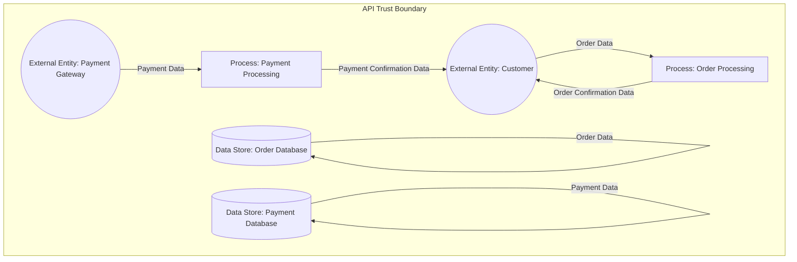

# Threat Model Report: OWASP Juice Shop Threat Model and Data Flow Analysis
**Generated on:** 2025-04-29 21:30:53 UTC

## Summary
The OWASP Juice Shop is an intentionally insecure web application designed for security training, exposing various vulnerabilities that can be exploited by attackers. As an internet-facing asset, it employs password-based authentication and handles confidential data, making it a prime target for malicious activities. 

The associated repositories contain the codebase for the Juice Shop, which includes the NextGen B2B API, facilitating customer orders through a secure JSON-based interface. This API is built on OpenAPI 3.0 specifications and integrates various components, including external entities, processes, data stores, and trust boundaries, which are crucial for understanding the data flows and interactions within the system.

The DataFlowReports highlight the intricate data flows between customers, the API, and the underlying databases, emphasizing the importance of secure communication channels and data integrity checks. Key insights reveal multiple trust boundaries that must be monitored to prevent unauthorized access and data tampering.

Several threats have been identified, including:
1. **Customer Impersonation**: Attackers may exploit weak authentication to impersonate legitimate customers, leading to unauthorized order submissions.
2. **Order Data Tampering**: Interception of order data can result in malicious modifications, affecting order integrity.
3. **Order Submission Flooding**: Attackers can overwhelm the API with excessive requests, causing service disruptions.
4. **Privilege Escalation via API Misuse**: Weak authorization mechanisms may allow attackers to perform unauthorized actions beyond their privileges.
5. **Sensitive Data Exposure**: Insecure data transmission can lead to unauthorized access to confidential order and payment information.

The potential impact of these threats is significant, with high-risk ratings assigned to many of them, indicating a critical need for robust mitigations. Recommended strategies include implementing multi-factor authentication, enforcing strong encryption protocols, conducting regular security assessments, and ensuring comprehensive audit logging to enhance accountability and traceability. Overall, the threat model underscores the necessity of a proactive security posture to safeguard the OWASP Juice Shop and its associated data flows.

## Asset Information
- **Name:** OWASP Juice Shop
- **Description:** An intentionally insecure web application for security training.
- **Internet Facing:** Yes
- **Authentication Type:** PASSWORD
- **Data Classification:** CONFIDENTIAL

## Repository Information
- **Name:** Juice Shop
- **Description:** None
- **URL:** None
## Data Flow Reports
### Report 1
**Overview:** This report provides a detailed overview of the data flows within the NextGen B2B API, which is designed to facilitate customer orders through a secure JSON-based interface. The API is built on OpenAPI 3.0 specifications and includes various components such as external entities, processes, data stores, and trust boundaries. Additionally, it integrates configuration data from external files to enhance its operational capabilities.

### Diagram 1

#### External Entities
- **Customer**: An external user or system that interacts with the API to create customer orders.
- **Payment Gateway**: An external service that processes payment transactions for customer orders.

#### Processes
- **Order Processing**: Handles the creation of customer orders based on the data received from the customer.
- **Payment Processing**: Handles payment transactions for customer orders.

#### Data Stores
- **Order Database**: Stores all customer orders and their details.
- **Payment Database**: Stores payment transaction details for customer orders.

#### Trust Boundaries
- **API Trust Boundary**: Defines the security perimeter for the API, separating external entities from internal processes and data stores.

## Threat Table
| Threat | STRIDE Category | Attack Vector | Impact Level | Risk Rating | Affected Components |
|---|---|---|---|---|---|
| Customer Impersonation | SPOOFING | An attacker obtains valid customer credentials through phishing or credential stuffing, then uses these to bypass authentication checks and submit orders via the API. | HIGH | HIGH | Customer |
| Order Data Tampering | TAMPERING | Exploitation of insecure communication channels or lack of data validation can allow an attacker to alter the order data en route to the API. | HIGH | HIGH | Customer |
| Order Submission Repudiation | REPUDIATION | Exploitation of insufficient logging on the API side may allow a customer to repudiate responsibility for order submissions. | MEDIUM | MEDIUM | Customer |
| Order Data Exposure | INFO_DISCLOSURE | Man-in-the-middle attacks or misconfigured API endpoints can allow interception of order data during transmission between the Customer and the API. | HIGH | HIGH | Customer |
| Order Submission Flooding | DOS | Automated scripts or bots sending high volumes of order submission requests can saturate system resources, resulting in service degradation or outage. | HIGH | HIGH | Customer |
| Privilege Escalation via API Misuse | ELEVATION_OF_PRIVG | An attacker uses a compromised customer account to invoke API functions without proper role checks, exploiting insufficient authorization controls. | HIGH | HIGH | Customer |
| Impersonation of Payment Gateway | SPOOFING | An adversary could employ DNS hijacking or fraudulent certificates to redirect payment processing requests (e.g., mimicking the Payment Processing data flow outlined in uuid_5) to a malicious endpoint. This might involve compromising network infrastructure or exploiting weak certificate validation mechanisms. | HIGH | HIGH | Payment Gateway |
| Tampering with Payment Data | TAMPERING | An attacker might intercept the Payment Processing data flow (uuid_5) and modify the payload (e.g., changing the amount or recipient details) before it reaches the Payment Gateway. This could be achieved by exploiting unencrypted communication channels or weak data integrity checks. | HIGH | HIGH | Payment Gateway |
| Repudiation of Payment Transactions | REPUDIATION | An attacker could exploit inadequate audit trails or logging mechanisms in the Payment Gateway, making it possible to deny or dispute valid transactions. This is particularly concerning when the service does not maintain secure logs for the Payment Processing flow (uuid_5). | MEDIUM | MEDIUM | Payment Gateway |
| Exposure of Sensitive Payment Information | INFO_DISCLOSURE | Attackers could target data in transit or at rest if payment data (as seen in the Payment Processing flow uuid_5) is not encrypted. This might involve man-in-the-middle attacks or exploiting vulnerabilities in data storage protocols. | HIGH | HIGH | Payment Gateway |
| Denial of Service on Payment Gateway | DOS | An attacker could send a high volume of fraudulent Payment Processing requests, or exploit resource-intensive operations within the Payment Gateway, rendering the service unable to process legitimate transactions. This can be executed via botnets or by abusing API endpoints. | HIGH | HIGH | Payment Gateway |
| Exploitation of Payment Gateway API Vulnerability | ELEVATION_OF_PRIVG | Attackers might identify and exploit vulnerabilities in the Payment Gateway API endpoints (e.g., insufficient authentication or input validation in the Payment Processing data flow uuid_5) to gain higher privileges or access administrative functions. This exploitation may involve bypassing authorization controls or leveraging software bugs. | HIGH | HIGH | Payment Gateway |
| Customer Impersonation | SPOOFING | Exploitation of weak authentication (password-based) and insecure session management in the public-facing OWASP Juice Shop application, enabling an attacker to inject crafted requests as a trusted customer. | HIGH | HIGH | Order Processing |
| Order Data Tampering | TAMPERING | Man-in-the-middle attacks or injection of malicious payloads in transit due to insufficient data integrity checks on incoming requests from the customer (via Order Submission data flow uuid_3). | HIGH | HIGH | Order Processing |
| Insufficient Audit Logging for Orders | REPUDIATION | Exploitation of inadequate or missing logging mechanisms in the order creation process, preventing proper trail of actions when disputes arise regarding order confirmation and modifications. | MEDIUM | MEDIUM | Order Processing |
| Order Confirmation Information Disclosure | INFO_DISCLOSURE | Leveraging unsecured or misconfigured communication channels in the Order Confirmation Flow (uuid_7), attackers can sniff network traffic to capture order details. | MEDIUM | MEDIUM | Order Processing |
| Order Flooding Denial of Service | DOS | Massive automated requests targeting the API endpoint for order submissions (via data flow from Customer), directly overloading system resources of the processing service. | HIGH | HIGH | Order Processing |
| Order Processing Elevation of Privilege | ELEVATION_OF_PRIVG | Exploitation of coding flaws or misconfigurations within the Order Processing component that can be triggered through carefully crafted 'Order Data' inputs, resulting in execution of privileged operations. | HIGH | HIGH | Order Processing |
| Payment Gateway Impersonation | SPOOFING | By forging credentials or exploiting a lack of mutual authentication, an attacker can impersonate the Payment Gateway and inject malicious Payment Data into the Payment Processing system. | HIGH | HIGH | Payment Processing |
| Payment Data Tampering | TAMPERING | An attacker intercepts the Payment Data (e.g., via man-in-the-middle attack on unsecured channels) and alters critical transaction details before they reach the Payment Processing component. | HIGH | HIGH | Payment Processing |
| Payment Confirmation Message Tampering | TAMPERING | An attacker intercepts outgoing Payment Confirmation data on the Payment Confirmation Flow (data flow uuid_5) and alters critical confirmation details before delivery to the customer (external entity id uuid_2). | MEDIUM | MEDIUM | Payment Processing |
| Insufficient Audit Logging of Payment Transactions | REPUDIATION | Exploiting gaps in audit logging and record-keeping, an attacker may perform unauthorized transactions and later repudiate these actions due to missing or tampered logs. | HIGH | MEDIUM | Payment Processing |
| Leakage of Confidential Payment Data | INFO_DISCLOSURE | An attacker might intercept unencrypted Payment Data or Payment Confirmation messages, or access improperly secured logs storing sensitive payment details, leading to data disclosure. | CRITICAL | HIGH | Payment Processing |
| Payment Processing Resource Exhaustion | DOS | Launching a high volume of requests from compromised sources or a botnet targeting the Payment Processing API to overload its processing capacity. | HIGH | HIGH | Payment Processing |
| Privilege Escalation via Malformed Payment Data | ELEVATION_OF_PRIVG | Crafting malformed or malicious Payment Data that bypasses input validations and leverages application vulnerabilities, resulting in privilege escalation within the Payment Processing component. | CRITICAL | HIGH | Payment Processing |
| Impersonation of Order Processing Service | SPOOFING | The attacker could obtain or forge credentials or tokens used by the order processing service to communicate with the Order Database. Once in possession of these credentials, the attacker could mimic the legitimate service's data flows (such as the 'Store Order Data' flow) to inject malicious orders. | HIGH | HIGH | Order Database |
| Order Data Tampering | TAMPERING | By intercepting the 'Store Order Data' flow between the Order Processing service and the database, an attacker could inject altered order details. This could be achieved if encryption is not enforced or if data integrity checks (such as digital signatures) are missing. | HIGH | HIGH | Order Database |
| Lack of Non-repudiation Logging in Order Transactions | REPUDIATION | An attacker could exploit the absence of robust logging mechanisms by modifying or deleting transactional logs, or by leveraging the system's inability to record user actions, thus escaping accountability for unauthorized changes or tampering. | MEDIUM | MEDIUM | Order Database |
| Unauthorized Access to Confidential Order Information | INFO_DISCLOSURE | An attacker could exploit vulnerabilities in access controls or misconfigured permissions on the Order Database. Combined with weak authentication (e.g. simple password-based mechanisms), this can lead to unauthorized disclosure of confidential order data. | HIGH | HIGH | Order Database |
| Order Database Overload (Denial of Service) | DOS | By targeting the 'Store Order Data' interface with a flood of requests or sending large volumes of data, an attacker could degrade the performance or crash the Order Database, rendering it unable to accept legitimate orders. | HIGH | HIGH | Order Database |
| Privilege Escalation via Misconfigured Database Access | ELEVATION_OF_PRIVG | If the Order Database does not enforce strict access control policies or has vulnerabilities in its authentication setup (e.g., default credentials or weak password policies), an attacker might bypass standard user privileges. This could allow them to perform administrative actions, including modifying or deleting data. | HIGH | MEDIUM | Order Database |
| Impersonation of Payment Processing Service | SPOOFING | The attacker forges credentials or mimics network traffic that appears to originate from the legitimate Payment Processing Service, sending malicious Payment Data into the Payment Database. | HIGH | HIGH | Payment Database |
| Tampering with Payment Transaction Data | TAMPERING | By exploiting vulnerabilities in the communication channels or weaknesses in data validation mechanisms, an attacker can alter the Payment Data as it leaves the Payment Processing service and before it is stored in the Payment Database. | HIGH | HIGH | Payment Database |
| Transaction Log Tampering Leading to Repudiation | REPUDIATION | Exploiting insufficient logging controls, an attacker may delete, modify, or forge transaction and audit trails stored in the Payment Database, making it difficult to determine the true history of payment transactions. | HIGH | MEDIUM | Payment Database |
| Unauthorized Access to Sensitive Payment Data | INFO_DISCLOSURE | The attacker leverages weak access controls or known vulnerabilities (such as SQL injection) in the Payment Database interface to retrieve or exfiltrate sensitive payment records. | HIGH | HIGH | Payment Database |
| Denial of Service on Payment Database | DOS | The attacker sends excessive traffic or specially crafted requests targeting the Payment Database, causing resource exhaustion or crashing the service. | HIGH | MEDIUM | Payment Database |
| Elevation of Privilege via Misconfiguration in Payment Database | ELEVATION_OF_PRIVG | A malicious user exploits weak or improperly configured access controls or vulnerabilities in the database management system to incrementally increase their privileges, eventually obtaining administrative control. | HIGH | HIGH | Payment Database |
| External Entity Impersonation | SPOOFING | The attacker exploits weak or misconfigured authentication mechanisms (e.g., stolen or forged credentials) to masquerade as a legitimate external entity. This can occur when interacting with the API endpoints defined by the trust boundary, especially if the underlying processes like Order Processing (uuid_6) and Payment Processing (uuid_8) rely on such credentials. | HIGH | HIGH | API Trust Boundary |
| Data Tampering Across Trust Boundary | TAMPERING | The attacker performs a man-in-the-middle attack or exploits vulnerabilities in data transmission protocols between components (e.g., Order Processing (uuid_6) and Payment Processing (uuid_8)) and data stores (Order Database uuid_9, Payment Database uuid_11). | HIGH | CRITICAL | API Trust Boundary |
| Insufficient Audit Trails at API Boundary | REPUDIATION | Attackers take advantage of poor logging mechanisms by performing transactions or altering data flows without leaving a traceable record. This lack of non-repudiation makes it difficult to hold them accountable during forensic analysis. | MEDIUM | MEDIUM | API Trust Boundary |
| Sensitive Data Exposure via API Boundary | INFO_DISCLOSURE | Attackers can eavesdrop on data flows between external entities and internal processes (e.g., between Customer (uuid_2) and Order Processing (uuid_6)) if data encryption is not enforced or if weak cipher suites are used. | HIGH | HIGH | API Trust Boundary |
| API Flooding and Resource Exhaustion | DOS | By sending a high volume of requests rapidly, attackers exploit the processing limits or misconfigured rate limiting on the API endpoints. The excessive load can disrupt services provided by services like Order Processing (uuid_6) and Payment Processing (uuid_8). | HIGH | HIGH | API Trust Boundary |
| Boundary Bypass for Privilege Escalation | ELEVATION_OF_PRIVG | By leveraging weaknesses in authentication, input validation, or misconfigured access control policies at the boundary, attackers can inject malicious payloads or reuse tokens to elevate their privileges from that boundary into internal components. | CRITICAL | CRITICAL | API Trust Boundary |

## Threats Identified
### Customer Impersonation
**Description:** An attacker may attempt to impersonate a legitimate customer to access and misuse the API. Exploiting weaknesses in the password-based authentication used by the OWASP Juice Shop asset, an attacker could use stolen credentials or phishing techniques to initiate fraudulent order submissions.
**STRIDE Category:** SPOOFING
**Affected Components:** Customer
**Attack Vector:** An attacker obtains valid customer credentials through phishing or credential stuffing, then uses these to bypass authentication checks and submit orders via the API.
**Impact Level:** HIGH
**Risk Rating:** HIGH
**Mitigations:**
- Implement multi-factor authentication and enforce strong password policies.
- Apply rate limiting and anomaly detection on authentication endpoints.
- Use secure communication channels (TLS) to safeguard credentials in transit.

### Order Data Tampering
**Description:** An attacker might intercept the order submission data from the Customer to the API and modify its contents. Such tampering could result in incorrect or malicious order details being processed, affecting order integrity and business logic.
**STRIDE Category:** TAMPERING
**Affected Components:** Customer
**Attack Vector:** Exploitation of insecure communication channels or lack of data validation can allow an attacker to alter the order data en route to the API.
**Impact Level:** HIGH
**Risk Rating:** HIGH
**Mitigations:**
- Enforce end-to-end TLS encryption.
- Implement data integrity checks (e.g., cryptographic signatures or checksums) on transmitted data.
- Validate and sanitize all incoming order data at the API.

### Order Submission Repudiation
**Description:** Without adequate audit logging, a customer could deny having submitted an order. This scenario increases the risk of disputes and hampers forensic investigations, undermining accountability.
**STRIDE Category:** REPUDIATION
**Affected Components:** Customer
**Attack Vector:** Exploitation of insufficient logging on the API side may allow a customer to repudiate responsibility for order submissions.
**Impact Level:** MEDIUM
**Risk Rating:** MEDIUM
**Mitigations:**
- Implement comprehensive audit logging with timestamps and unique transaction identifiers.
- Adopt digital signing for critical actions to ensure non-repudiation.
- Ensure logs are securely stored and tamper-resistant as per NIST guidelines.

### Order Data Exposure
**Description:** Order submission data originating from the Customer is classified as confidential. If transmitted or processed over insecure channels, sensitive data may be exposed to unauthorized parties, leading to potential financial or privacy implications.
**STRIDE Category:** INFO_DISCLOSURE
**Affected Components:** Customer
**Attack Vector:** Man-in-the-middle attacks or misconfigured API endpoints can allow interception of order data during transmission between the Customer and the API.
**Impact Level:** HIGH
**Risk Rating:** HIGH
**Mitigations:**
- Ensure all API communications are encrypted using strong TLS protocols.
- Configure secure headers and enforce strict certificate validations.
- Follow OWASP security best practices for API data exposure prevention.

### Order Submission Flooding
**Description:** A malicious actor, by masquerading as a legitimate Customer or abusing the submission endpoint, could flood the API with numerous order requests. This flood can overwhelm backend systems such as the order processing service, leading to service disruptions.
**STRIDE Category:** DOS
**Affected Components:** Customer
**Attack Vector:** Automated scripts or bots sending high volumes of order submission requests can saturate system resources, resulting in service degradation or outage.
**Impact Level:** HIGH
**Risk Rating:** HIGH
**Mitigations:**
- Implement rate limiting, throttling, and CAPTCHA mechanisms to mitigate automated attacks.
- Deploy intrusion detection/prevention systems (IDS/IPS) in line with NIST guidelines.
- Monitor traffic patterns to quickly identify and block anomalous activity.

### Privilege Escalation via API Misuse
**Description:** Exploiting weaknesses in the API's authorization mechanisms, an attacker could leverage a compromised Customer session to perform actions beyond typical customer privileges, potentially impacting internal processes.
**STRIDE Category:** ELEVATION_OF_PRIVG
**Affected Components:** Customer
**Attack Vector:** An attacker uses a compromised customer account to invoke API functions without proper role checks, exploiting insufficient authorization controls.
**Impact Level:** HIGH
**Risk Rating:** HIGH
**Mitigations:**
- Enforce strict role-based access controls and ensure proper separation of duties.
- Regularly audit API endpoints for adherence to minimum privilege principles.
- Implement security monitoring to detect abnormal account activity.

### Impersonation of Payment Gateway
**Description:** An attacker could impersonate the Payment Gateway by spoofing its identity, tricking the API or end users into sending payment details to a malicious service. Given the criticality of payment data, such an impersonation could lead to fraudulent transactions.
**STRIDE Category:** SPOOFING
**Affected Components:** Payment Gateway
**Attack Vector:** An adversary could employ DNS hijacking or fraudulent certificates to redirect payment processing requests (e.g., mimicking the Payment Processing data flow outlined in uuid_5) to a malicious endpoint. This might involve compromising network infrastructure or exploiting weak certificate validation mechanisms.
**Impact Level:** HIGH
**Risk Rating:** HIGH
**Mitigations:**
- Implement mutual TLS authentication between the API and Payment Gateway.
- Use certificate pinning and regular certificate audits.
- Follow OWASP guidelines for authentication and identity management.

### Tampering with Payment Data
**Description:** Malicious actors could tamper with the payment data transmitted between the API and the Payment Gateway, leading to altered transaction amounts or corrupted payment details.
**STRIDE Category:** TAMPERING
**Affected Components:** Payment Gateway
**Attack Vector:** An attacker might intercept the Payment Processing data flow (uuid_5) and modify the payload (e.g., changing the amount or recipient details) before it reaches the Payment Gateway. This could be achieved by exploiting unencrypted communication channels or weak data integrity checks.
**Impact Level:** HIGH
**Risk Rating:** HIGH
**Mitigations:**
- Enforce end-to-end encryption (e.g., TLS) for all payment-related data flows.
- Use digital signatures and integrity validation mechanisms.
- Adopt standards such as PCI DSS to secure payment transactions.

### Repudiation of Payment Transactions
**Description:** Without proper logging and non-repudiation controls, users or attackers might deny having conducted a payment transaction, leading to disputes over payment legitimacy.
**STRIDE Category:** REPUDIATION
**Affected Components:** Payment Gateway
**Attack Vector:** An attacker could exploit inadequate audit trails or logging mechanisms in the Payment Gateway, making it possible to deny or dispute valid transactions. This is particularly concerning when the service does not maintain secure logs for the Payment Processing flow (uuid_5).
**Impact Level:** MEDIUM
**Risk Rating:** MEDIUM
**Mitigations:**
- Implement secure, tamper-evident logging and audit trails with timestamps.
- Utilize digital receipts and transaction identifiers to ensure accountability.
- Follow NIST guidelines on audit and accountability.

### Exposure of Sensitive Payment Information
**Description:** Sensitive payment data could be exposed to unauthorized parties if proper confidentiality controls are not enforced, risking customer financial information leakage.
**STRIDE Category:** INFO_DISCLOSURE
**Affected Components:** Payment Gateway
**Attack Vector:** Attackers could target data in transit or at rest if payment data (as seen in the Payment Processing flow uuid_5) is not encrypted. This might involve man-in-the-middle attacks or exploiting vulnerabilities in data storage protocols.
**Impact Level:** HIGH
**Risk Rating:** HIGH
**Mitigations:**
- Apply strong encryption (e.g., TLS for transit, AES for storage) to all payment data.
- Enforce strict access controls and regularly audit access logs.
- Follow PCI DSS and ISO/IEC 27001 guidelines for data protection.

### Denial of Service on Payment Gateway
**Description:** The Payment Gateway may be overwhelmed by a flood of malicious requests, leading to downtime and disruption of payment processing.
**STRIDE Category:** DOS
**Affected Components:** Payment Gateway
**Attack Vector:** An attacker could send a high volume of fraudulent Payment Processing requests, or exploit resource-intensive operations within the Payment Gateway, rendering the service unable to process legitimate transactions. This can be executed via botnets or by abusing API endpoints.
**Impact Level:** HIGH
**Risk Rating:** HIGH
**Mitigations:**
- Implement rate limiting and traffic filtering at network and application layers.
- Deploy DoS protection systems and load balancers.
- Monitor traffic anomalies using intrusion detection systems (IDS) in line with NIST SP 800-53 controls.

### Exploitation of Payment Gateway API Vulnerability
**Description:** Weaknesses in the Payment Gateway API could allow attackers to escalate privileges and perform unauthorized operations, such as refunding, altering, or replaying payment transactions.
**STRIDE Category:** ELEVATION_OF_PRIVG
**Affected Components:** Payment Gateway
**Attack Vector:** Attackers might identify and exploit vulnerabilities in the Payment Gateway API endpoints (e.g., insufficient authentication or input validation in the Payment Processing data flow uuid_5) to gain higher privileges or access administrative functions. This exploitation may involve bypassing authorization controls or leveraging software bugs.
**Impact Level:** HIGH
**Risk Rating:** HIGH
**Mitigations:**
- Regularly conduct security assessments and penetration tests on the Payment Gateway API.
- Apply strict input validation, authentication, and authorization checks.
- Follow secure coding best practices as outlined in the OWASP ASVS and ensure timely patch management.

### Customer Impersonation
**Description:** An attacker may bypass authentication controls by exploiting vulnerabilities in the OWASP Juice Shop's intentionally insecure design, allowing them to impersonate a legitimate customer. By presenting falsified credentials or session tokens during order submission, the attacker can manipulate the 'Order Data' sent to the Order Processing component (uuid_6) to place unauthorized orders.
**STRIDE Category:** SPOOFING
**Affected Components:** Order Processing
**Attack Vector:** Exploitation of weak authentication (password-based) and insecure session management in the public-facing OWASP Juice Shop application, enabling an attacker to inject crafted requests as a trusted customer.
**Impact Level:** HIGH
**Risk Rating:** HIGH
**Mitigations:**
- Implement multi-factor authentication, enforce secure session management, and use strong token validation per OWASP ASVS guidelines.
- Utilize proper identity verification before processing order data.

### Order Data Tampering
**Description:** Attackers may intercept and manipulate the 'Order Data' sent to the Order Processing component, altering order details such as product quantities, prices, or customer information. This can result in financial loss or fulfillment errors.
**STRIDE Category:** TAMPERING
**Affected Components:** Order Processing
**Attack Vector:** Man-in-the-middle attacks or injection of malicious payloads in transit due to insufficient data integrity checks on incoming requests from the customer (via Order Submission data flow uuid_3).
**Impact Level:** HIGH
**Risk Rating:** HIGH
**Mitigations:**
- Enforce HTTPS/TLS for data transmission, perform robust input validation and integrity checks, and implement cryptographic signing of messages following NIST guidelines.

### Insufficient Audit Logging for Orders
**Description:** If the Order Processing component does not log critical events and user actions appropriately, both customers and attackers can repudiate improper or unauthorized transactions, complicating forensic investigations and accountability.
**STRIDE Category:** REPUDIATION
**Affected Components:** Order Processing
**Attack Vector:** Exploitation of inadequate or missing logging mechanisms in the order creation process, preventing proper trail of actions when disputes arise regarding order confirmation and modifications.
**Impact Level:** MEDIUM
**Risk Rating:** MEDIUM
**Mitigations:**
- Implement detailed audit logging with timestamped entries for all order-related actions, and use tamper-evident logging mechanisms as recommended by ISO/IEC 27001 standards.

### Order Confirmation Information Disclosure
**Description:** The output 'Order Confirmation' data, being sent back to the customer, might inadvertently contain sensitive details. If intercepted or exposed due to weak transmission protections, this could reveal confidential information about a customer’s order or system details.
**STRIDE Category:** INFO_DISCLOSURE
**Affected Components:** Order Processing
**Attack Vector:** Leveraging unsecured or misconfigured communication channels in the Order Confirmation Flow (uuid_7), attackers can sniff network traffic to capture order details.
**Impact Level:** MEDIUM
**Risk Rating:** MEDIUM
**Mitigations:**
- Ensure encryption is used (TLS/SSL) for all communications and sanitize confirmation messages to exclude sensitive internal details as per OWASP Secure Coding Practices.

### Order Flooding Denial of Service
**Description:** Attackers can overwhelm the Order Processing component by sending a high volume of bogus or malformed 'Order Data' requests. This can degrade the system’s performance, leading to service unavailability and impacting legitimate customers.
**STRIDE Category:** DOS
**Affected Components:** Order Processing
**Attack Vector:** Massive automated requests targeting the API endpoint for order submissions (via data flow from Customer), directly overloading system resources of the processing service.
**Impact Level:** HIGH
**Risk Rating:** HIGH
**Mitigations:**
- Implement rate limiting, CAPTCHA verification, and anomaly detection on order endpoints, following recommendations in the NIST SP 800-63 guidelines.

### Order Processing Elevation of Privilege
**Description:** Vulnerabilities in the order processing logic may allow an attacker to gain unauthorized privileges, potentially executing administrative functionalities or altering order management controls.
**STRIDE Category:** ELEVATION_OF_PRIVG
**Affected Components:** Order Processing
**Attack Vector:** Exploitation of coding flaws or misconfigurations within the Order Processing component that can be triggered through carefully crafted 'Order Data' inputs, resulting in execution of privileged operations.
**Impact Level:** HIGH
**Risk Rating:** HIGH
**Mitigations:**
- Conduct rigorous code reviews, deploy role-based access controls (RBAC), and use security testing practices such as dynamic analysis and penetration testing in line with OWASP guidelines.

### Payment Gateway Impersonation
**Description:** An attacker could impersonate the Payment Gateway to send fraudulent Payment Data to the Payment Processing component. This impersonation exploits potential weaknesses in authentication controls between the Payment Gateway (external entity: Payment Gateway, uuid_4) and the Payment Processing component (uuid_8), allowing unauthorized transactions to be initiated.
**STRIDE Category:** SPOOFING
**Affected Components:** Payment Processing
**Attack Vector:** By forging credentials or exploiting a lack of mutual authentication, an attacker can impersonate the Payment Gateway and inject malicious Payment Data into the Payment Processing system.
**Impact Level:** HIGH
**Risk Rating:** HIGH
**Mitigations:**
- Enforce mutual authentication between Payment Processing and Payment Gateway using cryptographic certificates and TLS.
- Implement strong API authentication and verification mechanisms based on OWASP guidelines.
- Regularly audit and update authentication protocols to mitigate impersonation risks.

### Payment Data Tampering
**Description:** An attacker may intercept and modify Payment Data being transmitted to Payment Processing from the Payment Gateway. Such tampering could result in fraudulent payments or altered transaction details.
**STRIDE Category:** TAMPERING
**Affected Components:** Payment Processing
**Attack Vector:** An attacker intercepts the Payment Data (e.g., via man-in-the-middle attack on unsecured channels) and alters critical transaction details before they reach the Payment Processing component.
**Impact Level:** HIGH
**Risk Rating:** HIGH
**Mitigations:**
- Implement end-to-end encryption (TLS) for all data in transit.
- Use cryptographic signing and integrity checks to ensure data has not been altered.
- Deploy input validation and data integrity checks based on NIST and OWASP guidelines.

### Payment Confirmation Message Tampering
**Description:** Interception and modification of Payment Confirmation messages en route to customers can result in incorrect transaction statuses being communicated, potentially misleading customers about their payment results.
**STRIDE Category:** TAMPERING
**Affected Components:** Payment Processing
**Attack Vector:** An attacker intercepts outgoing Payment Confirmation data on the Payment Confirmation Flow (data flow uuid_5) and alters critical confirmation details before delivery to the customer (external entity id uuid_2).
**Impact Level:** MEDIUM
**Risk Rating:** MEDIUM
**Mitigations:**
- Use message signing techniques and TLS to secure data in transit.
- Implement data integrity checks to verify that confirmation messages have not been tampered with.
- Perform regular security audits to validate the protection measures.

### Insufficient Audit Logging of Payment Transactions
**Description:** Lack of comprehensive logging in the Payment Processing component could allow malicious actors to deny involvement in fraudulent activities. Without proper audit trails, it becomes difficult to perform forensic analysis or hold entities accountable.
**STRIDE Category:** REPUDIATION
**Affected Components:** Payment Processing
**Attack Vector:** Exploiting gaps in audit logging and record-keeping, an attacker may perform unauthorized transactions and later repudiate these actions due to missing or tampered logs.
**Impact Level:** HIGH
**Risk Rating:** MEDIUM
**Mitigations:**
- Implement comprehensive and tamper-resistant logging following NIST guidelines.
- Ensure that all transaction requests and responses are timestamped and stored in an immutable format.
- Regularly review and audit logs to detect anomalies.

### Leakage of Confidential Payment Data
**Description:** Payment Processing handles sensitive payment information that is classified as Confidential under the OWASP Juice Shop asset. Inadequate protection mechanisms could result in exposure of this sensitive data to unauthorized parties.
**STRIDE Category:** INFO_DISCLOSURE
**Affected Components:** Payment Processing
**Attack Vector:** An attacker might intercept unencrypted Payment Data or Payment Confirmation messages, or access improperly secured logs storing sensitive payment details, leading to data disclosure.
**Impact Level:** CRITICAL
**Risk Rating:** HIGH
**Mitigations:**
- Enforce data encryption both in transit (using TLS) and at rest.
- Apply strict access control and data masking to sensitive logs.
- Utilize ISO and NIST standards for data protection and regularly perform vulnerability assessments.

### Payment Processing Resource Exhaustion
**Description:** An attacker may perform a Denial of Service (DoS) attack by flooding the Payment Processing component with a high volume of bogus Payment Data requests. This can exhaust system resources, leading to service unavailability for legitimate transactions.
**STRIDE Category:** DOS
**Affected Components:** Payment Processing
**Attack Vector:** Launching a high volume of requests from compromised sources or a botnet targeting the Payment Processing API to overload its processing capacity.
**Impact Level:** HIGH
**Risk Rating:** HIGH
**Mitigations:**
- Deploy rate limiting, input validation, and automated request throttling mechanisms.
- Leverage a Web Application Firewall (WAF) and load balancers to absorb traffic spikes.
- Conduct regular DoS resilience testing in line with NIST guidelines.

### Privilege Escalation via Malformed Payment Data
**Description:** An attacker might exploit vulnerabilities in the Payment Processing component by sending malformed Payment Data, potentially triggering buffer overflows or injection flaws that could allow escalation of privileges or unauthorized code execution.
**STRIDE Category:** ELEVATION_OF_PRIVG
**Affected Components:** Payment Processing
**Attack Vector:** Crafting malformed or malicious Payment Data that bypasses input validations and leverages application vulnerabilities, resulting in privilege escalation within the Payment Processing component.
**Impact Level:** CRITICAL
**Risk Rating:** HIGH
**Mitigations:**
- Employ rigorous input validation and secure coding practices aligned with OWASP recommendations.
- Regularly perform vulnerability scanning and conduct code reviews, including fuzz testing.
- Implement runtime protections and sandboxing mechanisms to minimize damage from exploited vulnerabilities.

### Impersonation of Order Processing Service
**Description:** An attacker could exploit weak authentication between the Order Processing service and the Order Database by spoofing the identity of the legitimate order processing service. This could allow fake or malicious order data to be sent to the Order Database.
**STRIDE Category:** SPOOFING
**Affected Components:** Order Database
**Attack Vector:** The attacker could obtain or forge credentials or tokens used by the order processing service to communicate with the Order Database. Once in possession of these credentials, the attacker could mimic the legitimate service's data flows (such as the 'Store Order Data' flow) to inject malicious orders.
**Impact Level:** HIGH
**Risk Rating:** HIGH
**Mitigations:**
- Enforce strong mutual authentication between services using mechanisms such as mutual TLS or certificate-based authentication (NIST SP 800-63).
- Implement strict access controls and monitor for unusual authentication patterns.
- Regularly rotate credentials and use multi-factor authentication where applicable.

### Order Data Tampering
**Description:** An attacker could modify or alter the order data in transit or at rest, compromising the integrity of customer orders stored in the Order Database.
**STRIDE Category:** TAMPERING
**Affected Components:** Order Database
**Attack Vector:** By intercepting the 'Store Order Data' flow between the Order Processing service and the database, an attacker could inject altered order details. This could be achieved if encryption is not enforced or if data integrity checks (such as digital signatures) are missing.
**Impact Level:** HIGH
**Risk Rating:** HIGH
**Mitigations:**
- Employ end-to-end encryption (e.g., TLS) for data in transit.
- Use cryptographic hashes or digital signatures to verify the integrity of order data.
- Implement additional integrity checks at the database level.

### Lack of Non-repudiation Logging in Order Transactions
**Description:** Insufficient logging and audit trails in the Order Database may allow attackers or legitimate users to deny having performed certain actions, making it difficult to trace malicious activities.
**STRIDE Category:** REPUDIATION
**Affected Components:** Order Database
**Attack Vector:** An attacker could exploit the absence of robust logging mechanisms by modifying or deleting transactional logs, or by leveraging the system's inability to record user actions, thus escaping accountability for unauthorized changes or tampering.
**Impact Level:** MEDIUM
**Risk Rating:** MEDIUM
**Mitigations:**
- Implement centralized, tamper-evident logging mechanisms that record all access and data modification events (NIST SP 800-92).
- Ensure logs are maintained in a secure, read-only environment.
- Perform regular audits and cross-boundary log correlation.

### Unauthorized Access to Confidential Order Information
**Description:** Due to the internet-facing nature of the asset, there is a risk that unauthorized users might access sensitive order data stored in the Order Database.
**STRIDE Category:** INFO_DISCLOSURE
**Affected Components:** Order Database
**Attack Vector:** An attacker could exploit vulnerabilities in access controls or misconfigured permissions on the Order Database. Combined with weak authentication (e.g. simple password-based mechanisms), this can lead to unauthorized disclosure of confidential order data.
**Impact Level:** HIGH
**Risk Rating:** HIGH
**Mitigations:**
- Implement role-based access control (RBAC) and least privilege principles (OWASP ASVS).
- Ensure data is encrypted at rest and in transit.
- Conduct regular security assessments and penetration testing.

### Order Database Overload (Denial of Service)
**Description:** An attacker could overwhelm the Order Database with excessive data or malformed requests, leading to resource exhaustion and a denial of service for legitimate order transactions.
**STRIDE Category:** DOS
**Affected Components:** Order Database
**Attack Vector:** By targeting the 'Store Order Data' interface with a flood of requests or sending large volumes of data, an attacker could degrade the performance or crash the Order Database, rendering it unable to accept legitimate orders.
**Impact Level:** HIGH
**Risk Rating:** HIGH
**Mitigations:**
- Implement rate limiting and input validation to mitigate abusive traffic.
- Use network firewalls and intrusion detection systems (IDS) to monitor and block abnormal request patterns.
- Employ redundancy and load balancing to distribute traffic effectively.

### Privilege Escalation via Misconfigured Database Access
**Description:** Weak or misconfigured access controls on the Order Database could be exploited by attackers to gain higher privileges, leading to unauthorized execution of administrative functions.
**STRIDE Category:** ELEVATION_OF_PRIVG
**Affected Components:** Order Database
**Attack Vector:** If the Order Database does not enforce strict access control policies or has vulnerabilities in its authentication setup (e.g., default credentials or weak password policies), an attacker might bypass standard user privileges. This could allow them to perform administrative actions, including modifying or deleting data.
**Impact Level:** HIGH
**Risk Rating:** MEDIUM
**Mitigations:**
- Enforce the principle of least privilege and ensure that only authorized roles have administrative access.
- Regularly update and patch database software.
- Remove default credentials, implement strong password policies, and consider multi-factor authentication.

### Impersonation of Payment Processing Service
**Description:** An attacker may spoof the identity of the legitimate Payment Processing Service when sending Payment Data to the Payment Database. By impersonating this trusted service, an attacker could inject fraudulent or manipulated payment transactions. This threat is particularly plausible given the use of password-based authentication in the OWASP Juice Shop asset, which may be exploited if weak or reused credentials are discovered.
**STRIDE Category:** SPOOFING
**Affected Components:** Payment Database
**Attack Vector:** The attacker forges credentials or mimics network traffic that appears to originate from the legitimate Payment Processing Service, sending malicious Payment Data into the Payment Database.
**Impact Level:** HIGH
**Risk Rating:** HIGH
**Mitigations:**
- Implement strong mutual authentication mechanisms (e.g., certificate-based auth) between services.
- Enforce multi-factor authentication.
- Use secure API keys and tokens to validate legitimate sources.
- Regularly audit authentication logs for anomalies.

### Tampering with Payment Transaction Data
**Description:** An attacker might intercept and alter the Payment Data in transit to the Payment Database or tamper with data stored on disk. This could include modifying transaction amounts, dates, or account details, leading to incorrect records being stored and financial loss.
**STRIDE Category:** TAMPERING
**Affected Components:** Payment Database
**Attack Vector:** By exploiting vulnerabilities in the communication channels or weaknesses in data validation mechanisms, an attacker can alter the Payment Data as it leaves the Payment Processing service and before it is stored in the Payment Database.
**Impact Level:** HIGH
**Risk Rating:** HIGH
**Mitigations:**
- Use end-to-end encryption (e.g., TLS) for data in transit.
- Implement cryptographic checksums or digital signatures to verify data integrity.
- Validate and sanitize incoming data at the Payment Database interface.
- Conduct regular security testing and code reviews.

### Transaction Log Tampering Leading to Repudiation
**Description:** If audit logs and transaction records in the Payment Database are not adequately secured, an attacker may alter or delete logs to repudiate fraudulent transactions. This could lead to disputes and financial losses as the integrity of the audit trail is compromised.
**STRIDE Category:** REPUDIATION
**Affected Components:** Payment Database
**Attack Vector:** Exploiting insufficient logging controls, an attacker may delete, modify, or forge transaction and audit trails stored in the Payment Database, making it difficult to determine the true history of payment transactions.
**Impact Level:** HIGH
**Risk Rating:** MEDIUM
**Mitigations:**
- Implement secure, tamper-evident logging mechanisms (e.g., blockchain-based logs, write-once storage).
- Ensure that logs are stored separately and protected from modification.
- Use digital signatures on logs to detect tampering.
- Adhere to standards such as NIST SP 800-92 for log management.

### Unauthorized Access to Sensitive Payment Data
**Description:** An attacker could exploit vulnerabilities in the Payment Database to gain unauthorized access to confidential payment information, including sensitive customer and transaction details. This exposure is critical given the classified nature of the data (Confidential) and the internet-facing nature of the associated asset, OWASP Juice Shop.
**STRIDE Category:** INFO_DISCLOSURE
**Affected Components:** Payment Database
**Attack Vector:** The attacker leverages weak access controls or known vulnerabilities (such as SQL injection) in the Payment Database interface to retrieve or exfiltrate sensitive payment records.
**Impact Level:** HIGH
**Risk Rating:** HIGH
**Mitigations:**
- Enforce strict access control policies and role-based access control.
- Use encryption for both data at rest and data in transit.
- Perform regular vulnerability assessments and secure code reviews.
- Adhere to OWASP guidelines to mitigate injection and related vulnerabilities.

### Denial of Service on Payment Database
**Description:** An attacker may launch a denial-of-service (DoS) attack against the Payment Database by bombarding it with a high volume of requests or malformed Payment Data. This can overwhelm the database resources, leading to service unavailability for legitimate payment transactions.
**STRIDE Category:** DOS
**Affected Components:** Payment Database
**Attack Vector:** The attacker sends excessive traffic or specially crafted requests targeting the Payment Database, causing resource exhaustion or crashing the service.
**Impact Level:** HIGH
**Risk Rating:** MEDIUM
**Mitigations:**
- Implement rate limiting and traffic filtering.
- Deploy load balancers and redundant database configurations.
- Monitor and alert on abnormal traffic patterns.
- Design the system to gracefully degrade in the face of high load.

### Elevation of Privilege via Misconfiguration in Payment Database
**Description:** Inadequate configuration of user roles and permissions may allow an attacker to escalate their privilege from a lower-level user to an administrative role within the Payment Database. Gaining admin rights could allow the attacker to alter or extract sensitive data and manipulate critical payments.
**STRIDE Category:** ELEVATION_OF_PRIVG
**Affected Components:** Payment Database
**Attack Vector:** A malicious user exploits weak or improperly configured access controls or vulnerabilities in the database management system to incrementally increase their privileges, eventually obtaining administrative control.
**Impact Level:** HIGH
**Risk Rating:** HIGH
**Mitigations:**
- Follow the principle of least privilege for all database users.
- Regularly audit and update database configurations and permissions.
- Apply patches and security updates promptly.
- Employ intrusion detection systems to monitor unauthorized escalation attempts.

### External Entity Impersonation
**Description:** Attackers may impersonate authorized external entities such as 'Customer' or 'Payment Gateway' to bypass authentication controls at the API Trust Boundary. By faking identities, an attacker can send fraudulent order or payment data into the system, causing unauthorized transactions and operational disruption.
**STRIDE Category:** SPOOFING
**Affected Components:** API Trust Boundary
**Attack Vector:** The attacker exploits weak or misconfigured authentication mechanisms (e.g., stolen or forged credentials) to masquerade as a legitimate external entity. This can occur when interacting with the API endpoints defined by the trust boundary, especially if the underlying processes like Order Processing (uuid_6) and Payment Processing (uuid_8) rely on such credentials.
**Impact Level:** HIGH
**Risk Rating:** HIGH
**Mitigations:**
- Implement strong multi-factor authentication and robust identity verification protocols.
- Enforce certificate and token validation as per NIST SP 800-63 guidelines.
- Regularly review and update access credentials and monitor authentication logs.

### Data Tampering Across Trust Boundary
**Description:** An attacker may modify data in transit between external entities and internal processes by intercepting and altering JSON payloads or other data types at the API Trust Boundary. Such tampering could lead to issues like incorrect order submission or fraudulent payment transactions.
**STRIDE Category:** TAMPERING
**Affected Components:** API Trust Boundary
**Attack Vector:** The attacker performs a man-in-the-middle attack or exploits vulnerabilities in data transmission protocols between components (e.g., Order Processing (uuid_6) and Payment Processing (uuid_8)) and data stores (Order Database uuid_9, Payment Database uuid_11).
**Impact Level:** HIGH
**Risk Rating:** CRITICAL
**Mitigations:**
- Enforce end-to-end encryption (TLS/SSL) to ensure the integrity of transmitted data.
- Implement data integrity checks, such as digital signatures and hashing.
- Conduct regular security assessments and penetration testing following OWASP recommendations.

### Insufficient Audit Trails at API Boundary
**Description:** Without proper logging and audit trails at the API Trust Boundary, actions taken by external entities (e.g., submission of Order Data by a Customer (uuid_2)) might not be reliably traced, allowing attackers to repudiate malicious activities.
**STRIDE Category:** REPUDIATION
**Affected Components:** API Trust Boundary
**Attack Vector:** Attackers take advantage of poor logging mechanisms by performing transactions or altering data flows without leaving a traceable record. This lack of non-repudiation makes it difficult to hold them accountable during forensic analysis.
**Impact Level:** MEDIUM
**Risk Rating:** MEDIUM
**Mitigations:**
- Implement robust, tamper-evident logging mechanisms and immutable audit trails.
- Ensure logs capture sufficient detail on authentication, data flow events, and privilege changes following NIST and ISO guidelines.
- Regularly audit and monitor log integrity.

### Sensitive Data Exposure via API Boundary
**Description:** Unprotected sensitive data such as 'Order Data', 'Payment Data', and their confirmations traversing the API Trust Boundary can be intercepted by attackers, leading to unauthorized information disclosure of confidential details.
**STRIDE Category:** INFO_DISCLOSURE
**Affected Components:** API Trust Boundary
**Attack Vector:** Attackers can eavesdrop on data flows between external entities and internal processes (e.g., between Customer (uuid_2) and Order Processing (uuid_6)) if data encryption is not enforced or if weak cipher suites are used.
**Impact Level:** HIGH
**Risk Rating:** HIGH
**Mitigations:**
- Enforce encryption in-transit using strong cryptographic protocols (e.g., TLS 1.2/1.3).
- Implement data masking where appropriate and robust access control measures.
- Follow OWASP guidelines on sensitive data exposure.

### API Flooding and Resource Exhaustion
**Description:** An attacker may launch a denial-of-service attack by flooding the API Trust Boundary with a large number of requests, overwhelming system resources and hindering legitimate transactions such as order submissions or payment processing.
**STRIDE Category:** DOS
**Affected Components:** API Trust Boundary
**Attack Vector:** By sending a high volume of requests rapidly, attackers exploit the processing limits or misconfigured rate limiting on the API endpoints. The excessive load can disrupt services provided by services like Order Processing (uuid_6) and Payment Processing (uuid_8).
**Impact Level:** HIGH
**Risk Rating:** HIGH
**Mitigations:**
- Implement rate limiting, throttling, and load balancing to manage the inbound traffic.
- Deploy DDoS mitigation strategies and monitoring tools as recommended by OWASP.
- Regularly test and update infrastructure capacity in line with best practices.

### Boundary Bypass for Privilege Escalation
**Description:** An attacker could exploit vulnerabilities at the API Trust Boundary to bypass security controls and gain elevated privileges, potentially accessing or modifying internal systems such as Order Processing or Payment Processing in an unauthorized manner.
**STRIDE Category:** ELEVATION_OF_PRIVG
**Affected Components:** API Trust Boundary
**Attack Vector:** By leveraging weaknesses in authentication, input validation, or misconfigured access control policies at the boundary, attackers can inject malicious payloads or reuse tokens to elevate their privileges from that boundary into internal components.
**Impact Level:** CRITICAL
**Risk Rating:** CRITICAL
**Mitigations:**
- Conduct regular security testing, including fuzzing and penetration testing against the API endpoints.
- Implement strict access controls with role-based permissions and validate all inputs rigorously.
- Apply best practices based on ISO/IEC 27001 and OWASP guidelines to secure privilege boundaries.

# Files:
## Reviewed
- **frontend/src/app/roles.ts**: This file may define roles and permissions, which could be relevant to the security aspects of the API.
- **frontend/src/app/contact/contact.component.ts**: Component may facilitate customer contact, relevant for customer interactions.
- **config/quiet.yml**: Configuration file that may contain relevant settings for the API, potentially related to data flows.
- **frontend/tsconfig.json**: Main TypeScript configuration file, relevant for understanding the application structure.
- **frontend/src/app/payment/payment.component.ts**: This component is likely involved in the payment process, which is relevant to the overall order processing.
- **frontend/src/app/order-completion/order-completion.component.ts**: This component likely handles the order completion process, which is directly related to the Order Processing and Order Confirmation flows in the Data Flow Report.
- **frontend/src/app/Models/securityQuestion.model.ts**: This model may relate to security questions for customer verification, relevant for order submissions.
- **frontend/tsconfig.base.json**: Base configuration file that could influence the overall application setup.
- **config/bodgeit.yml**: Configuration file that may contain relevant settings for the API, potentially related to data flows.
- **config/juicebox.yml**: Configuration file that may contain relevant settings for the API, potentially related to data flows.
- **frontend/src/app/oauth/oauth.component.ts**: Component likely handles OAuth for customer authentication, relevant for API interactions.
- **frontend/src/app/Services/keys.service.ts**: This service may manage API keys or other sensitive data, relevant for security.
- **lib/config.types.ts**: This file likely contains type definitions relevant to the API's configuration, which may include data structures for order and payment processing.
- **models/wallet.ts**: This file may define the wallet model, which could be relevant to payment processing.
- **frontend/webpack.angular.js**: Build configuration that may affect how the API is served and interacts with data.
- **frontend/src/app/Services/code-snippet.service.ts**: This service may manage code snippets, which could be relevant for API interactions.
- **frontend/src/app/order-summary/order-summary.component.ts**: This component likely summarizes order details, which is relevant to the Order Processing and Order Confirmation flows.
- **routes/authenticatedUsers.ts**: This file likely handles authentication for users, which is relevant to the Customer external entity.
- **frontend/src/app/Services/address.service.ts**: This service likely handles address-related data, which may be relevant for customer orders.
- **config/config.yaml**: This configuration file may contain settings related to the API, which are important for understanding data flows.
- **routes/web3Wallet.ts**: This file may handle web3 wallet interactions, which could be relevant for customer order processing.
- **frontend/src/app/Services/delivery.service.ts**: This service may handle delivery-related data, which is relevant to customer orders.
- **frontend/src/app/Services/track-order.service.ts**: This service likely handles order tracking, which is directly related to the Order Processing process in the Data Flow Report.
- **models/quantity.ts**: This file may define the quantity model, which is relevant to order submissions.
- **frontend/src/app/feedback-details/feedback-details.component.html**: Component may display feedback related to orders or payments.
- **frontend/src/app/app.guard.ts**: This file may contain guards that manage access to routes, potentially relevant for securing API interactions.
- **frontend/src/app/wallet/wallet.component.ts**: This component may be involved in customer order management, relevant to the data flow.
- **frontend/src/app/Services/data-subject.service.ts**: This service may manage data subjects, relevant for customer data handling.
- **frontend/src/app/token-sale/token-sale.component.ts**: This component may handle customer interactions related to order submissions, relevant to the data flow.
- **models/product.ts**: This file likely defines the product model, which is relevant to customer orders.
- **frontend/src/app/Services/code-fixes.service.ts**: This service may handle data related to code fixes, potentially relevant to the API.
- **frontend/src/app/Services/wallet.service.ts**: This file may handle payment-related operations, relevant to the Payment Gateway external entity.
- **routes/order.ts**: This file likely contains the logic for handling order submissions and processing, which is directly relevant to the Order Processing process in the Data Flow Report.
- **frontend/src/app/data-export/data-export.component.ts**: Component may handle data exports, potentially relevant for order or payment data.
- **lib/webhook.ts**: This file may contain logic related to handling incoming data from external entities, which is relevant to the data flow of customer orders.
- **frontend/src/assets/public/ContractABIs.ts**: This file may contain relevant contract ABIs that could be related to the API's data flows and interactions.
- **routes/orderHistory.ts**: This file likely contains logic related to retrieving or processing order data, which is directly relevant to the Order Processing component in the Data Flow Report.
- **config.schema.yml**: This schema file may define the structure of configurations, which could be relevant to the API's data handling.
- **frontend/src/app/delivery-method/delivery-method.component.ts**: This file may handle the selection of delivery methods, which could be relevant to the order processing.
- **data/mongodb.ts**: This file likely contains code related to database interactions, which is relevant for the Order Database data store.
- **frontend/src/app/web3-sandbox/web3-sandbox.component.ts**: This component may facilitate interactions with the API, relevant to customer order submissions.
- **frontend/src/app/Services/chatbot.service.ts**: This service may interact with customers, potentially relevant to order processing.
- **frontend/src/main.ts**: Main entry point for the application, likely contains initialization logic for the API interactions.
- **frontend/src/app/Services/basket.service.ts**: This service likely manages the shopping basket, which is relevant for order submissions.
- **config/default.yml**: Configuration files in the config directory may contain important settings related to data flows or processes.
- **threat-model.json**: This file may provide insights into security considerations related to data flows.
- **config/mozilla.yml**: Configuration file that may contain relevant settings for the API, potentially related to data flows.
- **frontend/src/tsconfig.spec.json**: Configuration file for tests, may provide context for testing data flows.
- **frontend/src/app/Services/user.service.ts**: This file likely contains the service logic for user-related operations, which may include interactions with external entities like customers.
- **config/fbctf.yml**: Configuration file that may contain relevant settings for the API, potentially related to data flows.
- **frontend/src/app/Models/product.model.ts**: This model likely represents product data, which is relevant for customer orders.
- **routes/delivery.ts**: This file may handle data flows related to order delivery, which is relevant to the overall order processing.
- **Dockerfile**: Matched include rule.
- **frontend/src/app/user-details/user-details.component.ts**: This component may handle user information, which is relevant to customer interactions with the API.
- **config/tutorial.yml**: Configuration file that may contain relevant settings for the API, potentially related to data flows.
- **routes/verify.ts**: This file may contain routing logic that is essential for verifying customer orders, which is relevant to the Order Submission data flow.
- **config/test.yml**: Configuration file that may contain relevant settings for the API, potentially related to data flows.
- **routes/appConfiguration.ts**: This file likely contains routing logic for the API, which is critical for understanding how data flows through the system.
- **routes/videoHandler.ts**: This file may handle video-related requests, which could be relevant if video data is part of the order process.
- **frontend/src/app/Services/country-mapping.service.ts**: This service may handle country-specific data, relevant for order processing.
- **frontend/src/app/Services/local-backup.service.ts**: This service may manage local backups of data, relevant for data integrity.
- **frontend/src/environments/environment.ts**: Contains environment configuration which may include API endpoints and settings relevant to data flows.
- **frontend/src/app/Services/languages.service.ts**: This service may handle language preferences, which could be relevant for customer interactions.
- **frontend/src/app/welcome/welcome.component.ts**: This component may provide user onboarding related to order processing, relevant to the data flow.
- **frontend/src/app/wallet-web3/wallet-web3.component.ts**: This component may interact with the API for order processing, relevant to customer order flows.
- **package.json**: This file may contain dependencies relevant to the API's functionality.
- **config/unsafe.yml**: Configuration file that may contain relevant settings for the API, potentially related to data flows.
- **frontend/src/app/wallet-web3/wallet-web3.module.ts**: This module may handle interactions with payment methods or wallets, relevant to the Payment Gateway.
- **frontend/src/app/Services/configuration.service.ts**: This service may manage configurations that could impact data flows in the API.
- **swagger.yml**: Matched include rule.
- **app.ts**: This file likely contains source code relevant to the API's functionality, which is critical for understanding data flows.
- **models/basket.ts**: This file may define the basket model, which could be relevant to order submissions.
- **models/securityQuestion.ts**: This file may define security questions related to user authentication, which is relevant to the customer entity.
- **frontend/src/app/Services/complaint.service.ts**: This service may manage complaints related to customer orders, relevant to the order processing.
- **frontend/src/app/login/login.component.ts**: This file likely contains the logic for the login component, which may interact with the API for customer order submissions.
- **frontend/src/app/Services/feedback.service.ts**: This service may handle customer feedback related to orders, relevant to the data flow.
- **config/oss.yml**: Configuration file that may contain relevant settings for the API, potentially related to data flows.
- **frontend/src/app/app.module.ts**: This file likely contains the main application module, which may include configurations for services and components related to the API.
- **frontend/src/tsconfig.app.json**: Configuration file that may define settings relevant to the application, possibly impacting data flow.
- **frontend/src/app/basket/basket.component.ts**: Component likely manages the shopping basket, relevant for order submission.
- **frontend/src/index.html**: The main entry point for the frontend application, which may include references to critical components.
- **frontend/src/app/Services/captcha.service.ts**: This service may handle CAPTCHA-related data, which could be relevant for customer order submissions.
- **routes/dataExport.ts**: This file may involve data flows related to exporting order or payment data, which is relevant to the data stores.
- **frontend/src/app/nft-unlock/nft-unlock.component.ts**: Component may relate to unlocking features for customers, potentially relevant.
- **frontend/src/app/payment-method/payment-method.component.ts**: This file likely contains code related to payment processing, which is relevant to the Payment Gateway and Payment Processing components in the Data Flow Report.
- **frontend/src/app/forgot-password/forgot-password.component.ts**: Component may handle user authentication, relevant for customer interactions.
- **frontend/src/app/Models/deliveryMethod.model.ts**: This model likely represents delivery methods, which are relevant for order processing.
- **frontend/src/test.ts**: Potentially contains code related to the API's functionality, though primarily a test file.
- **routes/wallet.ts**: This file may handle wallet-related functionalities, potentially relevant for customer transactions.
- **README.md**: Matched include rule.
- **routes/currentUser.ts**: This file likely retrieves the current user's information, which is relevant to the Customer external entity.
- **routes/trackOrder.ts**: This file likely handles tracking of orders, which is relevant to the Order Processing component.
- **frontend/src/app/Services/administration.service.ts**: This service may manage administrative tasks related to order processing.
- **frontend/src/app/app.component.ts**: Main application component likely orchestrates data flow and interactions with the API.
- **frontend/src/app/Models/review.model.ts**: This model may relate to customer feedback on orders, relevant for understanding customer interactions.
- **frontend/src/app/feedback-details/feedback-details.component.ts**: This file may provide feedback related to orders, which could be relevant to the order confirmation process.
- **app.json**: This file likely contains configuration details relevant to the API, which may include data flows or external entities.
- **frontend/src/app/Services/image-captcha.service.ts**: This service may handle image-based CAPTCHA, relevant for customer order submissions.
- **frontend/src/app/app.routing.ts**: This file likely defines the routing for the application, which may include routes for customer order submissions.
- **frontend/src/app/complaint/complaint.component.ts**: Component may handle complaints related to orders, relevant for customer interactions.
- **routes/b2bOrder.ts**: This file likely contains the logic for handling B2B orders, which is directly relevant to the Order Processing process in the Data Flow Report.
- **server.ts**: This file likely contains the main server logic, which is critical for handling API requests and responses, directly related to the Order Processing process.
- **data/datacache.ts**: Source code files that may contain logic for handling data flows or processing.
- **models/index.ts**: This file likely serves as an entry point for the models, which may include definitions relevant to the data structures used in the API.
- **monitoring/grafana-dashboard.json**: This file may provide monitoring insights related to the API's data flows.
- **config/ctf.yml**: Configuration file that may contain relevant settings for the API, potentially related to data flows.
- **lib/logger.ts**: This file may contain logging functionality that is relevant for monitoring data flows.
- **frontend/src/app/Services/photo-wall.service.ts**: This service may manage data related to customer interactions, potentially relevant to the API.
- **config/addo.yml**: Configuration file that may contain relevant settings for the API, potentially related to data flows.
- **data/datacreator.ts**: Source code files that may contain logic for handling data flows or processing.
- **config/7ms.yml**: Configuration files in the config directory may contain important settings related to data flows or processes.
- **frontend/src/environments/environment.prod.ts**: Contains environment configuration which may include API endpoints and settings relevant to data flows.
- **frontend/src/app/Services/photo-wall.service.spec.ts**: While this is a test file, it may provide insights into the functionality of the photo wall service.
- **models/user.ts**: This file likely defines the user model, which is relevant to the Customer external entity.
- **frontend/src/app/Services/order-history.service.ts**: This file likely contains logic related to handling customer orders, which is directly relevant to the Order Processing process in the Data Flow Report.
- **frontend/src/app/Services/payment.service.ts**: This file may handle payment processing, which is relevant to the order submission and confirmation flows.
- **frontend/src/app/order-history/order-history.component.ts**: This component may provide functionality related to viewing past orders, which is relevant to the Order Database.
- **frontend/src/app/Services/form-submit.service.ts**: This service likely handles form submissions, which is critical for order submissions.
- **frontend/src/app/Services/request.interceptor.ts**: This file may manage API requests, which is critical for understanding data flows to and from external entities.
- **frontend/src/app/Services/challenge.service.ts**: This service may handle challenges related to order processing or customer interactions.
- **frontend/src/app/address-select/address-select.component.ts**: Component may handle address selection related to customer orders.
- **tsconfig.json**: This file is relevant for TypeScript configuration, which is important for the overall codebase.

## Should Review
- **frontend/src/app/deluxe-user/deluxe-user.component.ts**: This file likely contains source code relevant to the deluxe user component, which may interact with external entities and processes.
- **frontend/src/app/web3-sandbox/web3-sandbox.module.ts**: This file likely contains source code relevant to the web3 sandbox module, which may interact with external entities and processes.
- **frontend/src/app/administration/administration.component.ts**: This file likely contains source code relevant to the administration component of the API, which may interact with external entities and processes.

## Should Not Review
- **data/static/codefixes/nftMintChallenge_2.sol**: Files in static/codefixes are likely auxiliary and unrelated to the main data flow of the API.
- **frontend/src/app/chatbot/chatbot.component.html**: UI component, unlikely to contain relevant data flow information.
- **test/api/productApiSpec.ts**: Matched exclude rule.
- **data/static/codefixes/weakPasswordChallenge_1_correct.ts**: Files in the static/codefixes directory are likely auxiliary and do not relate to the core data flows or processes described in the Data Flow Report.
- **data/static/codefixes/loginJimChallenge_1_correct.ts**: Files in static/codefixes are likely auxiliary and unrelated to the main data flow of the API.
- **frontend/src/app/login/login.component.html**: HTML file, not directly relevant for data flow.
- **data/static/i18n/ar_SA.json**: This file may provide localization support but is less relevant than the English and Spanish files.
- **frontend/src/assets/public/images/products/20th.jpeg**: Image files are unlikely to contain relevant information for the data flow diagram.
- **frontend/src/app/welcome/welcome.component.html**: HTML files are typically not relevant for data flow analysis.
- **.git/logs/HEAD**: Matched exclude rule.
- **test/api/deluxeApiSpec.ts**: Matched exclude rule.
- **routes/checkKeys.ts**: Not relevant to data flows, likely related to API key validation.
- **frontend/src/assets/public/images/products/snakes_ladders_m.jpg**: Matched exclude rule.
- **data/static/codefixes/restfulXssChallenge.info.yml**: Files in the static/codefixes directory are likely auxiliary and do not relate to the core data flows or processes described in the Data Flow Report.
- **frontend/src/app/score-board/components/filter-settings/filter-settings.component.ts**: UI component file, not relevant to data flow.
- **frontend/src/assets/i18n/no_NO.json**: Localization files are not relevant to the data flow of the API.
- **test/server/continueCodeSpec.ts**: Matched exclude rule.
- **data/static/codefixes/resetPasswordMortyChallenge_3.ts**: Unrelated to the main functionality of the API and does not pertain to data flows or processes described in the Data Flow Report.
- **frontend/src/assets/public/favicon_js.ico**: Favicon files are unlikely to contain relevant information for the data flow diagram.
- **.git/hooks/push-to-checkout.sample**: Matched exclude rule.
- **frontend/src/assets/public/images/products/quince.jpg**: Matched exclude rule.
- **frontend/src/app/privacy-security/privacy-security.component.scss**: Matched exclude rule.
- **routes/showProductReviews.ts**: Unrelated to the data flow of customer orders.
- **screenshots/screenshot00.png**: Matched exclude rule.
- **data/static/codefixes/weakPasswordChallenge_4.ts**: Files in the static/codefixes directory are likely auxiliary and do not relate to the core data flows or processes described in the Data Flow Report.
- **frontend/src/app/Services/security-question.service.ts**: Not directly related to the data flows described in the report.
- **frontend/src/app/address-create/address-create.component.html**: HTML files are typically not relevant for data flow analysis.
- **frontend/src/app/faucet/faucet.module.ts**: This file is likely auxiliary and not directly related to the data flows.
- **frontend/src/app/saved-payment-methods/saved-payment-methods.component.html**: HTML file, unlikely to contain relevant information for the data flow diagram.
- **frontend/src/app/web3-sandbox/web3-sandbox.component.html**: HTML files are typically not relevant for data flow analysis.
- **frontend/src/app/administration/administration.component.spec.ts**: Test files are not relevant for data flow analysis.
- **data/static/codefixes/resetPasswordUvoginChallenge.info.yml**: Unrelated to the main functionality of the API and does not pertain to data flows or processes described in the Data Flow Report.
- **frontend/src/assets/i18n/pt_PT.json**: Localization files are not relevant to the data flow of the API.
- **frontend/src/hacking-instructor/challenges/loginAdmin.ts**: Challenge file, likely not relevant to the main data flows.
- **ctf.key**: This file is likely a key file and does not contain relevant information for the data flow.
- **frontend/src/assets/public/images/JuiceShop_Logo.png**: Matched exclude rule.
- **data/static/i18n/th_TH.json**: Localization files are unlikely to contain relevant information for data flows.
- **models/challenge.ts**: Unlikely to contain relevant information for data flows.
- **test/api/chatBotSpec.ts**: Matched exclude rule.
- **.github/FUNDING.yml**: Funding configuration file, not relevant to data flow.
- **frontend/src/assets/public/images/carousel/5.png**: Matched exclude rule.
- **frontend/src/app/basket/basket.component.scss**: Matched exclude rule.
- **frontend/src/app/welcome-banner/welcome-banner.component.scss**: Matched exclude rule.
- **frontend/src/assets/public/images/carousel/1.jpg**: Matched exclude rule.
- **frontend/src/app/score-board/filter-settings/query-params-converters.ts**: Component file likely unrelated to data flow or API functionality.
- **frontend/src/app/order-summary/order-summary.component.html**: HTML file, not critical for data flow.
- **frontend/src/hacking-instructor/challenges/loginBender.ts**: Challenge file, likely not relevant to the main data flows.
- **frontend/src/app/score-board/components/difficulty-overview-score-card/difficulty-overview-score-card.component.html**: UI component file, not relevant to data flow.
- **screenshots/screenshot13.png**: Matched exclude rule.
- **data/static/codefixes/resetPasswordBenderChallenge.info.yml**: Unrelated to the main functionality of the API and does not pertain to data flows or processes described in the Data Flow Report.
- **ftp/quarantine/juicy_malware_macos_64.url**: Malware-related file, not relevant to data flows.
- **test/files/validLocalBackup.json**: Matched exclude rule.
- **frontend/src/assets/private/CopyShader.js**: Private assets are unlikely to contain relevant information for the data flow diagram.
- **data/static/codefixes/scoreBoardChallenge_2.ts**: Files in the static/codefixes directory are likely auxiliary and do not relate to the core data flows or processes described in the Data Flow Report.
- **frontend/.eslintrc.js**: This file is a configuration file for linting and is not relevant to data flows.
- **frontend/src/assets/public/images/uploads/default.svg**: Static asset, not relevant to data flows.
- **data/static/codefixes/exposedMetricsChallenge_2.ts**: Unrelated to the main functionality of the API and does not provide relevant information for data flows.
- **frontend/src/assets/public/images/products/lemon_juice.jpg**: Matched exclude rule.
- **frontend/src/app/Services/security-answer.service.ts**: Not directly related to the data flows described in the report.
- **rsn/rsn-update.ts**: This file likely contains update logic for the rsn module, which is not relevant to the data flow.
- **frontend/src/app/score-board/components/coding-challenge-progress-score-card/coding-challenge-progress-score-card.component.scss**: Matched exclude rule.
- **frontend/src/app/search-result/search-result.component.ts**: Component file likely unrelated to data flow or API functionality.
- **frontend/src/app/score-board/components/filter-settings/pipes/difficulty-selection-summary.pipe.ts**: Pipe file, not relevant to data flow.
- **lib/startup/validatePreconditions.ts**: Unlikely to contain relevant information for data flows.
- **data/static/codefixes/.editorconfig**: This file is a configuration file for code formatting and does not contain relevant information for the data flow.
- **data/static/codefixes/accessLogDisclosureChallenge_4.ts**: This file is likely related to a specific challenge and does not contain relevant information for the data flow.
- **frontend/src/app/photo-wall/photo-wall.component.html**: HTML file, not critical for data flow.
- **data/static/codefixes/loginAdminChallenge_1.ts**: Unrelated to the main functionality of the API and does not provide relevant information for data flows.
- **frontend/src/app/register/register.component.html**: HTML file, unlikely to contain relevant information for the data flow diagram.
- **data/static/codefixes/loginAdminChallenge_2.ts**: Unrelated to the main functionality of the API and does not provide relevant information for data flows.
- **data/static/i18n/cs_CZ.json**: This file may provide localization support but is less relevant than the English and Spanish files.
- **test/api/orderHistoryApiSpec.ts**: Matched exclude rule.
- **models/card.ts**: Unlikely to contain relevant information for data flows.
- **frontend/src/app/saved-address/saved-address.component.scss**: Matched exclude rule.
- **frontend/src/app/order-history/order-history.component.spec.ts**: Test file, not relevant for data flow.
- **ftp/package.json.bak**: Backup file, likely outdated and irrelevant.
- **frontend/src/assets/public/images/products/stickersheet_se.png**: Matched exclude rule.
- **test/cypress/e2e/profile.spec.ts**: Matched exclude rule.
- **frontend/src/assets/i18n/zh_TW.json**: Localization files are unlikely to contain relevant information for the data flow diagram.
- **.well-known/csaf/2024/juice-shop-sa-disclaimer.json.asc**: This is a signature file and not relevant to data flows.
- **test/files/validSizeAndTypeForClient.pdf**: Matched exclude rule.
- **test/server/webhookSpec.ts**: Matched exclude rule.
- **frontend/src/app/score-board/components/coding-challenge-progress-score-card/coding-challenge-progress-score-card.component.html**: UI component file, not relevant to data flow.
- **data/static/codefixes/changeProductChallenge_1.ts**: This file is likely related to a specific challenge and does not contain relevant information for the data flow.
- **.git/info/exclude**: Matched exclude rule.
- **frontend/src/app/qr-code/qr-code.component.scss**: Matched exclude rule.
- **frontend/src/app/track-result/track-result.component.scss**: Matched exclude rule.
- **frontend/src/app/score-board/filter-settings/FilterSetting.ts**: Component file likely unrelated to data flow or API functionality.
- **lib/startup/validateChatBot.ts**: Unlikely to contain relevant information for data flows.
- **Gruntfile.js**: Build configuration file not relevant to data flow.
- **test/api/searchApiSpec.ts**: Matched exclude rule.
- **frontend/src/assets/public/images/uploads/putting-in-the-hardware-1721152366854.jpg**: Matched exclude rule.
- **data/static/i18n/tr_TR.json**: Localization files are unlikely to contain relevant information for data flows.
- **routes/basket.ts**: Not directly related to the data flow, likely related to shopping cart functionality.
- **test/api/quantityApiSpec.ts**: Matched exclude rule.
- **views/promotionVideo.pug**: This file is likely a static asset related to the user interface and does not contain relevant information for the data flow diagram.
- **.gitlab-ci.yml**: GitLab CI configuration, not relevant to data flow.
- **frontend/src/assets/public/images/uploads/everything-up-and-running!-1721152385146.jpg**: Matched exclude rule.
- **frontend/src/assets/public/images/products/green_smoothie.jpg**: Matched exclude rule.
- **data/static/i18n/id_ID.json**: This file may provide localization support but is less relevant than the English and Spanish files.
- **frontend/src/hacking-instructor/challenges/domXss.ts**: Challenge file, likely not relevant to the main data flows.
- **frontend/src/app/address-select/address-select.component.spec.ts**: Test files are not relevant for data flow analysis.
- **frontend/src/app/Services/security-answer.service.spec.ts**: Test file, not relevant for data flow.
- **frontend/src/app/token-sale/token-sale.component.spec.ts**: Test file, not relevant for data flow.
- **.git/hooks/pre-receive.sample**: Matched exclude rule.
- **frontend/src/assets/public/images/products/fruit_press.jpg**: Matched exclude rule.
- **.eslintrc.js**: ESLint configuration file, not relevant to data flow.
- **test/files/yamlBomb.yml**: Matched exclude rule.
- **routes/chatbot.ts**: Not relevant to data flows, likely related to customer support.
- **frontend/src/app/app.component.html**: HTML files are typically not relevant for data flow analysis.
- **lib/accuracy.ts**: Unlikely to contain relevant information for the data flow diagram.
- **ftp/incident-support.kdbx**: Password-protected database file, not relevant for data flow.
- **test/api/administrationApiSpec.ts**: Matched exclude rule.
- **frontend/src/app/administration/administration.component.scss**: Matched exclude rule.
- **screenshots/screenshot06.png**: Matched exclude rule.
- **models/privacyRequests.ts**: Unlikely to contain relevant information for data flows.
- **test/files/xxeForLinux.xml**: Matched exclude rule.
- **test/server/codeSnippetSpec.ts**: Matched exclude rule.
- **frontend/src/app/score-board/components/hacking-challenge-progress-score-card/hacking-challenge-progress-score-card.component.spec.ts**: Test file, not relevant to data flow.
- **.github/PULL_REQUEST_TEMPLATE.md**: Pull request template, not relevant to data flow.
- **frontend/src/app/navbar/navbar.component.spec.ts**: Test file, not relevant for data flow.
- **frontend/src/app/wallet/wallet.component.html**: HTML files are typically not relevant for data flow analysis.
- **frontend/src/assets/public/images/BeeOwner.png**: Matched exclude rule.
- **test/cypress/support/e2e.ts**: Matched exclude rule.
- **frontend/src/app/privacy-security/privacy-security.component.ts**: Component file, likely not directly related to the data flows described in the report.
- **frontend/src/assets/i18n/zh_HK.json**: Localization files are unlikely to contain relevant information for the data flow diagram.
- **routes/2fa.ts**: Likely related to two-factor authentication, which is not directly relevant to the data flow.
- **test/server/challengeCountryMappingSpec.ts**: Matched exclude rule.
- **data/static/codefixes/loginBenderChallenge_2_correct.ts**: Unrelated to the main functionality of the API and does not provide relevant information for data flows.
- **frontend/src/assets/public/images/JuicyBot_MedicalMask.png**: Matched exclude rule.
- **data/static/codefixes/registerAdminChallenge_4.ts**: Unrelated to the main functionality of the API and does not pertain to data flows or processes described in the Data Flow Report.
- **routes/payment.ts**: Unrelated to the data flow of customer orders.
- **test/apiTestsSetup.ts**: Matched exclude rule.
- **frontend/src/app/two-factor-auth-enter/two-factor-auth-enter.component.html**: HTML files are typically not relevant for data flow analysis.
- **test/cypress/e2e/dataExport.spec.ts**: Matched exclude rule.
- **frontend/src/assets/private/JuiceShop_Wallpaper_1920x1080_VR.jpg**: Matched exclude rule.
- **frontend/src/assets/i18n/de_CH.json**: Localization files are not relevant to the data flow of the API.
- **test/api/fileServingSpec.ts**: Matched exclude rule.
- **routes/search.ts**: Unrelated to the data flow of customer orders.
- **frontend/src/app/change-password/change-password.component.ts**: Component not directly related to the data flow report.
- **.github/workflows/lock.yml**: Lock workflow, not relevant to data flow.
- **data/static/codefixes/weakPasswordChallenge_2.ts**: Files in the static/codefixes directory are likely auxiliary and do not relate to the core data flows or processes described in the Data Flow Report.
- **frontend/src/app/navbar/navbar.component.html**: HTML file, not directly relevant for data flow.
- **test/api/passwordApiSpec.ts**: Matched exclude rule.
- **routes/login.ts**: Unrelated to the data flow of customer orders.
- **frontend/src/app/wallet-web3/wallet-web3.component.html**: HTML files are typically not relevant for data flow analysis.
- **routes/redirect.ts**: Unrelated to the data flow of customer orders.
- **frontend/src/app/accounting/accounting.component.ts**: Not directly related to the data flows described in the report.
- **test/server/fileServerSpec.ts**: Matched exclude rule.
- **frontend/src/app/wallet-web3/wallet-web3.component.scss**: Matched exclude rule.
- **frontend/src/app/Services/chatbot.service.spec.ts**: This is a test file and not relevant to data flows.
- **test/files/encrypt.py**: Matched exclude rule.
- **.github/workflows/codeql-analysis.yml**: CodeQL analysis workflow, not relevant to data flow.
- **test/api/feedbackApiSpec.ts**: Matched exclude rule.
- **data/static/codefixes/resetPasswordJimChallenge.info.yml**: Unrelated to the main functionality of the API and does not pertain to data flows or processes described in the Data Flow Report.
- **lib/insecurity.ts**: Unlikely to contain relevant information for the data flow diagram.
- **data/static/codefixes/forgedReviewChallenge_1.ts**: Unrelated to the main functionality of the API and does not provide relevant information for data flows.
- **frontend/src/assets/public/images/carousel/3.jpg**: Matched exclude rule.
- **data/types.ts**: This file likely contains type definitions that are not directly relevant to the data flows.
- **test/cypress/e2e/dataErasure.spec.ts**: Matched exclude rule.
- **data/static/codefixes/noSqlReviewsChallenge_3_correct.ts**: Files in static/codefixes are likely auxiliary and unrelated to the main data flow of the API.
- **.dockerignore**: Matched exclude rule.
- **test/cypress/e2e/publicFtp.spec.ts**: Matched exclude rule.
- **frontend/src/app/Services/code-snippet.service.spec.ts**: Test file, not relevant for data flow.
- **frontend/src/assets/public/images/uploads/IMG_4253.jpg**: Matched exclude rule.
- **frontend/src/app/Services/form-submit.service.spec.ts**: Test file, not relevant for data flow.
- **frontend/src/assets/public/images/products/user_day_ticket.png**: Matched exclude rule.
- **frontend/src/app/score-board/helpers/challenge-sorting.spec.ts**: Test file, not relevant for data flow.
- **frontend/src/assets/i18n/de_DE.json**: Localization files are not relevant to the data flow of the API.
- **frontend/src/app/score-board/score-board.module.ts**: Module file likely unrelated to data flow or API functionality.
- **frontend/src/hacking-instructor/challenges/privacyPolicy.ts**: Challenge file, likely not relevant to the main data flows.
- **test/api/ftpFolderSpec.ts**: Matched exclude rule.
- **frontend/src/assets/private/dat.gui.min.js**: Private assets are unlikely to contain relevant information for the data flow diagram.
- **frontend/src/app/password-strength/password-strength.component.spec.ts**: Test file, not relevant for data flow.
- **frontend/src/app/address-create/address-create.component.scss**: Matched exclude rule.
- **lib/startup/registerWebsocketEvents.ts**: Unlikely to contain relevant information for data flows.
- **data/static/codefixes/resetPasswordUvoginChallenge_1.yml**: Unrelated to the main functionality of the API and does not pertain to data flows or processes described in the Data Flow Report.
- **frontend/src/app/code-fixes/code-fixes.component.html**: UI component, unlikely to contain relevant data flow information.
- **frontend/src/assets/public/images/products/sticker_page.jpg**: Matched exclude rule.
- **frontend/src/assets/private/ShaderPass.js**: Private assets are unlikely to contain relevant information for the data flow diagram.
- **data/static/codefixes/resetPasswordUvoginChallenge_3_correct.yml**: Files in the static/codefixes directory are likely auxiliary and do not relate to the core data flows or processes described in the Data Flow Report.
- **data/static/i18n/tlh_AA.json**: Localization files are unlikely to contain relevant information for data flows.
- **data/static/codefixes/loginAdminChallenge.info.yml**: Unrelated to the main functionality of the API and does not provide relevant information for data flows.
- **data/static/web3-snippets/JuiceShopSBT.sol**: This file is unrelated to the data flows of the API.
- **frontend/src/app/challenge-status-badge/challenge-status-badge.component.html**: UI component, unlikely to contain relevant data flow information.
- **frontend/src/app/track-result/track-result.component.ts**: Unlikely to contain relevant information for the data flow diagram.
- **data/static/i18n/uk_UA.json**: Localization files are unlikely to contain relevant information for data flows.
- **frontend/src/app/welcome-banner/welcome-banner.component.html**: HTML files are typically not relevant for data flow analysis.
- **frontend/src/app/basket/basket.component.html**: HTML files are typically not relevant for data flow analysis.
- **lib/is-docker.ts**: This file is likely a utility file and unlikely to contain relevant information for the data flow diagram.
- **data/static/codefixes/loginJimChallenge_4.ts**: Files in static/codefixes are likely auxiliary and unrelated to the main data flow of the API.
- **frontend/src/app/delivery-method/delivery-method.component.scss**: Matched exclude rule.
- **frontend/src/assets/i18n/nl_NL.json**: Localization files are not relevant to the data flow of the API.
- **frontend/src/hacking-instructor/challenges/adminSection.ts**: Challenge file, likely not relevant to the main data flows.
- **frontend/src/assets/public/images/uploads/13.jpg**: Matched exclude rule.
- **data/static/i18n/ja_JP.json**: Localization files are unlikely to contain relevant information for data flows.
- **frontend/src/app/password-strength/password-strength.component.scss**: Matched exclude rule.
- **frontend/src/assets/public/images/uploads/20.jpg**: Matched exclude rule.
- **data/static/codefixes/loginAdminChallenge_3.ts**: Unrelated to the main functionality of the API and does not provide relevant information for data flows.
- **data/static/codefixes/redirectCryptoCurrencyChallenge.info.yml**: Files in static/codefixes are likely auxiliary and unrelated to the main data flow of the API.
- **.gitpod.yml**: Gitpod configuration, not relevant to data flow.
- **frontend/src/assets/i18n/bg_BG.json**: Localization files are not relevant to the data flow of the API.
- **frontend/src/assets/public/images/JuicyBot.png**: Matched exclude rule.
- **test/cypress/e2e/search.spec.ts**: Matched exclude rule.
- **frontend/src/app/feedback-details/feedback-details.component.scss**: Matched exclude rule.
- **frontend/src/app/data-export/data-export.component.scss**: Matched exclude rule.
- **frontend/src/app/address/address.component.ts**: This component is likely auxiliary and not directly related to the data flows.
- **frontend/src/app/data-export/data-export.component.spec.ts**: Test file, not relevant for data flow.
- **frontend/src/app/search-result/search-result.component.html**: HTML component file likely unrelated to data flow or API functionality.
- **frontend/src/assets/i18n/es_ES.json**: Localization files are not relevant to the data flow of the API.
- **.well-known/csaf/2017/juice-shop-sa-20200513-express-jwt.json.asc**: CSAF file, not relevant to data flow.
- **frontend/src/assets/private/MaskPass.js**: Private assets are unlikely to contain relevant information for the data flow diagram.
- **lib/botUtils.ts**: Unlikely to contain relevant information for the data flow diagram.
- **frontend/src/assets/public/images/products/squareBox1-40x40x40.stl**: Static asset, not relevant to data flows.
- **frontend/src/assets/private/fair_clouds_4k.png**: Matched exclude rule.
- **frontend/src/styles.scss**: Matched exclude rule.
- **frontend/src/assets/public/images/products/holo_sticker.png**: Matched exclude rule.
- **test/cypress/e2e/changePassword.spec.ts**: Matched exclude rule.
- **data/static/codefixes/web3SandboxChallenge_3.ts**: Files in the static/codefixes directory are likely auxiliary and do not relate to the core data flows or processes described in the Data Flow Report.
- **data/static/codefixes/resetPasswordMortyChallenge_2.ts**: Unrelated to the main functionality of the API and does not pertain to data flows or processes described in the Data Flow Report.
- **views/userProfile.pug**: This file is likely a static asset related to user profiles and does not contain relevant information for the data flow diagram.
- **frontend/src/app/score-board/components/warning-card/warning-card.component.ts**: Component file likely unrelated to data flow or API functionality.
- **data/static/codefixes/xssBonusChallenge_2.ts**: This file appears to be related to a specific challenge and is unlikely to contain relevant information for the data flow.
- **frontend/src/app/score-board/components/challenge-card/challenge-card.component.spec.ts**: Test file, not relevant to data flow.
- **data/static/codefixes/noSqlReviewsChallenge_2.ts**: Files in static/codefixes are likely auxiliary and unrelated to the main data flow of the API.
- **ftp/quarantine/juicy_malware_linux_amd_64.url**: Malware-related file, not relevant to data flows.
- **test/cypress/e2e/contact.spec.ts**: Matched exclude rule.
- **frontend/src/app/score-board/types/EnrichedChallenge.ts**: Type definition file likely unrelated to data flow or API functionality.
- **data/static/i18n/fr_FR.json**: Static localization file likely unrelated to the core data flows.
- **frontend/src/assets/public/images/carousel/6.jpg**: Matched exclude rule.
- **frontend/src/assets/public/images/products/lego_case.jpg**: Matched exclude rule.
- **data/static/i18n/bn_BD.json**: This file may provide localization support but is less relevant than the English and Spanish files.
- **frontend/src/app/Services/window-ref.service.ts**: This file is likely a service for window reference and is not directly related to the data flow.
- **frontend/src/app/score-board/components/challenge-card/challenge-card.component.scss**: Matched exclude rule.
- **frontend/src/app/Services/complaint.service.spec.ts**: Test file, not relevant for data flow.
- **frontend/src/app/about/about.component.html**: HTML files are typically not relevant for data flow analysis.
- **frontend/src/app/product-review-edit/product-review-edit.component.scss**: Matched exclude rule.
- **.well-known/csaf/2017/juice-shop-sa-20200513-express-jwt.json.sha512**: CSAF file, not relevant to data flow.
- **frontend/src/app/code-area/code-area.component.spec.ts**: Test file, not relevant for data flow.
- **data/static/codefixes/xssBonusChallenge_1_correct.ts**: This file appears to be related to a specific challenge and is unlikely to contain relevant information for the data flow.
- **frontend/src/app/score-board/components/difficulty-stars/difficulty-stars.component.ts**: UI component file, not relevant to data flow.
- **frontend/src/assets/i18n/cs_CZ.json**: Localization files are not relevant to the data flow of the API.
- **frontend/src/app/score-board/components/difficulty-stars/difficulty-stars.component.scss**: Matched exclude rule.
- **frontend/src/app/score-board/components/filter-settings/components/score-board-additional-settings-dialog/score-board-additional-settings-dialog.component.scss**: Matched exclude rule.
- **lib/startup/validateConfig.ts**: Unlikely to contain relevant information for data flows.
- **screenshots/screenshot01.png**: Matched exclude rule.
- **test/server/verifySpec.ts**: Matched exclude rule.
- **frontend/src/app/Services/socket-io.service.spec.ts**: Test file, not relevant for data flow.
- **frontend/src/app/deluxe-user/deluxe-user.component.spec.ts**: Test file, not relevant for data flow.
- **data/static/codefixes/weakPasswordChallenge_3.ts**: Files in the static/codefixes directory are likely auxiliary and do not relate to the core data flows or processes described in the Data Flow Report.
- **frontend/src/assets/public/images/products/melon_bike.jpeg**: Static asset, not relevant to data flows.
- **test/files/videoExploit.zip**: Matched exclude rule.
- **data/static/codefixes/adminSectionChallenge_2.ts**: This file is likely related to a specific challenge and does not contain relevant information for the data flow.
- **frontend/src/app/Services/data-subject.service.spec.ts**: Test file, not relevant for data flow.
- **.devcontainer.json**: Development container configuration, not relevant to data flow.
- **test/cypress/e2e/noSql.spec.ts**: Matched exclude rule.
- **frontend/src/app/challenge-solved-notification/challenge-solved-notification.component.spec.ts**: Test file, not relevant for data flow.
- **frontend/src/assets/public/images/products/fan_facemask.jpg**: Matched exclude rule.
- **frontend/src/assets/i18n/my_MM.json**: Localization files are not relevant to the data flow of the API.
- **data/static/codefixes/nftUnlockChallenge_4.sol**: Files in static/codefixes are likely auxiliary and unrelated to the main data flow of the API.
- **test/cypress/e2e/scoreBoard.spec.ts**: Matched exclude rule.
- **frontend/src/assets/public/images/uploads/ᓚᘏᗢ-#zatschi-#whoneedsfourlegs-1572600969477.jpg**: Matched exclude rule.
- **data/static/i18n/ru_RU.json**: Localization files are unlikely to contain relevant information for data flows.
- **lib/noUpdate.ts**: This file is likely a utility file and unlikely to contain relevant information for the data flow diagram.
- **frontend/src/app/order-summary/order-summary.component.spec.ts**: Test file, not relevant for data flow.
- **.dependabot/config.yml**: Configuration file for Dependabot, not relevant to data flow.
- **frontend/src/theme.scss**: Matched exclude rule.
- **frontend/src/assets/public/images/carousel/2.jpg**: Matched exclude rule.
- **data/static/codefixes/resetPasswordBjoernChallenge_1_correct.yml**: Unrelated to the main functionality of the API and does not pertain to data flows or processes described in the Data Flow Report.
- **data/static/i18n/es_ES.json**: Static localization file likely unrelated to the core data flows.
- **.github/ISSUE_TEMPLATE/config.yml**: Issue template configuration, not relevant to data flow.
- **frontend/src/app/oauth/oauth.component.html**: HTML file, not directly relevant for data flow.
- **test/cypress/e2e/administration.spec.ts**: Matched exclude rule.
- **frontend/src/app/token-sale/token-sale.component.scss**: Matched exclude rule.
- **.github/ISSUE_TEMPLATE/feature-request.md**: Issue template, not relevant to data flow.
- **data/static/codefixes/nftMintChallenge_1.sol**: Files in static/codefixes are likely auxiliary and unrelated to the main data flow of the API.
- **test/api/basketApiSpec.ts**: Matched exclude rule.
- **frontend/src/app/code-snippet/code-snippet.component.scss**: Matched exclude rule.
- **frontend/src/app/product-review-edit/product-review-edit.component.html**: HTML file, unlikely to contain relevant information for the data flow diagram.
- **data/static/codefixes/resetPasswordMortyChallenge_4_correct.ts**: Unrelated to the main functionality of the API and does not pertain to data flows or processes described in the Data Flow Report.
- **data/static/codefixes/tokenSaleChallenge_2.ts**: Files in the static/codefixes directory are likely auxiliary and do not relate to the core data flows or processes described in the Data Flow Report.
- **.git/hooks/update.sample**: Matched exclude rule.
- **frontend/src/assets/i18n/uk_UA.json**: Localization files are unlikely to contain relevant information for the data flow diagram.
- **vagrant/default.conf**: Configuration file for Vagrant, not directly related to the API's data flows or processes.
- **test/api/2faSpec.ts**: Matched exclude rule.
- **frontend/src/app/wallet/wallet.component.spec.ts**: Test files are not relevant for data flow analysis.
- **frontend/src/app/code-snippet/code-snippet.component.ts**: Component not directly related to the data flow report.
- **routes/easterEgg.ts**: Not relevant to data flows, likely related to hidden features.
- **frontend/src/app/address/address.component.spec.ts**: Test files are not relevant for data flow analysis.
- **routes/deluxe.ts**: Not relevant to data flows, likely related to premium features.
- **data/static/codefixes/adminSectionChallenge_3.ts**: This file is likely related to a specific challenge and does not contain relevant information for the data flow.
- **frontend/src/app/Services/user.service.spec.ts**: This is a test file and does not contain relevant data flow information.
- **frontend/src/app/saved-payment-methods/saved-payment-methods.component.ts**: Component file, likely not directly related to the data flows described in the report.
- **frontend/src/app/nft-unlock/nft-unlock.component.html**: HTML file, not directly relevant for data flow.
- **test/api/paymentApiSpec.ts**: Matched exclude rule.
- **frontend/src/app/score-board/components/hacking-challenge-progress-score-card/hacking-challenge-progress-score-card.component.html**: UI component file, not relevant to data flow.
- **frontend/src/hacking-instructor/challenges/passwordStrength.ts**: Challenge file, likely not relevant to the main data flows.
- **routes/fileServer.ts**: Not relevant to data flows, likely related to file handling.
- **.well-known/csaf/2024/juice-shop-sa-disclaimer.json**: This file is likely a disclaimer and not relevant to data flows.
- **data/static/codefixes/dbSchemaChallenge.info.yml**: Unrelated to the main functionality of the API and does not provide relevant information for data flows.
- **lib/codingChallenges.ts**: Unlikely to contain relevant information for the data flow diagram.
- **data/static/challenges.yml**: Static data file likely unrelated to the core data flows.
- **data/static/i18n/ko_KR.json**: Localization files are unlikely to contain relevant information for data flows.
- **frontend/src/assets/public/images/products/sticker.png**: Matched exclude rule.
- **frontend/.npmrc**: This file is for npm configuration, not relevant to data flows.
- **frontend/src/app/Services/snack-bar-helper.service.spec.ts**: Test file, not relevant for data flow.
- **frontend/src/assets/i18n/hu_HU.json**: Localization files are not relevant to the data flow of the API.
- **frontend/src/app/payment/payment.component.spec.ts**: Test file, not relevant for data flow.
- **test/cypress/e2e/tokenSale.spec.ts**: Matched exclude rule.
- **frontend/src/app/wallet/wallet.component.scss**: Matched exclude rule.
- **frontend/src/app/Services/payment.service.spec.ts**: Test file, not relevant for data flow.
- **frontend/src/app/score-board/components/tutorial-mode-warning/tutorial-mode-warning.component.spec.ts**: Test file, not relevant for data flow.
- **frontend/src/app/accounting/accounting.component.scss**: Matched exclude rule.
- **.github/workflows/zap_scan.yml**: ZAP scan workflow, not relevant to data flow.
- **test/files/xxeQuadraticBlowup.xml**: Matched exclude rule.
- **data/static/codefixes/unionSqlInjectionChallenge_2_correct.ts**: Files in the static/codefixes directory are likely auxiliary and do not relate to the core data flows or processes described in the Data Flow Report.
- **frontend/src/assets/private/three.js**: Private assets are unlikely to contain relevant information for the data flow diagram.
- **frontend/src/app/app.component.spec.ts**: Test files are not relevant for data flow analysis.
- **frontend/src/assets/i18n/ja_JP.json**: Localization files are not relevant to the data flow of the API.
- **data/static/web3-snippets/ETHWalletBank.sol**: Unrelated to the data flow and API functionality.
- **frontend/src/assets/public/images/padding/81px.png**: Matched exclude rule.
- **frontend/src/app/code-area/code-area.component.scss**: Matched exclude rule.
- **test/api/b2bOrderSpec.ts**: Matched exclude rule.
- **.git/hooks/sendemail-validate.sample**: Matched exclude rule.
- **frontend/src/app/chatbot/chatbot.component.scss**: Matched exclude rule.
- **screenshots/screenshot11.png**: Matched exclude rule.
- **frontend/src/assets/public/images/uploads/sorted-the-pieces,-starting-assembly-process-1721152307290.jpg**: Matched exclude rule.
- **test/cypress/e2e/forgotPassword.spec.ts**: Matched exclude rule.
- **data/static/codefixes/redirectCryptoCurrencyChallenge_1.ts**: Files in static/codefixes are likely auxiliary and unrelated to the main data flow of the API.
- **.codeclimate.yml**: Configuration file for Code Climate, not relevant to data flow.
- **data/static/codefixes/forgedReviewChallenge_3.ts**: Unrelated to the main functionality of the API and does not provide relevant information for data flows.
- **test/server/challengeUtilsSpec.ts**: Matched exclude rule.
- **frontend/src/assets/public/images/products/undefined.png**: Matched exclude rule.
- **data/static/codefixes/changeProductChallenge_3_correct.ts**: This file is likely related to a specific challenge and does not contain relevant information for the data flow.
- **frontend/src/app/faucet/faucet.component.html**: HTML file, not directly relevant for data flow.
- **frontend/src/app/order-completion/order-completion.component.spec.ts**: Test file, not relevant for data flow.
- **frontend/src/assets/public/images/products/carrot_juice.jpeg**: Static asset, not relevant to data flows.
- **frontend/src/app/sidenav/sidenav.component.spec.ts**: Test file, not relevant for data flow.
- **.git/hooks/pre-push.sample**: Matched exclude rule.
- **routes/quarantineServer.ts**: Unrelated to the data flow of customer orders.
- **i18n/.gitkeep**: Matched exclude rule.
- **data/static/codefixes/directoryListingChallenge_3.ts**: Unrelated to the main functionality of the API and does not provide relevant information for data flows.
- **data/static/i18n/nl_NL.json**: Localization files are unlikely to contain relevant information for data flows.
- **models/feedback.ts**: Unlikely to contain relevant information for data flows.
- **frontend/src/app/welcome-banner/welcome-banner.component.spec.ts**: Test files are not relevant for data flow analysis.
- **test/api/privacyRequestApiSpec.ts**: Matched exclude rule.
- **routes/saveLoginIp.ts**: Unrelated to the data flow of customer orders.
- **rsn/rsn.ts**: This file likely contains core logic for the rsn module, which is not relevant to the data flow.
- **.git/FETCH_HEAD**: Matched exclude rule.
- **frontend/src/assets/public/images/uploads/BeeHaven.png**: Matched exclude rule.
- **frontend/src/assets/public/images/products/sticker_single.jpg**: Matched exclude rule.
- **frontend/src/app/photo-wall/photo-wall.component.spec.ts**: Test file, not relevant for data flow.
- **lib/is-heroku.ts**: This file is likely a utility file and unlikely to contain relevant information for the data flow diagram.
- **frontend/src/app/Services/basket.service.spec.ts**: This is a test file and not relevant to data flows.
- **data/static/i18n/ka_GE.json**: Localization files are unlikely to contain relevant information for data flows.
- **routes/vulnCodeSnippet.ts**: This file likely contains code snippets for vulnerabilities, which is not relevant to the data flow.
- **frontend/src/assets/public/css/dataErasure.css**: CSS files are unlikely to contain relevant information for the data flow diagram.
- **frontend/src/assets/public/images/products/artwork.jpg**: Matched exclude rule.
- **data/static/codefixes/resetPasswordBjoernOwaspChallenge.info.yml**: Unrelated to the main functionality of the API and does not pertain to data flows or processes described in the Data Flow Report.
- **data/static/i18n/hi_IN.json**: This file may provide localization support but is less relevant than the English and Spanish files.
- **frontend/src/app/recycle/recycle.component.scss**: Matched exclude rule.
- **test/api/userProfileSpec.ts**: Matched exclude rule.
- **frontend/src/assets/i18n/ko_KR.json**: Localization files are not relevant to the data flow of the API.
- **test/api/httpSpec.ts**: Matched exclude rule.
- **frontend/src/app/order-completion/order-completion.component.scss**: Matched exclude rule.
- **data/static/codefixes/resetPasswordMortyChallenge.info.yml**: Unrelated to the main functionality of the API and does not pertain to data flows or processes described in the Data Flow Report.
- **.well-known/security.txt**: Unrelated file likely containing security information not relevant to data flow.
- **data/static/codefixes/localXssChallenge_2_correct.ts**: Unrelated to the main functionality of the API and does not provide relevant information for data flows.
- **frontend/src/app/deluxe-user/deluxe-user.component.scss**: Matched exclude rule.
- **frontend/src/app/address/address.component.html**: HTML files are typically not relevant for data flow analysis.
- **screenshots/screenshot09.png**: Matched exclude rule.
- **frontend/src/app/Services/challenge.service.spec.ts**: This is a test file and not relevant to data flows.
- **.well-known/csaf/2017/juice-shop-sa-20200513-express-jwt.json**: CSAF file, not relevant to data flow.
- **screenshots/screenshot08.png**: Matched exclude rule.
- **frontend/src/app/sidenav/sidenav.component.scss**: Matched exclude rule.
- **frontend/src/app/score-board/components/tutorial-mode-warning/tutorial-mode-warning.component.ts**: Component file likely unrelated to data flow or API functionality.
- **data/static/codefixes/web3SandboxChallenge_2.ts**: Files in the static/codefixes directory are likely auxiliary and do not relate to the core data flows or processes described in the Data Flow Report.
- **frontend/src/app/delivery-method/delivery-method.component.spec.ts**: Test file, not relevant for data flow.
- **routes/angular.ts**: Unrelated to the data flow, likely related to frontend routing.
- **frontend/src/assets/private/OrbitControls.js**: Private assets are unlikely to contain relevant information for the data flow diagram.
- **.gitignore**: Matched exclude rule.
- **frontend/src/assets/public/images/products/raspberry_juice.jpg**: Matched exclude rule.
- **frontend/src/assets/public/images/uploads/12.png**: Matched exclude rule.
- **frontend/src/app/score-board/components/filter-settings/components/score-board-additional-settings-dialog/score-board-additional-settings-dialog.component.ts**: UI component file, not relevant to data flow.
- **data/static/codefixes/redirectChallenge_1.ts**: Files in static/codefixes are likely auxiliary and unrelated to the main data flow of the API.
- **test/apiTestsSetupJest.ts**: Matched exclude rule.
- **test/cypress/e2e/restApi.spec.ts**: Matched exclude rule.
- **data/static/users.yml**: This file is likely auxiliary data and not directly related to the data flows.
- **routes/continueCode.ts**: Not relevant to data flows, likely related to user sessions.
- **frontend/src/assets/public/images/products/woodruff_syrup.jpg**: Matched exclude rule.
- **frontend/src/app/score-board/components/coding-challenge-progress-score-card/coding-challenge-progress-score-card.component.spec.ts**: Test file, not relevant to data flow.
- **vagrant/bootstrap.sh**: Bootstrap script is for environment initialization and does not contain critical information about data flows.
- **lib/utils.ts**: This file is likely a utility file and unlikely to contain relevant information for the data flow diagram.
- **frontend/src/app/score-board/components/filter-settings/components/score-board-additional-settings-dialog/score-board-additional-settings-dialog.component.spec.ts**: Test file, not relevant to data flow.
- **test/files/outdatedLocalBackup.json**: Matched exclude rule.
- **test/api/fileUploadSpec.ts**: Matched exclude rule.
- **frontend/src/app/Services/configuration.service.spec.ts**: Test file, not relevant for data flow.
- **test/api/complaintApiSpec.ts**: Matched exclude rule.
- **frontend/src/assets/public/images/products/magnets.jpg**: Matched exclude rule.
- **data/static/i18n/si_LK.json**: Localization files are unlikely to contain relevant information for data flows.
- **frontend/src/polyfills.ts**: Polyfills are not relevant for data flow.
- **routes/metrics.ts**: Unrelated to the data flow of customer orders.
- **lib/startup/customizeEasterEgg.ts**: Unlikely to contain relevant information for data flows.
- **frontend/src/assets/public/css/userProfile.css**: CSS files are unlikely to contain relevant information for the data flow diagram.
- **frontend/src/app/password-strength-info/password-strength-info.component.scss**: Matched exclude rule.
- **vagrant/Vagrantfile**: Vagrantfile is related to environment setup and not directly relevant to data flows or processes.
- **frontend/src/app/purchase-basket/purchase-basket.component.html**: HTML file, unlikely to contain relevant information for the data flow diagram.
- **frontend/src/assets/i18n/az_AZ.json**: This file is likely for localization and not relevant to the data flows.
- **frontend/src/app/last-login-ip/last-login-ip.component.html**: HTML file, not directly relevant for data flow.
- **data/static/codefixes/dbSchemaChallenge_3.ts**: Unrelated to the main functionality of the API and does not provide relevant information for data flows.
- **data/static/i18n/el_GR.json**: This file may provide localization support but is less relevant than the English and Spanish files.
- **.git/hooks/pre-applypatch.sample**: Matched exclude rule.
- **frontend/src/app/order-summary/order-summary.component.scss**: Matched exclude rule.
- **frontend/src/app/change-password/change-password.component.scss**: Matched exclude rule.
- **frontend/src/app/score-board/components/score-card/score-card.component.ts**: Component file likely unrelated to data flow or API functionality.
- **data/static/codefixes/unionSqlInjectionChallenge.info.yml**: Files in the static/codefixes directory are likely auxiliary and do not relate to the core data flows or processes described in the Data Flow Report.
- **frontend/src/assets/public/images/products/JuiceShop.stl**: Image files are unlikely to contain relevant information for the data flow diagram.
- **test/cypress/e2e/deluxe.spec.ts**: Matched exclude rule.
- **test/cypress/e2e/basket.spec.ts**: Matched exclude rule.
- **frontend/src/app/Services/image-captcha.service.spec.ts**: Test file, not relevant for data flow.
- **frontend/src/app/login/login.component.spec.ts**: Test file, not relevant for data flow.
- **frontend/src/app/score-board/components/filter-settings/pipes/difficulty-selection-summary.pipe.spec.ts**: Test file, not relevant to data flow.
- **.github/workflows/rebase.yml**: Rebase workflow, not relevant to data flow.
- **.npmrc**: NPM configuration file, not relevant to data flow.
- **.git/hooks/post-update.sample**: Matched exclude rule.
- **test/server/fileUploadSpec.ts**: Matched exclude rule.
- **data/static/codefixes/loginJimChallenge_2.ts**: Files in static/codefixes are likely auxiliary and unrelated to the main data flow of the API.
- **frontend/src/app/register/register.component.spec.ts**: Test file, unlikely to contain relevant information for the data flow diagram.
- **frontend/src/app/oauth/oauth.component.scss**: Matched exclude rule.
- **frontend/src/assets/public/images/uploads/defaultAdmin.png**: Matched exclude rule.
- **frontend/src/app/Services/socket-io.service.ts**: Not directly related to the data flows described in the report.
- **test/api/vulnCodeFixesSpec.ts**: Matched exclude rule.
- **.github/workflows/release.yml**: Release workflow, not relevant to data flow.
- **.git/shallow**: Matched exclude rule.
- **routes/fileUpload.ts**: Not relevant to data flows, likely related to file handling.
- **frontend/src/app/last-login-ip/last-login-ip.component.scss**: Matched exclude rule.
- **data/static/codefixes/resetPasswordBenderChallenge_3.yml**: Unrelated to the main functionality of the API and does not pertain to data flows or processes described in the Data Flow Report.
- **frontend/src/app/score-board/score-board.component.spec.ts**: Test file, not relevant for data flow.
- **ftp/encrypt.pyc**: Compiled Python file, not relevant for review.
- **frontend/src/app/two-factor-auth/two-factor-auth.component.ts**: Unlikely to contain relevant information for the data flow diagram.
- **test/api/profileImageUploadSpec.ts**: Matched exclude rule.
- **frontend/src/app/code-fixes/code-fixes.component.ts**: Component not directly related to the data flow report.
- **frontend/src/app/Services/address.service.spec.ts**: This is a test file and not relevant to data flows.
- **views/dataErasureForm.hbs**: View file for rendering a form, not relevant to data flows or processes.
- **data/static/codefixes/unionSqlInjectionChallenge_1.ts**: Files in the static/codefixes directory are likely auxiliary and do not relate to the core data flows or processes described in the Data Flow Report.
- **frontend/src/assets/i18n/si_LK.json**: Localization files are unlikely to contain relevant information for the data flow diagram.
- **test/api/repeatNotificationSpec.ts**: Matched exclude rule.
- **test/files/xxeDevRandom.xml**: Matched exclude rule.
- **data/static/codefixes/accessLogDisclosureChallenge_2.ts**: This file is likely related to a specific challenge and does not contain relevant information for the data flow.
- **frontend/src/app/register/register.component.scss**: Matched exclude rule.
- **data/static/codefixes/accessLogDisclosureChallenge_1_correct.ts**: This file is likely related to a specific challenge and does not contain relevant information for the data flow.
- **frontend/src/assets/public/images/products/iron-on.jpg**: Matched exclude rule.
- **test/server/codingChallengeFixesSpec.ts**: Matched exclude rule.
- **frontend/src/hacking-instructor/challenges/scoreBoard.ts**: Challenge file, likely not relevant to the main data flows.
- **frontend/src/assets/public/images/JuiceShop_Logo.ai**: Image files are unlikely to contain relevant information for the data flow diagram.
- **.git/hooks/pre-rebase.sample**: Matched exclude rule.
- **frontend/src/hacking-instructor/challenges/forgedFeedback.ts**: Challenge file, likely not relevant to the main data flows.
- **lib/startup/restoreOverwrittenFilesWithOriginals.ts**: Unlikely to contain relevant information for data flows.
- **frontend/src/app/Models/challenge.model.ts**: This model is likely not relevant to the current data flows.
- **data/static/codefixes/localXssChallenge_1.ts**: Unrelated to the main functionality of the API and does not provide relevant information for data flows.
- **frontend/src/assets/public/images/products/velcro-patch.jpg**: Matched exclude rule.
- **frontend/src/assets/private/stats.min.js**: Private assets are unlikely to contain relevant information for the data flow diagram.
- **test/api/productReviewApiSpec.ts**: Matched exclude rule.
- **data/static/web3-snippets/HoneyPotNFT.sol**: Unrelated to the data flow and API functionality.
- **frontend/src/assets/public/images/padding/11px.png**: Matched exclude rule.
- **.git/logs/refs/remotes/origin/master**: Matched exclude rule.
- **data/static/i18n/de_DE.json**: This file may provide localization support but is less relevant than the English and Spanish files.
- **data/static/codefixes/resetPasswordBjoernOwaspChallenge_1.yml**: Unrelated to the main functionality of the API and does not pertain to data flows or processes described in the Data Flow Report.
- **data/static/codefixes/resetPasswordBjoernOwaspChallenge_3.yml**: Unrelated to the main functionality of the API and does not pertain to data flows or processes described in the Data Flow Report.
- **test/cypress/e2e/geoStalking.spec.ts**: Matched exclude rule.
- **test/server/easterEggSpec.ts**: Matched exclude rule.
- **routes/createProductReviews.ts**: Not relevant to data flows, likely related to product feedback.
- **test/cypress/e2e/chatbot.spec.ts**: Matched exclude rule.
- **frontend/src/app/challenge-solved-notification/challenge-solved-notification.component.html**: HTML files are typically not relevant for data flow analysis.
- **frontend/src/app/Services/product-review.service.ts**: Not directly related to the data flows described in the report.
- **test/server/preconditionValidationSpec.ts**: Matched exclude rule.
- **test/files/validProfileImage.jpg**: Matched exclude rule.
- **test/files/invalidSizeForClient.pdf**: Matched exclude rule.
- **frontend/src/assets/private/threejs-demo.html**: Private assets are unlikely to contain relevant information for the data flow diagram.
- **data/static/codefixes/loginJimChallenge_3.ts**: Files in static/codefixes are likely auxiliary and unrelated to the main data flow of the API.
- **ftp/acquisitions.md**: This file is unlikely to contain relevant information for the data flow diagram.
- **screenshots/screenshot07.png**: Matched exclude rule.
- **.gitlab/auto-deploy-values.yaml**: GitLab auto-deploy configuration, not relevant to data flow.
- **frontend/src/app/faucet/faucet.component.scss**: Matched exclude rule.
- **data/static/codefixes/nftMintChallenge.info.yml**: Files in static/codefixes are likely auxiliary and unrelated to the main data flow of the API.
- **frontend/src/app/Services/product-review.service.spec.ts**: Test file, not relevant for data flow.
- **frontend/src/app/score-board/components/score-card/score-card.component.spec.ts**: Test file, not relevant to data flow.
- **frontend/src/assets/public/images/products/ccg_common.png**: Matched exclude rule.
- **frontend/src/app/code-snippet/code-snippet.component.html**: UI component, unlikely to contain relevant data flow information.
- **data/static/codefixes/loginBenderChallenge_1.ts**: Unrelated to the main functionality of the API and does not provide relevant information for data flows.
- **frontend/src/assets/public/images/uploads/magn(et)ificent!-1571814229653.jpg**: Matched exclude rule.
- **frontend/src/app/token-sale/token-sale.component.html**: HTML component file likely unrelated to data flow or API functionality.
- **frontend/src/app/product-details/product-details.component.html**: HTML file, unlikely to contain relevant information for the data flow diagram.
- **routes/appVersion.ts**: Not relevant to data flows, likely related to versioning.
- **test/server/b2bOrderSpec.ts**: Matched exclude rule.
- **.well-known/csaf/2021/juice-shop-sa-20211014-proto.json**: This file is likely related to security advisories and not relevant to data flows.
- **.github/workflows/ci.yml**: Continuous integration workflow, not directly relevant to data flow.
- **frontend/src/app/payment/payment.component.scss**: Matched exclude rule.
- **frontend/src/assets/public/images/products/fan_hoodie.jpg**: Matched exclude rule.
- **frontend/src/app/saved-payment-methods/saved-payment-methods.component.scss**: Matched exclude rule.
- **data/static/codefixes/scoreBoardChallenge_1_correct.ts**: Files in the static/codefixes directory are likely auxiliary and do not relate to the core data flows or processes described in the Data Flow Report.
- **frontend/src/app/track-result/track-result.component.html**: HTML files are typically not relevant for data flow analysis.
- **frontend/src/app/payment-method/payment-method.component.spec.ts**: Test file, not relevant for data flow.
- **data/static/codefixes/web3SandboxChallenge.info.yml**: Files in the static/codefixes directory are likely auxiliary and do not relate to the core data flows or processes described in the Data Flow Report.
- **frontend/src/app/recycle/recycle.component.ts**: Component file, likely not directly related to the data flows described in the report.
- **frontend/src/app/score-board/components/challenges-unavailable-warning/challenges-unavailable-warning.component.html**: UI component file, not relevant to data flow.
- **frontend/src/app/score-board/components/filter-settings/components/score-board-additional-settings-dialog/score-board-additional-settings-dialog.component.html**: UI component file, not relevant to data flow.
- **frontend/src/app/score-board/components/filter-settings/filter-settings.component.html**: UI component file, not relevant to data flow.
- **data/static/codefixes/redirectChallenge_2.ts**: Files in static/codefixes are likely auxiliary and unrelated to the main data flow of the API.
- **frontend/src/assets/public/images/carousel/7.jpg**: Matched exclude rule.
- **frontend/src/assets/public/images/uploads/building-something-literally-bottom-up-1721152342603.jpg**: Matched exclude rule.
- **test/api/languagesSpec.ts**: Matched exclude rule.
- **screenshots/screenshot10.png**: Matched exclude rule.
- **screenshots/screenshot05.png**: Matched exclude rule.
- **frontend/src/assets/public/images/JuiceShop_Logo_50px.png**: Matched exclude rule.
- **frontend/src/assets/public/images/products/juicy_chatbot.jpg**: Matched exclude rule.
- **frontend/src/app/administration/administration.component.html**: HTML files are typically not relevant for data flow analysis.
- **frontend/src/app/purchase-basket/purchase-basket.component.spec.ts**: Test file, unlikely to contain relevant information for the data flow diagram.
- **data/static/i18n/pt_PT.json**: Localization files are unlikely to contain relevant information for data flows.
- **frontend/src/assets/public/images/JuiceShop_Logo_100px.png**: Matched exclude rule.
- **encryptionkeys/premium.key**: This file is related to encryption keys, which are not directly relevant to the data flows.
- **frontend/src/app/Services/languages.service.spec.ts**: Test file, not relevant for data flow.
- **rsn/cache.json**: This file is likely a cache file, which is not relevant to the data flow.
- **data/static/codefixes/resetPasswordJimChallenge_2.yml**: Unrelated to the main functionality of the API and does not pertain to data flows or processes described in the Data Flow Report.
- **frontend/src/app/qr-code/qr-code.component.spec.ts**: Test file, unlikely to contain relevant information for the data flow diagram.
- **frontend/src/assets/i18n/ka_GE.json**: Localization files are not relevant to the data flow of the API.
- **test/api/memoryApiSpec.ts**: Matched exclude rule.
- **test/cypress/e2e/totpSetup.spec.ts**: Matched exclude rule.
- **frontend/src/app/order-history/order-history.component.scss**: Matched exclude rule.
- **frontend/src/assets/i18n/ca_ES.json**: Localization files are not relevant to the data flow of the API.
- **.git/hooks/fsmonitor-watchman.sample**: Matched exclude rule.
- **frontend/src/app/chatbot/chatbot.component.spec.ts**: Test file, not relevant for data flow.
- **test/files/decrypt_bruteforce.py**: Matched exclude rule.
- **frontend/src/assets/i18n/tlh_AA.json**: Localization files are unlikely to contain relevant information for the data flow diagram.
- **frontend/src/app/product-details/product-details.component.scss**: Matched exclude rule.
- **frontend/src/app/Models/backup.model.ts**: This model is likely not relevant to the current data flows.
- **frontend/src/assets/public/videos/owasp_promo.mp4**: Static asset, not relevant to data flows.
- **frontend/src/app/Services/order-history.service.spec.ts**: Test file, not relevant for data flow.
- **data/static/codefixes/loginJimChallenge.info.yml**: Files in static/codefixes are likely auxiliary and unrelated to the main data flow of the API.
- **frontend/src/app/two-factor-auth-enter/two-factor-auth-enter.component.ts**: Unlikely to contain relevant information for the data flow diagram.
- **frontend/src/app/Services/track-order.service.spec.ts**: This is a test file and does not contain relevant data flow information.
- **.git/objects/pack/pack-98b84fd22eb79f875d5fcb11bc8b6b1725ac46a1.pack**: Matched exclude rule.
- **data/static/codefixes/web3WalletChallenge_3_correct.sol**: This file appears to be related to a specific challenge and is unlikely to contain relevant information for the data flow.
- **test/files/xxeBillionLaughs.xml**: Matched exclude rule.
- **models/delivery.ts**: Unlikely to contain relevant information for data flows.
- **routes/privacyPolicyProof.ts**: Unrelated to the data flow of customer orders.
- **data/static/codefixes/tokenSaleChallenge.info.yml**: Files in the static/codefixes directory are likely auxiliary and do not relate to the core data flows or processes described in the Data Flow Report.
- **frontend/src/assets/public/images/products/fan_girlie.jpg**: Matched exclude rule.
- **data/static/codefixes/weakPasswordChallenge.info.yml**: Files in the static/codefixes directory are likely auxiliary and do not relate to the core data flows or processes described in the Data Flow Report.
- **frontend/src/app/score-board/components/warning-card/warning-card.component.scss**: Matched exclude rule.
- **frontend/src/app/product-details/product-details.component.spec.ts**: Test file, unlikely to contain relevant information for the data flow diagram.
- **frontend/src/assets/public/images/products/apple_pressings.jpg**: Matched exclude rule.
- **test/api/socketSpec.ts**: Matched exclude rule.
- **test/cypress/e2e/trackOrder.spec.ts**: Matched exclude rule.
- **frontend/src/app/two-factor-auth-enter/two-factor-auth-enter.component.scss**: Matched exclude rule.
- **data/static/i18n/he_IL.json**: This file may provide localization support but is less relevant than the English and Spanish files.
- **frontend/src/app/challenge-solved-notification/challenge-solved-notification.component.scss**: Matched exclude rule.
- **data/static/i18n/pt_BR.json**: Localization files are unlikely to contain relevant information for data flows.
- **frontend/src/assets/public/favicon_ctf.ico**: Favicon files are unlikely to contain relevant information for the data flow diagram.
- **data/static/codefixes/resetPasswordBjoernChallenge.info.yml**: Unrelated to the main functionality of the API and does not pertain to data flows or processes described in the Data Flow Report.
- **.git/config**: Matched exclude rule.
- **frontend/src/assets/public/images/deluxe/blankBoxes.png**: Matched exclude rule.
- **ftp/suspicious_errors.yml**: This file is unlikely to contain relevant information for the data flow diagram.
- **test/server/angularSpec.ts**: Matched exclude rule.
- **routes/basketItems.ts**: Not directly related to the data flow, likely related to shopping cart functionality.
- **data/static/codefixes/registerAdminChallenge_3_correct.ts**: Unrelated to the main functionality of the API and does not pertain to data flows or processes described in the Data Flow Report.
- **test/api/challengeApiSpec.ts**: Matched exclude rule.
- **test/smoke/smoke-test.sh**: Matched exclude rule.
- **frontend/src/app/welcome-banner/welcome-banner.component.ts**: Unlikely to contain relevant information for the data flow diagram.
- **routes/logfileServer.ts**: Unrelated to the data flow of customer orders.
- **frontend/src/app/score-board/components/coding-challenge-progress-score-card/coding-challenge-progress-score-card.component.ts**: UI component file, not relevant to data flow.
- **data/static/i18n/en.json**: Static localization file likely unrelated to the core data flows.
- **test/api/basketItemApiSpec.ts**: Matched exclude rule.
- **frontend/src/app/feedback-details/feedback-details.component.spec.ts**: Test file, not relevant for data flow.
- **frontend/src/app/navbar/navbar.component.scss**: Matched exclude rule.
- **.well-known/csaf/provider-metadata.json**: This file is likely related to provider metadata and not relevant to data flows.
- **.git/logs/refs/remotes/origin/HEAD**: Matched exclude rule.
- **frontend/src/app/mat-search-bar/mat-search-bar.component.scss**: Matched exclude rule.
- **frontend/src/app/user-details/user-details.component.scss**: Matched exclude rule.
- **data/static/i18n/az_AZ.json**: This file may provide localization support but is less relevant than the English and Spanish files.
- **frontend/src/app/Services/two-factor-auth-service.ts**: Not directly related to the data flows described in the report.
- **test/smoke/Dockerfile**: Matched exclude rule.
- **frontend/src/assets/public/images/products/coaster.jpg**: Matched exclude rule.
- **screenshots/screenshot12.png**: Matched exclude rule.
- **data/static/i18n/sv_SE.json**: Localization files are unlikely to contain relevant information for data flows.
- **frontend/src/app/forgot-password/forgot-password.component.spec.ts**: Test file, not relevant for data flow.
- **test/api/promotionVideoSpec.ts**: Matched exclude rule.
- **encryptionkeys/jwt.pub**: This file is related to encryption keys, which are not directly relevant to the data flows.
- **frontend/src/app/Services/wallet.service.spec.ts**: Test file, not relevant for data flow.
- **frontend/src/app/Services/quantity.service.ts**: Not directly related to the data flows described in the report.
- **data/static/i18n/ga_IE.json**: This file may provide localization support but is less relevant than the English and Spanish files.
- **data/static/codefixes/forgedReviewChallenge.info.yml**: Unrelated to the main functionality of the API and does not provide relevant information for data flows.
- **frontend/src/assets/i18n/pl_PL.json**: Localization files are not relevant to the data flow of the API.
- **data/static/codefixes/loginAdminChallenge_4_correct.ts**: Unrelated to the main functionality of the API and does not provide relevant information for data flows.
- **frontend/src/assets/public/images/products/no-results.png**: Matched exclude rule.
- **frontend/src/assets/i18n/zh_CN.json**: Localization files are unlikely to contain relevant information for the data flow diagram.
- **frontend/src/assets/public/images/carousel/4.jpg**: Matched exclude rule.
- **.zap/rules.tsv**: This file is likely related to security rules and not relevant to data flows.
- **frontend/src/assets/i18n/ru_RU.json**: Localization files are unlikely to contain relevant information for the data flow diagram.
- **views/dataErasureResult.hbs**: View file for rendering results, not relevant to data flows or processes.
- **frontend/src/app/challenge-status-badge/challenge-status-badge.component.ts**: Component not directly related to the data flow report.
- **test/api/redirectSpec.ts**: Matched exclude rule.
- **models/securityAnswer.ts**: Unlikely to contain relevant information for data flows.
- **.git/hooks/commit-msg.sample**: Matched exclude rule.
- **test/server/appConfigurationSpec.ts**: Matched exclude rule.
- **frontend/src/assets/public/images/products/artwork2.jpg**: Matched exclude rule.
- **frontend/src/hacking-instructor/challenges/loginJim.ts**: Challenge file, likely not relevant to the main data flows.
- **test/api/deliveryApiSpec.ts**: Matched exclude rule.
- **frontend/src/app/score-board/score-board.component.ts**: Component file likely unrelated to data flow or API functionality.
- **frontend/src/app/product-review-edit/product-review-edit.component.spec.ts**: Test file, unlikely to contain relevant information for the data flow diagram.
- **ftp/announcement_encrypted.md**: This file is unlikely to contain relevant information for the data flow diagram.
- **test/cypress/e2e/forgedJwt.spec.ts**: Matched exclude rule.
- **.github/workflows/lint-fixer.yml**: Lint fixing workflow, not relevant to data flow.
- **routes/captcha.ts**: Not relevant to data flows, likely related to security.
- **frontend/src/assets/i18n/sv_SE.json**: Localization files are unlikely to contain relevant information for the data flow diagram.
- **data/static/codefixes/changeProductChallenge_4.ts**: This file is likely related to a specific challenge and does not contain relevant information for the data flow.
- **frontend/src/app/track-result/track-result.component.spec.ts**: Test files are not relevant for data flow analysis.
- **test/api/metricsApiSpec.ts**: Matched exclude rule.
- **data/static/codefixes/redirectCryptoCurrencyChallenge_4.ts**: Unrelated to the main functionality of the API and does not pertain to data flows or processes described in the Data Flow Report.
- **data/static/i18n/zh_HK.json**: Localization files are unlikely to contain relevant information for data flows.
- **frontend/angular.json**: This file is a configuration file for Angular and does not contain relevant data flow information.
- **data/static/codefixes/tokenSaleChallenge_3_correct.ts**: Files in the static/codefixes directory are likely auxiliary and do not relate to the core data flows or processes described in the Data Flow Report.
- **frontend/src/app/Services/captcha.service.spec.ts**: This is a test file and not relevant to data flows.
- **frontend/src/app/server-started-notification/server-started-notification.component.ts**: Component file likely unrelated to data flow or API functionality.
- **frontend/src/app/sidenav/sidenav.component.ts**: Component file likely unrelated to data flow or API functionality.
- **frontend/src/app/two-factor-auth/two-factor-auth.component.spec.ts**: Test files are not relevant for data flow analysis.
- **data/static/codefixes/forgedReviewChallenge_2_correct.ts**: Unrelated to the main functionality of the API and does not provide relevant information for data flows.
- **data/static/codefixes/localXssChallenge.info.yml**: Unrelated to the main functionality of the API and does not provide relevant information for data flows.
- **frontend/src/app/score-board/components/tutorial-mode-warning/tutorial-mode-warning.component.html**: HTML component file likely unrelated to data flow or API functionality.
- **data/chatbot/.gitkeep**: Matched exclude rule.
- **.well-known/csaf/index.txt**: Unrelated file likely containing security information not relevant to data flow.
- **frontend/src/assets/i18n/fi_FI.json**: Localization files are not relevant to the data flow of the API.
- **frontend/src/assets/public/images/uploads/favorite-hiking-place.png**: Matched exclude rule.
- **ftp/quarantine/juicy_malware_linux_arm_64.url**: Malware-related file, not relevant to data flows.
- **data/static/codefixes/web3WalletChallenge_1.sol**: Files in the static/codefixes directory are likely auxiliary and do not relate to the core data flows or processes described in the Data Flow Report.
- **.github/ISSUE_TEMPLATE/bug-report.md**: Issue template, not relevant to data flow.
- **frontend/src/app/Services/recycle.service.ts**: Not directly related to the data flows described in the report.
- **frontend/src/assets/public/images/products/fan_shirt.jpg**: Matched exclude rule.
- **frontend/.stylelintrc.js**: This file is a configuration file for style linting and is not relevant to data flows.
- **frontend/src/app/photo-wall/photo-wall.component.scss**: Matched exclude rule.
- **frontend/.editorconfig**: This file is for code formatting settings, not relevant to data flows.
- **frontend/src/app/mat-search-bar/abstract-value-accessor.ts**: This file is likely auxiliary and not directly related to the data flows.
- **.well-known/csaf/2021/juice-shop-sa-20211014-proto.json.sha512**: This is a checksum file and not relevant to data flows.
- **frontend/src/app/two-factor-auth/two-factor-auth.component.scss**: Matched exclude rule.
- **data/static/codefixes/directoryListingChallenge_1_correct.ts**: Unrelated to the main functionality of the API and does not provide relevant information for data flows.
- **frontend/src/assets/public/images/padding/19px.png**: Matched exclude rule.
- **data/static/codefixes/web3WalletChallenge_2.sol**: Files in the static/codefixes directory are likely auxiliary and do not relate to the core data flows or processes described in the Data Flow Report.
- **frontend/src/app/accounting/accounting.component.spec.ts**: Test files are not relevant for data flow analysis.
- **frontend/src/app/score-board/components/challenge-card/challenge-card.component.html**: UI component file, not relevant to data flow.
- **frontend/src/app/error-page/error-page.component.html**: HTML file, not directly relevant for data flow.
- **frontend/src/app/payment-method/payment-method.component.scss**: Matched exclude rule.
- **frontend/src/app/order-completion/order-completion.component.html**: HTML file, not critical for data flow.
- **data/static/codefixes/restfulXssChallenge_3.ts**: Files in the static/codefixes directory are likely auxiliary and do not relate to the core data flows or processes described in the Data Flow Report.
- **data/static/codefixes/nftUnlockChallenge_3.sol**: Files in static/codefixes are likely auxiliary and unrelated to the main data flow of the API.
- **data/static/contractABIs.ts**: This file is likely related to contract ABIs and not directly relevant to the data flow of the API.
- **frontend/src/assets/i18n/fr_FR.json**: Localization files are not relevant to the data flow of the API.
- **frontend/src/app/web3-sandbox/web3-sandbox.component.scss**: Matched exclude rule.
- **frontend/src/app/Services/vuln-lines.service.spec.ts**: Test file, not relevant for data flow.
- **routes/resetPassword.ts**: Unrelated to the data flow of customer orders.
- **frontend/src/app/deluxe-user/deluxe-user.component.html**: HTML file, not directly relevant for data flow.
- **frontend/src/hacking-instructor/challenges/bonusPayload.ts**: Challenge file, likely not relevant to the main data flows.
- **.github/workflows/stale.yml**: Stale issue management workflow, not relevant to data flow.
- **data/static/i18n/bg_BG.json**: This file may provide localization support but is less relevant than the English and Spanish files.
- **frontend/src/app/sidenav/sidenav.component.html**: HTML component file likely unrelated to data flow or API functionality.
- **test/api/countryMapppingSpec.ts**: Matched exclude rule.
- **data/static/codefixes/loginBenderChallenge.info.yml**: Unrelated to the main functionality of the API and does not provide relevant information for data flows.
- **frontend/src/app/address-select/address-select.component.scss**: Matched exclude rule.
- **frontend/src/app/saved-address/saved-address.component.spec.ts**: Test file, unlikely to contain relevant information for the data flow diagram.
- **test/server/blueprintSpec.ts**: Matched exclude rule.
- **test/api/walletApiSpec.ts**: Matched exclude rule.
- **test/files/deprecatedTypeForServer.xml**: Matched exclude rule.
- **test/server/configValidationSpec.ts**: Matched exclude rule.
- **frontend/src/app/Services/delivery.service.spec.ts**: Test file, not relevant for data flow.
- **frontend/src/app/score-board/filter-settings/query-params-coverter.spec.ts**: Test file, not relevant for data flow.
- **data/static/codefixes/dbSchemaChallenge_1.ts**: Unrelated to the main functionality of the API and does not provide relevant information for data flows.
- **test/files/invalidProfileImageType.docx**: Matched exclude rule.
- **test/server/botUtilsSpec.ts**: Matched exclude rule.
- **frontend/.gitignore**: Matched exclude rule.
- **frontend/src/app/score-board/pipes/challenge-hint.pipe.ts**: Pipe file likely unrelated to data flow or API functionality.
- **frontend/src/app/user-details/user-details.component.spec.ts**: Test files are not relevant for data flow analysis.
- **frontend/src/assets/public/images/Welcome_Banner.svg**: Image files are unlikely to contain relevant information for the data flow diagram.
- **routes/premiumReward.ts**: Unrelated to the data flow of customer orders.
- **frontend/src/app/Services/snack-bar-helper.service.ts**: Not directly related to the data flows described in the report.
- **frontend/src/app/Services/recycle.service.spec.ts**: Test file, not relevant for data flow.
- **models/address.ts**: This file is likely auxiliary and not directly related to data flows.
- **ftp/quarantine/juicy_malware_windows_64.exe.url**: Malware-related file, not relevant to data flows.
- **data/static/i18n/ro_RO.json**: Localization files are unlikely to contain relevant information for data flows.
- **frontend/src/app/last-login-ip/last-login-ip.component.ts**: This component is likely auxiliary and not directly related to the data flows.
- **data/static/codefixes/nftUnlockChallenge_2_correct.sol**: Files in static/codefixes are likely auxiliary and unrelated to the main data flow of the API.
- **frontend/src/assets/i18n/en.json**: Localization files are not relevant to the data flow of the API.
- **frontend/src/app/basket/basket.component.spec.ts**: Test files are not relevant for data flow analysis.
- **routes/profileImageFileUpload.ts**: Unrelated to the data flow of customer orders.
- **frontend/src/app/score-board/score-board.component.scss**: Matched exclude rule.
- **frontend/src/app/server-started-notification/server-started-notification.component.spec.ts**: Test file, not relevant for data flow.
- **.git/hooks/pre-merge-commit.sample**: Matched exclude rule.
- **frontend/src/app/product-review-edit/product-review-edit.component.ts**: Component file, likely not directly related to the data flows described in the report.
- **frontend/src/assets/public/images/products/snakes_ladders.jpg**: Matched exclude rule.
- **data/static/codefixes/xssBonusChallenge.info.yml**: This file appears to be related to a specific challenge and is unlikely to contain relevant information for the data flow.
- **frontend/src/app/Services/code-fixes.service.spec.ts**: Test file, not relevant for data flow.
- **test/files/invalidTypeForClient.exe**: Matched exclude rule.
- **frontend/src/app/score-board/components/hacking-challenge-progress-score-card/hacking-challenge-progress-score-card.component.ts**: UI component file, not relevant to data flow.
- **data/static/codefixes/nftUnlockChallenge_1.sol**: Files in static/codefixes are likely auxiliary and unrelated to the main data flow of the API.
- **data/static/codefixes/resetPasswordBenderChallenge_2_correct.yml**: Unrelated to the main functionality of the API and does not pertain to data flows or processes described in the Data Flow Report.
- **frontend/src/app/photo-wall/photo-wall.component.ts**: Unlikely to contain relevant information for the data flow diagram.
- **.git/refs/remotes/origin/master**: Matched exclude rule.
- **frontend/src/app/complaint/complaint.component.scss**: Matched exclude rule.
- **data/static/deliveries.yml**: Static data file likely unrelated to the core data flows.
- **frontend/src/app/password-strength-info/password-strength-info.component.ts**: This component is likely auxiliary and not directly related to the data flows.
- **frontend/src/app/score-board/components/challenge-card/challenge-card.component.ts**: UI component file, not relevant to data flow.
- **test/api/dataExportApiSpec.ts**: Matched exclude rule.
- **models/complaint.ts**: Unlikely to contain relevant information for data flows.
- **routes/nftMint.ts**: Unrelated to the data flow of customer orders.
- **frontend/src/app/score-board/components/difficulty-overview-score-card/difficulty-overview-score-card.component.spec.ts**: Test file, not relevant to data flow.
- **data/static/codefixes/loginBenderChallenge_3.ts**: Files in static/codefixes are likely auxiliary and unrelated to the main data flow of the API.
- **frontend/src/app/mat-search-bar/mat-search-bar.component.html**: HTML file, not directly relevant for data flow.
- **frontend/src/app/payment-method/payment-method.component.html**: HTML file, not critical for data flow.
- **frontend/src/assets/public/images/products/waspy.png**: Matched exclude rule.
- **frontend/src/assets/public/images/JuiceShop_Logo_400px.png**: Matched exclude rule.
- **frontend/src/app/search-result/search-result.component.spec.ts**: Test file, not relevant for data flow.
- **test/files/decrypt.py**: Matched exclude rule.
- **routes/imageCaptcha.ts**: Unrelated to the data flow of customer orders.
- **frontend/src/app/Services/local-backup.service.spec.ts**: Test file, not relevant for data flow.
- **.git/HEAD**: Matched exclude rule.
- **frontend/src/app/qr-code/qr-code.component.html**: HTML file, unlikely to contain relevant information for the data flow diagram.
- **lib/startup/customizeApplication.ts**: Unlikely to contain relevant information for data flows.
- **frontend/src/app/recycle/recycle.component.html**: HTML file, unlikely to contain relevant information for the data flow diagram.
- **frontend/src/app/score-board/components/challenges-unavailable-warning/challenges-unavailable-warning.component.scss**: Matched exclude rule.
- **frontend/src/assets/public/images/JuicyChatBot.png**: Matched exclude rule.
- **test/cypress/e2e/metrics.spec.ts**: Matched exclude rule.
- **data/static/i18n/lv_LV.json**: Localization files are unlikely to contain relevant information for data flows.
- **frontend/src/hacking-instructor/index.ts**: Unlikely to contain relevant information for the data flow diagram.
- **test/api/authenticatedUsersSpec.ts**: Matched exclude rule.
- **frontend/src/app/Services/feedback.service.spec.ts**: Test file, not relevant for data flow.
- **data/static/codefixes/resetPasswordBenderChallenge_1.yml**: Unrelated to the main functionality of the API and does not pertain to data flows or processes described in the Data Flow Report.
- **frontend/src/assets/i18n/bn_BD.json**: Localization files are not relevant to the data flow of the API.
- **data/static/codefixes/noSqlReviewsChallenge.info.yml**: Files in static/codefixes are likely auxiliary and unrelated to the main data flow of the API.
- **.git/logs/refs/heads/master**: Matched exclude rule.
- **frontend/src/assets/i18n/hi_IN.json**: Localization files are not relevant to the data flow of the API.
- **models/relations.ts**: This file is likely auxiliary and not directly related to data flows.
- **views/themes/themes.js**: This file is likely related to UI theming and does not pertain to the data flows, processes, or data stores described in the Data Flow Report.
- **data/static/codefixes/web3SandboxChallenge_1_correct.ts**: Files in the static/codefixes directory are likely auxiliary and do not relate to the core data flows or processes described in the Data Flow Report.
- **frontend/src/app/complaint/complaint.component.spec.ts**: Test file, not relevant for data flow.
- **frontend/src/assets/public/images/products/ccg_foil.png**: Matched exclude rule.
- **data/static/codefixes/changeProductChallenge.info.yml**: This file is likely related to a specific challenge and does not contain relevant information for the data flow.
- **data/static/codefixes/resetPasswordJimChallenge_1.yml**: Unrelated to the main functionality of the API and does not pertain to data flows or processes described in the Data Flow Report.
- **frontend/src/assets/private/EffectComposer.js**: Private assets are unlikely to contain relevant information for the data flow diagram.
- **test/cypress/tsconfig.json**: Matched exclude rule.
- **data/static/codefixes/directoryListingChallenge_2.ts**: Unrelated to the main functionality of the API and does not provide relevant information for data flows.
- **frontend/src/app/oauth/oauth.component.spec.ts**: Test file, not relevant for data flow.
- **frontend/src/app/purchase-basket/purchase-basket.component.scss**: Matched exclude rule.
- **data/static/i18n/fi_FI.json**: This file may provide localization support but is less relevant than the English and Spanish files.
- **routes/memory.ts**: Unrelated to the data flow of customer orders.
- **test/api/addressApiSpec.ts**: Matched exclude rule.
- **ftp/eastere.gg**: Unclear relevance, likely unrelated to data flows.
- **frontend/src/app/address-select/address-select.component.html**: HTML files are typically not relevant for data flow analysis.
- **data/static/codefixes/nftUnlockChallenge.info.yml**: Files in static/codefixes are likely auxiliary and unrelated to the main data flow of the API.
- **frontend/src/assets/i18n/ro_RO.json**: Localization files are not relevant to the data flow of the API.
- **ftp/coupons_2013.md.bak**: Backup file, likely outdated and irrelevant.
- **screenshots/screenshot03.png**: Matched exclude rule.
- **frontend/src/app/search-result/search-result.component.scss**: Matched exclude rule.
- **data/static/codefixes/exposedMetricsChallenge_3_correct.ts**: Unrelated to the main functionality of the API and does not provide relevant information for data flows.
- **frontend/src/app/product-details/product-details.component.ts**: Component file, likely not directly related to the data flows described in the report.
- **routes/updateProductReviews.ts**: Unrelated to the data flow of customer orders.
- **frontend/src/assets/private/earth_normalmap_flat4k.jpg**: Matched exclude rule.
- **test/cypress/e2e/redirect.spec.ts**: Matched exclude rule.
- **frontend/src/app/contact/contact.component.scss**: Matched exclude rule.
- **data/static/codefixes/loginBenderChallenge_4.ts**: Files in static/codefixes are likely auxiliary and unrelated to the main data flow of the API.
- **.github/ISSUE_TEMPLATE/challenge-idea.md**: Issue template, not relevant to data flow.
- **data/static/owasp_promo.vtt**: Unrelated to the data flow and API functionality.
- **data/static/codefixes/localXssChallenge_3.ts**: Unrelated to the main functionality of the API and does not provide relevant information for data flows.
- **frontend/src/hacking-instructor/challenges/exposedCredentials.ts**: Challenge file, likely not relevant to the main data flows.
- **data/static/botDefaultTrainingData.json**: Static data file likely unrelated to the core data flows.
- **frontend/src/assets/i18n/da_DK.json**: Localization files are not relevant to the data flow of the API.
- **routes/coupon.ts**: Not relevant to data flows, likely related to promotions.
- **screenshots/slideshow.gif**: This file is a static asset, which is not relevant to the data flow.
- **frontend/src/app/welcome/welcome.component.spec.ts**: Test files are not relevant for data flow analysis.
- **frontend/src/app/forgot-password/forgot-password.component.scss**: Matched exclude rule.
- **frontend/src/app/privacy-policy/privacy-policy.component.scss**: Matched exclude rule.
- **routes/recycles.ts**: Unrelated to the data flow of customer orders.
- **test/server/premiumRewardSpec.ts**: Matched exclude rule.
- **frontend/src/app/privacy-security/privacy-security.component.html**: HTML file, unlikely to contain relevant information for the data flow diagram.
- **frontend/src/app/score-board/helpers/challenge-filtering.spec.ts**: Test file, not relevant for data flow.
- **frontend/src/app/two-factor-auth/two-factor-auth.component.html**: HTML files are typically not relevant for data flow analysis.
- **data/static/codefixes/resetPasswordJimChallenge_3_correct.yml**: Unrelated to the main functionality of the API and does not pertain to data flows or processes described in the Data Flow Report.
- **frontend/src/app/score-board/components/filter-settings/components/category-filter/category-filter.component.scss**: Matched exclude rule.
- **.git/hooks/prepare-commit-msg.sample**: Matched exclude rule.
- **test/api/userApiSpec.ts**: Matched exclude rule.
- **frontend/src/assets/public/images/products/tattoo.jpg**: Matched exclude rule.
- **frontend/src/app/score-board/components/score-card/score-card.component.scss**: Matched exclude rule.
- **frontend/src/app/register/register.component.ts**: Component file, likely not directly related to the data flows described in the report.
- **.github/CODEOWNERS**: GitHub configuration file, not relevant to data flow.
- **.git/objects/pack/pack-98b84fd22eb79f875d5fcb11bc8b6b1725ac46a1.idx**: Matched exclude rule.
- **frontend/src/app/score-board/components/filter-settings/components/category-filter/category-filter.component.spec.ts**: Test file, not relevant to data flow.
- **data/static/i18n/zh_TW.json**: Localization files are unlikely to contain relevant information for data flows.
- **frontend/src/app/code-snippet/code-snippet.component.spec.ts**: Test file, not relevant for data flow.
- **.well-known/csaf/changes.csv**: This file likely contains change logs and is not relevant to data flows.
- **frontend/src/app/privacy-security/privacy-security.component.spec.ts**: Test file, unlikely to contain relevant information for the data flow diagram.
- **data/static/codefixes/redirectChallenge_4_correct.ts**: Files in static/codefixes are likely auxiliary and unrelated to the main data flow of the API.
- **frontend/src/app/password-strength/password-strength.component.html**: HTML file, not critical for data flow.
- **frontend/src/assets/i18n/th_TH.json**: Localization files are unlikely to contain relevant information for the data flow diagram.
- **frontend/src/hacking-instructor/challenges/viewBasket.ts**: Challenge file, likely not relevant to the main data flows.
- **test/server/appVersionSpec.ts**: Matched exclude rule.
- **frontend/src/assets/public/images/products/strawberry_juice.jpeg**: Static asset, not relevant to data flows.
- **docker-compose.test.yml**: This file is related to testing and not relevant to the data flows.
- **data/static/codefixes/scoreBoardChallenge.info.yml**: Files in the static/codefixes directory are likely auxiliary and do not relate to the core data flows or processes described in the Data Flow Report.
- **frontend/src/app/login/login.component.scss**: Matched exclude rule.
- **frontend/src/assets/i18n/it_IT.json**: Localization files are not relevant to the data flow of the API.
- **test/api/erasureRequestApiSpec.ts**: Matched exclude rule.
- **frontend/src/assets/public/images/products/cover_small.jpg**: Matched exclude rule.
- **.well-known/csaf/2024/juice-shop-sa-disclaimer.json.sha512**: This is a checksum file and not relevant to data flows.
- **frontend/src/app/address-create/address-create.component.ts**: Not directly related to the data flows described in the report.
- **data/static/i18n/my_MM.json**: Localization files are unlikely to contain relevant information for data flows.
- **data/static/codefixes/restfulXssChallenge_2.ts**: Files in the static/codefixes directory are likely auxiliary and do not relate to the core data flows or processes described in the Data Flow Report.
- **frontend/src/assets/i18n/ga_IE.json**: Localization files are not relevant to the data flow of the API.
- **frontend/src/app/score-board/components/score-card/score-card.component.html**: UI component file, not relevant to data flow.
- **frontend/src/app/user-details/user-details.component.html**: HTML files are typically not relevant for data flow analysis.
- **lib/startup/cleanupFtpFolder.ts**: Unlikely to contain relevant information for data flows.
- **uploads/complaints/.gitkeep**: Matched exclude rule.
- **frontend/src/app/error-page/error-page.component.scss**: Matched exclude rule.
- **data/static/codefixes/redirectChallenge_3.ts**: Files in static/codefixes are likely auxiliary and unrelated to the main data flow of the API.
- **data/static/codefixes/tokenSaleChallenge_1.ts**: Files in the static/codefixes directory are likely auxiliary and do not relate to the core data flows or processes described in the Data Flow Report.
- **frontend/src/assets/public/images/products/banana_juice.jpg**: Matched exclude rule.
- **frontend/src/assets/public/images/products/eggfruit_juice.jpg**: Matched exclude rule.
- **frontend/src/app/score-board/components/challenges-unavailable-warning/challenges-unavailable-warning.component.ts**: UI component file, not relevant to data flow.
- **frontend/src/app/score-board/components/warning-card/warning-card.component.html**: HTML component file likely unrelated to data flow or API functionality.
- **test/cypress/support/commands.ts**: Matched exclude rule.
- **frontend/src/app/address-create/address-create.component.spec.ts**: Test files are not relevant for data flow analysis.
- **frontend/src/assets/public/images/products/card_alpha.jpg**: Matched exclude rule.
- **frontend/src/assets/private/starry_background.jpg**: Matched exclude rule.
- **.git/refs/heads/master**: Matched exclude rule.
- **.git/hooks/pre-commit.sample**: Matched exclude rule.
- **frontend/src/assets/public/images/padding/56px.png**: Matched exclude rule.
- **data/static/codefixes/registerAdminChallenge_1.ts**: Unrelated to the main functionality of the API and does not pertain to data flows or processes described in the Data Flow Report.
- **frontend/src/app/privacy-policy/privacy-policy.component.ts**: Component file, likely not directly related to the data flows described in the report.
- **data/static/i18n/da_DK.json**: This file may provide localization support but is less relevant than the English and Spanish files.
- **.github/workflows/update-news-www.yml**: Update workflow, not relevant to data flow.
- **frontend/src/app/contact/contact.component.spec.ts**: Test file, not relevant for data flow.
- **data/static/i18n/no_NO.json**: Localization files are unlikely to contain relevant information for data flows.
- **data/static/i18n/it_IT.json**: This file may provide localization support but is less relevant than the English and Spanish files.
- **frontend/src/assets/private/orangemap2k.jpg**: Matched exclude rule.
- **frontend/src/app/welcome/welcome.component.scss**: Matched exclude rule.
- **frontend/.browserslistrc**: This file is related to browser compatibility settings, not relevant to data flows.
- **lib/startup/validateDependenciesBasic.ts**: Unlikely to contain relevant information for data flows.
- **.well-known/csaf/2021/juice-shop-sa-20211014-proto.json.asc**: This is a signature file and not relevant to data flows.
- **screenshots/git-stats.png**: Matched exclude rule.
- **models/memory.ts**: Unlikely to contain relevant information for data flows.
- **frontend/src/app/challenge-status-badge/challenge-status-badge.component.scss**: Matched exclude rule.
- **frontend/src/assets/public/images/products/fan_mug.jpg**: Matched exclude rule.
- **data/static/codefixes/localXssChallenge_4.ts**: Unrelated to the main functionality of the API and does not provide relevant information for data flows.
- **frontend/src/assets/i18n/et_EE.json**: Localization files are not relevant to the data flow of the API.
- **test/api/internetResourcesSpec.ts**: Matched exclude rule.
- **frontend/src/app/payment/payment.component.html**: HTML file, not critical for data flow.
- **.git/description**: Matched exclude rule.
- **data/static/i18n/hu_HU.json**: This file may provide localization support but is less relevant than the English and Spanish files.
- **test/api/loginApiSpec.ts**: Matched exclude rule.
- **frontend/src/app/Services/country-mapping.service.spec.ts**: Test file, not relevant for data flow.
- **frontend/src/assets/public/images/JuiceShopCTF_Logo.png**: Matched exclude rule.
- **frontend/src/app/chatbot/chatbot.component.ts**: Component not directly related to the data flow report.
- **test/server/currentUserSpec.ts**: Matched exclude rule.
- **lib/challengeUtils.ts**: Unlikely to contain relevant information for the data flow diagram.
- **test/api/apiSpec.ts**: Matched exclude rule.
- **data/static/i18n/et_EE.json**: This file may provide localization support but is less relevant than the English and Spanish files.
- **test/api/securityQuestionApiSpec.ts**: Matched exclude rule.
- **test/files/announcement.md**: Matched exclude rule.
- **frontend/src/assets/i18n/pt_BR.json**: Localization files are not relevant to the data flow of the API.
- **data/static/codefixes/restfulXssChallenge_1_correct.ts**: Files in the static/codefixes directory are likely auxiliary and do not relate to the core data flows or processes described in the Data Flow Report.
- **screenshots/screenshot02.png**: Matched exclude rule.
- **data/staticData.ts**: This file likely contains static data not directly related to the data flows.
- **frontend/src/assets/private/RenderPass.js**: Private assets are unlikely to contain relevant information for the data flow diagram.
- **frontend/src/app/score-board/components/filter-settings/components/category-filter/category-filter.component.ts**: UI component file, not relevant to data flow.
- **routes/address.ts**: May relate to user addresses but is not critical for the data flow.
- **lib/is-windows.ts**: This file is likely a utility file and unlikely to contain relevant information for the data flow diagram.
- **data/static/codefixes/directoryListingChallenge_4.ts**: Unrelated to the main functionality of the API and does not provide relevant information for data flows.
- **frontend/src/app/app.component.scss**: Matched exclude rule.
- **frontend/src/assets/public/images/JuiceShopCTF_Logo_400px.png**: Matched exclude rule.
- **screenshots/screenshot04.png**: Matched exclude rule.
- **frontend/src/assets/public/images/JuiceShop_Logo.svg**: Image files are unlikely to contain relevant information for the data flow diagram.
- **frontend/src/app/score-board/helpers/challenge-filtering.ts**: Helper file likely unrelated to data flow or API functionality.
- **test/files/maxSizeForServer.xml**: Matched exclude rule.
- **data/static/codefixes/nftMintChallenge_4_correct.sol**: Files in static/codefixes are likely auxiliary and unrelated to the main data flow of the API.
- **data/static/codefixes/scoreBoardChallenge_3.ts**: Files in the static/codefixes directory are likely auxiliary and do not relate to the core data flows or processes described in the Data Flow Report.
- **routes/vulnCodeFixes.ts**: This file likely contains code fixes for vulnerabilities, which is not relevant to the data flow.
- **frontend/src/hacking-instructor/tutorialUnavailable.ts**: Unlikely to contain relevant information for the data flow diagram.
- **test/api/securityAnswerApiSpec.ts**: Matched exclude rule.
- **data/static/codefixes/resetPasswordUvoginChallenge_2.yml**: Unrelated to the main functionality of the API and does not pertain to data flows or processes described in the Data Flow Report.
- **data/static/codefixes/restfulXssChallenge_4.ts**: Files in the static/codefixes directory are likely auxiliary and do not relate to the core data flows or processes described in the Data Flow Report.
- **frontend/src/assets/i18n/el_GR.json**: Localization files are not relevant to the data flow of the API.
- **frontend/src/assets/i18n/ar_SA.json**: This file is likely for localization and not relevant to the data flows.
- **test/server/countryMappingSpec.ts**: Matched exclude rule.
- **frontend/src/app/change-password/change-password.component.html**: UI component, unlikely to contain relevant data flow information.
- **frontend/src/app/server-started-notification/server-started-notification.component.html**: HTML component file likely unrelated to data flow or API functionality.
- **frontend/src/app/score-board/components/hacking-challenge-progress-score-card/hacking-challenge-progress-score-card.component.scss**: Matched exclude rule.
- **frontend/src/assets/i18n/he_IL.json**: Localization files are not relevant to the data flow of the API.
- **data/static/codefixes/resetPasswordBjoernChallenge_2.yml**: Unrelated to the main functionality of the API and does not pertain to data flows or processes described in the Data Flow Report.
- **data/static/codefixes/resetPasswordBjoernChallenge_3.yml**: Unrelated to the main functionality of the API and does not pertain to data flows or processes described in the Data Flow Report.
- **test/api/trackResultApiSpec.ts**: Matched exclude rule.
- **frontend/src/app/delivery-method/delivery-method.component.html**: UI component, unlikely to contain relevant data flow information.
- **routes/restoreProgress.ts**: Unrelated to the data flow of customer orders.
- **frontend/src/app/server-started-notification/server-started-notification.component.scss**: Matched exclude rule.
- **.git/refs/remotes/origin/HEAD**: Matched exclude rule.
- **frontend/src/app/recycle/recycle.component.spec.ts**: Test file, unlikely to contain relevant information for the data flow diagram.
- **models/captcha.ts**: Unlikely to contain relevant information for data flows.
- **test/cypress/e2e/register.spec.ts**: Matched exclude rule.
- **routes/updateUserProfile.ts**: Unrelated to the data flow of customer orders.
- **data/static/codefixes/accessLogDisclosureChallenge.info.yml**: This file is likely related to a specific challenge and does not contain relevant information for the data flow.
- **data/static/codefixes/web3WalletChallenge.info.yml**: Files in the static/codefixes directory are likely auxiliary and do not relate to the core data flows or processes described in the Data Flow Report.
- **frontend/src/app/Services/vuln-lines.service.ts**: Not directly related to the data flows described in the report.
- **test/files/xxeForWindows.xml**: Matched exclude rule.
- **frontend/src/karma.conf.js**: Test configuration file, not relevant for data flow.
- **frontend/src/app/Services/administration.service.spec.ts**: This is a test file and not relevant to data flows.
- **.mailmap**: Mailmap file, not relevant to data flow.
- **test/api/vulnCodeSnippetSpec.ts**: Matched exclude rule.
- **frontend/src/app/saved-address/saved-address.component.ts**: Component file, likely not directly related to the data flows described in the report.
- **frontend/src/assets/public/images/products/3d_keychain.jpg**: Matched exclude rule.
- **frontend/src/app/Services/product.service.spec.ts**: Test file, not relevant for data flow.
- **test/cypress/support/setup.ts**: Matched exclude rule.
- **frontend/src/app/password-strength-info/password-strength-info.component.spec.ts**: Test file, not relevant for data flow.
- **frontend/src/app/challenge-status-badge/challenge-status-badge.component.spec.ts**: Test file, not relevant for data flow.
- **test/api/recycleApiSpec.ts**: Matched exclude rule.
- **frontend/src/assets/public/images/juicyEvilWasp.png**: Matched exclude rule.
- **frontend/src/app/Services/security-question.service.spec.ts**: Test file, not relevant for data flow.
- **data/static/i18n/de_CH.json**: This file may provide localization support but is less relevant than the English and Spanish files.
- **data/static/codefixes/xssBonusChallenge_3.ts**: This file appears to be related to a specific challenge and is unlikely to contain relevant information for the data flow.
- **routes/changePassword.ts**: Not relevant to data flows, likely related to user account management.
- **frontend/src/confetti/index.ts**: Unlikely to contain relevant information for the data flow diagram.
- **.git/config.worktree**: Matched exclude rule.
- **frontend/src/app/score-board/components/difficulty-overview-score-card/difficulty-overview-score-card.component.scss**: Matched exclude rule.
- **.git/index**: Matched exclude rule.
- **frontend/src/app/error-page/error-page.component.spec.ts**: Test file, not relevant for data flow.
- **data/static/web3-snippets/BeeFaucet.sol**: Unrelated to the data flow and API functionality.
- **cypress.config.ts**: This file is related to testing and does not contain relevant information for the data flow.
- **routes/repeatNotification.ts**: Unrelated to the data flow of customer orders.
- **frontend/src/assets/public/images/products/thingie1.jpg**: Matched exclude rule.
- **frontend/src/app/score-board/helpers/challenge-sorting.ts**: Helper file likely unrelated to data flow or API functionality.
- **data/static/codefixes/accessLogDisclosureChallenge_3.ts**: This file is likely related to a specific challenge and does not contain relevant information for the data flow.
- **test/cypress/e2e/complain.spec.ts**: Matched exclude rule.
- **frontend/src/app/score-board/components/challenges-unavailable-warning/challenges-unavailable-warning.component.spec.ts**: Test file, not relevant to data flow.
- **data/static/codefixes/directoryListingChallenge.info.yml**: Unrelated to the main functionality of the API and does not provide relevant information for data flows.
- **frontend/src/app/privacy-policy/privacy-policy.component.spec.ts**: Test file, unlikely to contain relevant information for the data flow diagram.
- **frontend/src/app/purchase-basket/purchase-basket.component.ts**: Component file, likely not directly related to the data flows described in the report.
- **routes/languages.ts**: Unrelated to the data flow of customer orders.
- **data/static/codefixes/registerAdminChallenge_2.ts**: Unrelated to the main functionality of the API and does not pertain to data flows or processes described in the Data Flow Report.
- **lib/startup/validateDependencies.ts**: Unlikely to contain relevant information for data flows.
- **frontend/src/app/score-board/score-board.component.html**: HTML component file likely unrelated to data flow or API functionality.
- **data/static/codefixes/nftMintChallenge_3.sol**: Files in static/codefixes are likely auxiliary and unrelated to the main data flow of the API.
- **test/files/arbitraryFileWrite.zip**: Matched exclude rule.
- **frontend/src/app/code-area/code-area.component.html**: UI component, unlikely to contain relevant data flow information.
- **frontend/src/app/about/about.component.scss**: Matched exclude rule.
- **frontend/src/app/code-fixes/code-fixes.component.scss**: Matched exclude rule.
- **frontend/src/app/address/address.component.scss**: Matched exclude rule.
- **data/static/codefixes/adminSectionChallenge_4.ts**: This file is likely related to a specific challenge and does not contain relevant information for the data flow.
- **test/cypress/e2e/directAccess.spec.ts**: Matched exclude rule.
- **frontend/src/app/two-factor-auth-enter/two-factor-auth-enter.component.spec.ts**: Test files are not relevant for data flow analysis.
- **frontend/src/app/score-board/components/filter-settings/components/category-filter/category-filter.component.html**: UI component file, not relevant to data flow.
- **frontend/src/assets/i18n/id_ID.json**: Localization files are not relevant to the data flow of the API.
- **test/server/insecuritySpec.ts**: Matched exclude rule.
- **data/static/codefixes/redirectCryptoCurrencyChallenge_2.ts**: Files in static/codefixes are likely auxiliary and unrelated to the main data flow of the API.
- **data/static/i18n/pl_PL.json**: Localization files are unlikely to contain relevant information for data flows.
- **data/static/codefixes/registerAdminChallenge.info.yml**: Unrelated to the main functionality of the API and does not pertain to data flows or processes described in the Data Flow Report.
- **frontend/src/app/about/about.component.spec.ts**: Test files are not relevant for data flow analysis.
- **frontend/src/app/password-strength-info/password-strength-info.component.html**: HTML file, not critical for data flow.
- **rsn/rsn-verbose.ts**: This file likely contains verbose logging for the rsn module, which is not relevant to the data flow.
- **test/cypress/e2e/login.spec.ts**: Matched exclude rule.
- **data/static/codefixes/redirectCryptoCurrencyChallenge_3_correct.ts**: Files in static/codefixes are likely auxiliary and unrelated to the main data flow of the API.
- **data/static/i18n/zh_CN.json**: Localization files are unlikely to contain relevant information for data flows.
- **frontend/src/app/challenge-solved-notification/challenge-solved-notification.component.ts**: Component not directly related to the data flow report.
- **.git/hooks/applypatch-msg.sample**: Matched exclude rule.
- **frontend/src/app/code-fixes/code-fixes.component.spec.ts**: Test file, not relevant for data flow.
- **models/recycle.ts**: Unlikely to contain relevant information for data flows.
- **frontend/src/app/score-board/components/filter-settings/filter-settings.component.spec.ts**: Test file, not relevant to data flow.
- **routes/securityQuestion.ts**: Unrelated to the data flow of customer orders.
- **frontend/src/app/Services/window-ref.service.spec.ts**: Test file, not relevant for data flow.
- **test/server/challengeTutorialSequenceSpec.ts**: Matched exclude rule.
- **frontend/src/assets/public/images/products/apple_juice.jpg**: Matched exclude rule.
- **data/static/web3-snippets/BEEToken.sol**: Unrelated to the data flow and API functionality.
- **frontend/src/app/saved-address/saved-address.component.html**: HTML file, unlikely to contain relevant information for the data flow diagram.
- **models/imageCaptcha.ts**: Unlikely to contain relevant information for data flows.
- **data/static/codefixes/noSqlReviewsChallenge_1.ts**: Files in static/codefixes are likely auxiliary and unrelated to the main data flow of the API.
- **data/static/codefixes/exposedMetricsChallenge.info.yml**: Unrelated to the main functionality of the API and does not provide relevant information for data flows.
- **frontend/src/app/last-login-ip/last-login-ip.component.spec.ts**: Test file, not relevant for data flow.
- **frontend/src/app/accounting/accounting.component.html**: HTML files are typically not relevant for data flow analysis.
- **frontend/src/app/forgot-password/forgot-password.component.html**: HTML file, not directly relevant for data flow.
- **frontend/src/app/about/about.component.ts**: Not directly related to the data flows described in the report.
- **test/api/web3Spec.ts**: Matched exclude rule.
- **lib/antiCheat.ts**: Unlikely to contain relevant information for the data flow diagram.
- **data/static/codefixes/resetPasswordBjoernOwaspChallenge_2_correct.yml**: Unrelated to the main functionality of the API and does not pertain to data flows or processes described in the Data Flow Report.
- **frontend/src/app/change-password/change-password.component.spec.ts**: Test file, not relevant for data flow.
- **data/static/securityQuestions.yml**: This file is likely auxiliary data and not directly related to the data flows.
- **test/server/keyServerSpec.ts**: Matched exclude rule.
- **frontend/src/app/app.guard.spec.ts**: Test file, not relevant for data flow.
- **frontend/src/assets/public/images/products/orange_juice.jpg**: Matched exclude rule.
- **frontend/src/app/qr-code/qr-code.component.ts**: Component file, likely not directly related to the data flows described in the report.
- **data/static/codefixes/changeProductChallenge_2.ts**: This file is likely related to a specific challenge and does not contain relevant information for the data flow.
- **frontend/src/app/code-area/code-area.component.ts**: Component not directly related to the data flow report.
- **test/files/invalidSizeForServer.pdf**: Matched exclude rule.
- **data/static/codefixes/adminSectionChallenge_1_correct.ts**: This file is likely related to a specific challenge and does not contain relevant information for the data flow.
- **frontend/src/hacking-instructor/helpers/helpers.ts**: Unlikely to contain relevant information for the data flow diagram.
- **test/apiTestsTeardown.ts**: Matched exclude rule.
- **frontend/src/assets/public/images/padding/1px.png**: Matched exclude rule.
- **frontend/src/hacking-instructor/challenges/codingChallenges.ts**: Challenge file, likely not relevant to the main data flows.
- **data/static/codefixes/unionSqlInjectionChallenge_3.ts**: Files in the static/codefixes directory are likely auxiliary and do not relate to the core data flows or processes described in the Data Flow Report.
- **frontend/src/assets/public/images/products/permafrost.jpg**: Matched exclude rule.
- **test/cypress/e2e/privacyPolicy.spec.ts**: Matched exclude rule.
- **rsn/rsnUtil.ts**: This file likely contains utility functions for the rsn module, which is not relevant to the data flow.
- **data/static/codefixes/web3WalletChallenge_4.sol**: This file appears to be related to a specific challenge and is unlikely to contain relevant information for the data flow.
- **frontend/src/app/Services/two-factor-auth-service.spec.ts**: Test file, not relevant for data flow.
- **models/basketitem.ts**: Unlikely to contain relevant information for data flows.
- **test/server/utilsSpec.ts**: Matched exclude rule.
- **frontend/src/app/order-history/order-history.component.html**: HTML file, not critical for data flow.
- **frontend/src/assets/public/images/uploads/my-rare-collectors-item!-[̲̅$̲̅(̲̅-͡°-͜ʖ-͡°̲̅)̲̅$̲̅]-1572603645543.jpg**: Matched exclude rule.
- **data/static/codefixes/exposedMetricsChallenge_1.ts**: Unrelated to the main functionality of the API and does not provide relevant information for data flows.
- **test/server/chatBotValidationSpec.ts**: Matched exclude rule.
- **data/static/i18n/ca_ES.json**: This file may provide localization support but is less relevant than the English and Spanish files.
- **test/api/angularDistSpec.ts**: Matched exclude rule.
- **.github/workflows/update-challenges-www.yml**: Update workflow, not relevant to data flow.
- **test/files/passwordProtected.zip**: Matched exclude rule.
- **test/server/redirectSpec.ts**: Matched exclude rule.
- **frontend/src/app/saved-payment-methods/saved-payment-methods.component.spec.ts**: Test file, unlikely to contain relevant information for the data flow diagram.
- **frontend/src/assets/private/earthspec4k.jpg**: Matched exclude rule.
- **frontend/src/app/score-board/components/difficulty-stars/difficulty-stars.component.html**: UI component file, not relevant to data flow.
- **routes/countryMapping.ts**: Not relevant to data flows, likely related to localization.
- **frontend/src/assets/public/images/HoneyPot.png**: Matched exclude rule.
- **frontend/src/hacking-instructor/challenges/reflectedXss.ts**: Challenge file, likely not relevant to the main data flows.
- **frontend/src/app/nft-unlock/nft-unlock.component.scss**: Matched exclude rule.
- **frontend/src/app/score-board/components/filter-settings/filter-settings.component.scss**: Matched exclude rule.
- **data/static/codefixes/resetPasswordMortyChallenge_1.ts**: Unrelated to the main functionality of the API and does not pertain to data flows or processes described in the Data Flow Report.
- **data/static/codefixes/xssBonusChallenge_4.ts**: This file appears to be related to a specific challenge and is unlikely to contain relevant information for the data flow.
- **data/static/codefixes/dbSchemaChallenge_2_correct.ts**: Unrelated to the main functionality of the API and does not provide relevant information for data flows.
- **data/static/codefixes/redirectChallenge.info.yml**: Files in static/codefixes are likely auxiliary and unrelated to the main data flow of the API.
- **routes/keyServer.ts**: Unrelated to the data flow of customer orders.
- **frontend/src/app/Services/quantity.service.spec.ts**: Test file, not relevant for data flow.
- **.git/objects/pack/pack-98b84fd22eb79f875d5fcb11bc8b6b1725ac46a1.rev**: Matched exclude rule.
- **.github/workflows/lets_threat_model.yml**: Threat modeling workflow, not directly relevant to data flow.
- **test/cypress/e2e/b2bOrder.spec.ts**: Matched exclude rule.
- **routes/userProfile.ts**: Unrelated to the data flow of customer orders.
- **frontend/src/app/photo-wall/mime-type.validator.ts**: Validator file, not directly relevant for data flow.
- **routes/likeProductReviews.ts**: Unrelated to the data flow of customer orders.
- **routes/dataErasure.ts**: Not relevant to data flows, likely related to data privacy.
- **frontend/src/app/Services/product.service.ts**: Not directly related to the data flows described in the report.
- **frontend/package.json**: This file is a package configuration and does not contain relevant data flow information.
- **data/static/codefixes/adminSectionChallenge.info.yml**: This file is likely related to a specific challenge and does not contain relevant information for the data flow.
- **frontend/src/assets/i18n/tr_TR.json**: Localization files are unlikely to contain relevant information for the data flow diagram.
- **frontend/src/app/score-board/components/difficulty-overview-score-card/difficulty-overview-score-card.component.ts**: UI component file, not relevant to data flow.
- **frontend/src/assets/i18n/lv_LV.json**: Localization files are not relevant to the data flow of the API.
- **routes/profileImageUrlUpload.ts**: Unrelated to the data flow of customer orders.

## Could Review
- **frontend/src/app/error-page/error-page.component.ts**: This file may contain source code for error handling, which could be relevant.
- **REFERENCES.md**: This file may provide contextual information about references used in the project.
- **CODE_OF_CONDUCT.md**: This file may provide contextual information about the project's guidelines.
- **frontend/src/app/mat-search-bar/mat-search-bar.component.ts**: This file may contain source code for a search bar component, which could be relevant.
- **frontend/src/app/privacy-policy/privacy-policy.component.html**: This file may contain UI code related to privacy policy, which could be relevant.
- **data/static/legal.md**: This file may provide legal information that could be relevant to the API.
- **HALL_OF_FAME.md**: This file may provide contextual information about contributors to the project.
- **frontend/src/app/navbar/navbar.component.ts**: This file may contain source code for the navigation bar, which could be relevant.
- **frontend/src/app/password-strength/password-strength.component.ts**: This file may contain source code for password strength validation, which could be relevant.
- **frontend/src/app/complaint/complaint.component.html**: This file may contain UI code related to complaints, which could be relevant.
- **data/static/locales.json**: This file may contain localization data that could be relevant to the API.
- **SOLUTIONS.md**: This file may provide contextual information about solutions implemented in the project.
- **frontend/src/app/faucet/faucet.component.ts**: This file may contain source code for a faucet component, which could be relevant.
- **frontend/src/app/contact/contact.component.html**: This file may contain UI code related to contact, which could be relevant.
- **CONTRIBUTING.md**: This file may provide contextual information about how to contribute to the project.
- **frontend/src/app/data-export/data-export.component.html**: This file may contain UI code related to data export, which could be relevant.
- **crowdin.yaml**: This file may contain configuration data related to localization, which could be relevant.
- **SECURITY.md**: This file may provide important security guidelines relevant to the API.
- **LICENSE**: This file provides legal information about the use of the codebase.

## Could Not Review
No files flagged for Could Not Review.

